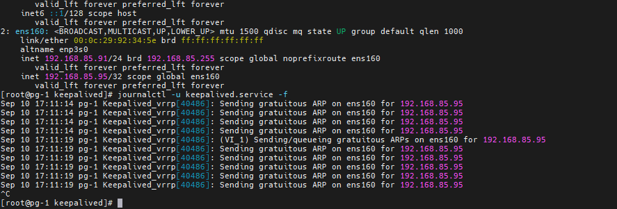
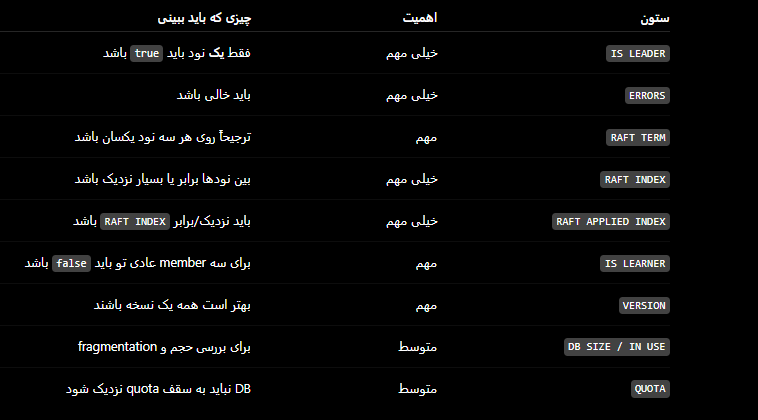

# setup patroni for pg ha

[download pgsql](https://www.postgresql.org/download/)

zabbix-server: 7.0.30
rockylinux: 9.7
postgresql: 18.6
timescaledb:  2.29
patroni: 4.1.5


use a dns server instead of ip address
- pg-1-etcd0-haproxy1-keepalived: 192.168.85.91
- pg-2-etcd1-haproxy2-keepalived: 192.168.85.92
- pg-3-etcd2: 192.168.85.93


for testing purpuses you can add in /etc/hosts

## pg-01 - 192.168.85.91
```sh
vim /etc/hosts
-----
192.168.85.91 pg-1
192.168.85.92 pg-2
192.168.85.93 pg-3
-----

# add required port in firewalld
# etcd: 2379 client API, 2380 peer communication
# HAProxy: 7000 stats, 5000 primary, 5001 replicas
# PostgreSQL: 5432 database/replication
# Patroni: 8008 REST API
firewall-cmd --permanent \
  --add-port=2379/tcp \
  --add-port=2380/tcp \
  --add-port=7000/tcp \
  --add-port=5000/tcp \
  --add-port=5001/tcp \
  --add-port=5432/tcp \
  --add-port=8008/tcp

firewall-cmd --reload


# Install the repository RPM:
sudo dnf install -y https://download.postgresql.org/pub/repos/yum/reporpms/EL-9-x86_64/pgdg-redhat-repo-latest.noarch.rpm

# Install PostgreSQL:
sudo dnf install -y postgresql18-server

# Optionally initialize the database and enable automatic start:
sudo systemctl disable --now postgresql-18


# setup timescaledb
sudo tee /etc/yum.repos.d/timescale_timescaledb.repo <<EOL
[timescale_timescaledb]
name=timescale_timescaledb
baseurl=https://packagecloud.io/timescale/timescaledb/el/$(rpm -E %{rhel})/\$basearch
repo_gpgcheck=1
gpgcheck=0
enabled=1
gpgkey=https://packagecloud.io/timescale/timescaledb/gpgkey
sslverify=1
sslcacert=/etc/pki/tls/certs/ca-bundle.crt
metadata_expire=300
EOL

# dnf clean all
dnf makecache

# show and select specific version of timescaledb
dnf list timescaledb-2-postgresql-18 --showduplicates
dnf list timescaledb-2-loader-postgresql-18 --showduplicates
dnf list timescaledb-tools --showduplicates


dnf install timescaledb-2-postgresql-18-2.29.2 timescaledb-2-loader-postgresql-18-2.29.2 timescaledb-tools-0.19.0


sudo dnf versionlock add timescaledb-2-postgresql-18
sudo dnf versionlock timescaledb-2-loader-postgresql-18
sudo dnf versionlock timescaledb-tools 

sudo dnf versionlock list


# install etcd
dnf --enablerepo=pgdg-rhel9-extras install etcd

# setup CA and create certificate 
mkdir cert && cd cert
vim cert.cnf
-----

[req]
default_bits = 4096
distinguished_name = req_distinguished_name
req_extensions = v3_req
prompt = no

[req_distinguished_name]
countryName = IR
stateOrProvinceName = Tehran
localityName = Tehran
organizationName = ZabbixLab
commonName = etcd

[v3_req]
keyUsage = digitalSignature, keyEncipherment, dataEncipherment
extendedKeyUsage = serverAuth, clientAuth
subjectAltName = @alt_names

[alt_names]
IP.1 = 127.0.0.1
IP.2 = 192.168.85.91
IP.3 = 192.168.85.92
IP.4 = 192.168.85.93
DNS.1 = localhost
-----

# Create CA
openssl req -x509 -noenc -newkey rsa:4096 \
    -subj '/CN=Zabbix-Postgres-HA-CA' \
    -keyout ca_key.pem \
    -out ca_cert.pem \
    -days 36500


# create etcd private key and CSR
openssl req \
    -noenc \
    -newkey rsa:4096 \
    -keyout etcd_key.pem \
    -out etcd_cert.csr \
    -config cert.cnf


# sgin CSR

openssl x509 \
    -req \
    -days 36500 \
    -in etcd_cert.csr \
    -CA ca_cert.pem \
    -CAkey ca_key.pem \
    -out etcd_cert.pem \
    -copy_extensions copy


mkdir /etc/etcd/cert
cp ca_cert.pem cert.cnf etcd_cert.csr etcd_cert.pem etcd_key.pem /etc/etcd/cert/
# copy cert files into another servers
scp /etc/etcd/cert/* root@192.168.85.92:/etc/etcd/cert
scp /etc/etcd/cert/* root@192.168.85.93:/etc/etcd/cert


vim /etc/etcd/etcd.conf
----
[member]
ETCD_NAME=etcd0
ETCD_DATA_DIR="/var/lib/etcd/default.etcd"
ETCD_LISTEN_PEER_URLS="https://192.168.85.91:2380"
ETCD_LISTEN_CLIENT_URLS="https://localhost:2379, https://192.168.85.91:2379"

[cluster]
ETCD_INITIAL_ADVERTISE_PEER_URLS="https://192.168.85.91:2380"
ETCD_ADVERTISE_CLIENT_URLS="https://192.168.85.91:2379"
ETCD_INITIAL_CLUSTER="etcd0=https://192.168.85.91:2380,etcd1=https://192.168.85.92:2380,etcd2=https://192.168.85.93:2380"
ETCD_INITIAL_CLUSTER_STATE="new"
ETCD_INITIAL_CLUSTER_TOKEN="etcd-cluster-1"
ETCD_CERT_FILE="/etc/etcd/cert/etcd_cert.pem"
ETCD_KEY_FILE="/etc/etcd/cert/etcd_key.pem"
ETCD_PEER_TRUSTED_CA_FILE="/etc/etcd/cert/ca_cert.pem"
ETCD_PEER_CERT_FILE="/etc/etcd/cert/etcd_cert.pem"
ETCD_PEER_KEY_FILE="/etc/etcd/cert/etcd_key.pem"

[logging]
ETCD_DEBUG="false"
-----


chown -R etcd: /etc/etcd
chmod 0750 -R /etc/etcd/


systemctl enable --now etcd.service
systemctl restart etcd.service


journalctl -u etcd.service -f

# export ETCDCTL_API=3

export ENDPOINTS="https://192.168.85.91:2379,https://192.168.85.92:2379,https://192.168.85.93:2379"

export CACERT="/etc/etcd/cert/ca_cert.pem"
export CERT="/etc/etcd/cert/etcd_cert.pem"
export KEY="/etc/etcd/cert/etcd_key.pem"

etcdctl --endpoints="$ENDPOINTS" --cacert="$CACERT" --cert="$CERT" --key="$KEY" endpoint health


etcdctl --endpoints="$ENDPOINTS" --cacert="$CACERT" --cert="$CERT" --key="$KEY"  endpoint status -w table

etcdctl --endpoints="$ENDPOINTS" --cacert="$CACERT" --cert="$CERT" --key="$KEY" member list -w table


#dnf install epel-release
#dnf makecache
dnf --enablerepo=pgdg-rhel9-extras install haproxy
dnf --enablerepo=pgdg-rhel9-extras install keepalived


vim /etc/keepalived/keepalived.conf
--------

global_defs {
}

vrrp_script chk_haproxy {
    script "/usr/bin/killall -0 haproxy"
    interval 2
    weight 2
}

vrrp_instance VI_1 {
    interface ens160
    state MASTER
    priority 101
    virtual_router_id 51

    authentication {
        auth_type PASS
        auth_pass imanpass
    }

    virtual_ipaddress {
        192.168.85.95
    }

    unicast_src_ip 192.168.85.91

    unicast_peer {
        192.168.85.92
    }

    track_script {
        chk_haproxy
    }
}

-------

systemctl enable --now keepalived.service

```



```sh


systemctl edit haproxy

# add
--------
[Service]
RestartSec=5s
-------

systemctl daemon-reload
systemctl restart haproxy

systemctl show haproxy -p Restart -p RestartUSec -p Type

vim /etc/haproxy/haproxy.conf
-----
global
    maxconn 100

defaults
    log global
    mode tcp
    retries 2
    timeout client 30m
    timeout connect 4s
    timeout server 30m
    timeout check 5s

listen stats
    mode http
    bind *:7000
    stats enable
    stats uri /
    stats realm HAProxy\ Statistics
    stats auth admin:StrongPassword

listen production
    bind 192.168.85.95:5000
    option httpchk OPTIONS /primary
    http-check expect status 200
    default-server inter 3s fall 3 rise 2 on-marked-down shutdown-sessions

    server pg-1 192.168.85.91:5432 maxconn 100 check port 8008
    server pg-2 192.168.85.92:5432 maxconn 100 check port 8008
    server pg-3 192.168.85.93:5432 maxconn 100 check port 8008

listen standby
    bind 192.168.85.95:5001
    option httpchk OPTIONS /replica
    http-check expect status 200
    default-server inter 3s fall 3 rise 2 on-marked-down shutdown-sessions

    server pg-1 192.168.85.91:5432 maxconn 100 check port 8008
    server pg-2 192.168.85.92:5432 maxconn 100 check port 8008
    server pg-3 192.168.85.93:5432 maxconn 100 check port 8008

-----


# setup patroni
dnf install patroni patroni-etcd

mkdir -p /var/lib/pgsql/cert/etcd
cp /etc/etcd/cert/ca_cert.pem /var/lib/pgsql/cert/etcd/
cp /etc/etcd/cert/etcd_cert.pem /var/lib/pgsql/cert/etcd/
cp /etc/etcd/cert/etcd_key.pem /var/lib/pgsql/cert/etcd/

chown -R postgres:postgres /var/lib/pgsql/cert
chmod 700 /var/lib/pgsql/cert /var/lib/pgsql/cert/etcd
chmod 600 /var/lib/pgsql/cert/etcd/etcd_key.pem
chmod 644 /var/lib/pgsql/cert/etcd/ca_cert.pem
chmod 644 /var/lib/pgsql/cert/etcd/etcd_cert.pem

restorecon -Rv /var/lib/pgsql/cert

vim /etc/patroni/patroni.yml
----
scope: zabbix-postgres
namespace: /service/
name: pg-1

restapi:
  listen: 0.0.0.0:8008
  connect_address: 192.168.85.91:8008

etcd3:
  protocol: https
  hosts:
    - 192.168.85.91:2379
    - 192.168.85.92:2379
    - 192.168.85.93:2379

  cacert: /var/lib/pgsql/cert/etcd/ca_cert.pem
  cert: /var/lib/pgsql/cert/etcd/etcd_cert.pem
  key: /var/lib/pgsql/cert/etcd/etcd_key.pem

bootstrap:
  dcs:
    ttl: 30
    loop_wait: 10
    retry_timeout: 10
    maximum_lag_on_failover: 1048576

    postgresql:
      use_pg_rewind: true
      use_slots: true

      parameters:
        wal_level: replica
        hot_standby: "on"

        max_wal_senders: 10
        max_replication_slots: 10
        wal_keep_size: 1GB

        wal_log_hints: "on"

        max_connections: 200

        shared_preload_libraries: "timescaledb"
        timescaledb.telemetry_level: "off"

        password_encryption: "scram-sha-256"

  initdb:
    - encoding: UTF8
    - data-checksums
    - auth-host: scram-sha-256
    - auth-local: peer

  pg_hba:
    - local all all peer

    - host replication replicator 127.0.0.1/32 scram-sha-256
    - host replication replicator 192.168.85.0/24 scram-sha-256

    - host all all 127.0.0.1/32 scram-sha-256
    - host all all 192.168.85.0/24 scram-sha-256

postgresql:
  listen: 0.0.0.0:5432
  connect_address: 192.168.85.91:5432

  data_dir: /var/lib/pgsql/18/data
  bin_dir: /usr/pgsql-18/bin

  pgpass: /var/lib/pgsql/.pgpass_patroni

  authentication:
    superuser:
      username: postgres
      password: "CHANGE_POSTGRES_PASSWORD"

    replication:
      username: replicator
      password: "CHANGE_REPLICATION_PASSWORD"

    rewind:
      username: rewind_user
      password: "CHANGE_REWIND_PASSWORD"

  parameters:
    unix_socket_directories: "/var/run/postgresql"

tags:
  noloadbalance: false
  clonefrom: false
  nostream: false

-----


systemctl enable --now patroni
systemctl status patrnoi


patronictl -c /etc/patroni/patroni.yml list

curl -i http://192.168.85.92:8008/replica
curl -i http://192.168.85.92:8008/primary
curl -i http://192.168.85.92:8008/master


```

## pg-02- 192.168.85.92
```sh


vim /etc/hosts
-----
192.168.85.91 pg-1
192.168.85.92 pg-2
192.168.85.93 pg-3
-----


# add required port in firewalld
# etcd: 2379 client API, 2380 peer communication
# HAProxy: 7000 stats, 5000 primary, 5001 replicas
# PostgreSQL: 5432 database/replication
# Patroni: 8008 REST API
firewall-cmd --permanent \
  --add-port=2379/tcp \
  --add-port=2380/tcp \
  --add-port=7000/tcp \
  --add-port=5000/tcp \
  --add-port=5001/tcp \
  --add-port=5432/tcp \
  --add-port=8008/tcp

firewall-cmd --reload


# Install the repository RPM:
sudo dnf install -y https://download.postgresql.org/pub/repos/yum/reporpms/EL-9-x86_64/pgdg-redhat-repo-latest.noarch.rpm

# Install PostgreSQL:
sudo dnf install -y postgresql18-server

# Optionally initialize the database and enable automatic start:
sudo systemctl disable --now postgresql-18


# setup timescaledb
sudo tee /etc/yum.repos.d/timescale_timescaledb.repo <<EOL
[timescale_timescaledb]
name=timescale_timescaledb
baseurl=https://packagecloud.io/timescale/timescaledb/el/$(rpm -E %{rhel})/\$basearch
repo_gpgcheck=1
gpgcheck=0
enabled=1
gpgkey=https://packagecloud.io/timescale/timescaledb/gpgkey
sslverify=1
sslcacert=/etc/pki/tls/certs/ca-bundle.crt
metadata_expire=300
EOL

# dnf clean all
dnf makecache

# show and select specific version of timescaledb
dnf list timescaledb-2-postgresql-18 --showduplicates
dnf list timescaledb-2-loader-postgresql-18 --showduplicates
dnf list timescaledb-tools --showduplicates


dnf install timescaledb-2-postgresql-18-2.29.2 timescaledb-2-loader-postgresql-18-2.29.2 timescaledb-tools-0.19.0


sudo dnf versionlock add timescaledb-2-postgresql-18
sudo dnf versionlock timescaledb-2-loader-postgresql-18
sudo dnf versionlock timescaledb-tools 

sudo dnf versionlock list


# install etcd
dnf --enablerepo=pgdg-rhel9-extras install etcd

mkdir /etc/etcd/cert

vim /etc/etcd/etcd.conf
-----

[member]
ETCD_NAME=etcd1
ETCD_DATA_DIR="/var/lib/etcd/default.etcd"
ETCD_LISTEN_PEER_URLS="https://192.168.85.92:2380"
ETCD_LISTEN_CLIENT_URLS="https://localhost:2379, https://192.168.85.92:2379"

[cluster]
ETCD_INITIAL_ADVERTISE_PEER_URLS="https://192.168.85.92:2380"
ETCD_ADVERTISE_CLIENT_URLS="https://192.168.85.92:2379"
ETCD_INITIAL_CLUSTER="etcd0=https://192.168.85.91:2380,etcd1=https://192.168.85.92:2380,etcd2=https://192.168.85.93:2380"
ETCD_INITIAL_CLUSTER_STATE="new"
ETCD_INITIAL_CLUSTER_TOKEN="etcd-cluster-1"
ETCD_CERT_FILE="/etc/etcd/cert/etcd_cert.pem"
ETCD_KEY_FILE="/etc/etcd/cert/etcd_key.pem"
ETCD_PEER_TRUSTED_CA_FILE="/etc/etcd/cert/ca_cert.pem"
ETCD_PEER_CERT_FILE="/etc/etcd/cert/etcd_cert.pem"
ETCD_PEER_KEY_FILE="/etc/etcd/cert/etcd_key.pem"

[logging]
ETCD_DEBUG="false"

-----

chown -R etcd: /etc/etcd
chmod 0750 -R /etc/etcd/


firewall-cmd --add-port=2379/tcp --permanent
firewall-cmd --add-port=2380/tcp --permanent
firewall-cmd --reload

systemctl enable --now etcd.service
systemctl restart etcd.service


#dnf install epel-release
#dnf makecache
dnf --enablerepo=pgdg-rhel9-extras install haproxy
dnf --enablerepo=pgdg-rhel9-extras install keepalived


vim /etc/keepalived/keepalived.conf
--------

global_defs {
}

vrrp_script chk_haproxy {
    script "/usr/bin/killall -0 haproxy"
    interval 2
    weight 2
}

vrrp_instance VI_1 {
    interface ens160
    state BACKUP
    priority 100
    virtual_router_id 51

    authentication {
        auth_type PASS
        auth_pass imanpass
    }

    virtual_ipaddress {
        192.168.85.95
    }

    unicast_src_ip 192.168.85.92

    unicast_peer {
        192.168.85.91
    }

    track_script {
        chk_haproxy
    }
}

-------
systemctl enable --now keepalived.service

systemctl edit haproxy

# add
--------
[Service]
RestartSec=5s
-------

systemctl daemon-reload
systemctl restart haproxy

systemctl show haproxy -p Restart -p RestartUSec -p Type


vim /etc/haproxy/haproxy.cfg
----

global
    maxconn 100

defaults
    log global
    mode tcp
    retries 2
    timeout client 30m
    timeout connect 4s
    timeout server 30m
    timeout check 5s

listen stats
    mode http
    bind *:7000
    stats enable
    stats uri /
    stats realm HAProxy\ Statistics
    stats auth admin:StrongPassword

listen production
    bind 192.168.85.95:5000
    option httpchk OPTIONS /primary
    http-check expect status 200
    default-server inter 3s fall 3 rise 2 on-marked-down shutdown-sessions

    server pg-1 192.168.85.91:5432 maxconn 100 check port 8008
    server pg-2 192.168.85.92:5432 maxconn 100 check port 8008
    server pg-3 192.168.85.93:5432 maxconn 100 check port 8008

listen standby
    bind 192.168.85.95:5001
    option httpchk OPTIONS /replica
    http-check expect status 200
    default-server inter 3s fall 3 rise 2 on-marked-down shutdown-sessions

    server pg-1 192.168.85.91:5432 maxconn 100 check port 8008
    server pg-2 192.168.85.92:5432 maxconn 100 check port 8008
    server pg-3 192.168.85.93:5432 maxconn 100 check port 8008
----


# setup patroni
dnf install patroni patroni-etcd

mkdir -p /var/lib/pgsql/cert/etcd
cp /etc/etcd/cert/ca_cert.pem /var/lib/pgsql/cert/etcd/
cp /etc/etcd/cert/etcd_cert.pem /var/lib/pgsql/cert/etcd/
cp /etc/etcd/cert/etcd_key.pem /var/lib/pgsql/cert/etcd/

chown -R postgres:postgres /var/lib/pgsql/cert
chmod 700 /var/lib/pgsql/cert /var/lib/pgsql/cert/etcd
chmod 600 /var/lib/pgsql/cert/etcd/etcd_key.pem
chmod 644 /var/lib/pgsql/cert/etcd/ca_cert.pem
chmod 644 /var/lib/pgsql/cert/etcd/etcd_cert.pem

restorecon -Rv /var/lib/pgsql/cert


vim /etc/patroni/patroni.yml
----
scope: zabbix-postgres
namespace: /service/
name: pg-2

restapi:
  listen: 0.0.0.0:8008
  connect_address: 192.168.85.92:8008

etcd3:
  protocol: https
  hosts:
    - 192.168.85.91:2379
    - 192.168.85.92:2379
    - 192.168.85.93:2379

  cacert: /var/lib/pgsql/cert/etcd/ca_cert.pem
  cert: /var/lib/pgsql/cert/etcd/etcd_cert.pem
  key: /var/lib/pgsql/cert/etcd/etcd_key.pem

bootstrap:
  dcs:
    ttl: 30
    loop_wait: 10
    retry_timeout: 10
    maximum_lag_on_failover: 1048576

    postgresql:
      use_pg_rewind: true
      use_slots: true

      parameters:
        wal_level: replica
        hot_standby: "on"

        max_wal_senders: 10
        max_replication_slots: 10
        wal_keep_size: 1GB

        wal_log_hints: "on"

        max_connections: 200

        shared_preload_libraries: "timescaledb"
        timescaledb.telemetry_level: "off"

        password_encryption: "scram-sha-256"

  initdb:
    - encoding: UTF8
    - data-checksums
    - auth-host: scram-sha-256
    - auth-local: peer

  pg_hba:
    - local all all peer

    - host replication replicator 127.0.0.1/32 scram-sha-256
    - host replication replicator 192.168.85.0/24 scram-sha-256

    - host all all 127.0.0.1/32 scram-sha-256
    - host all all 192.168.85.0/24 scram-sha-256

postgresql:
  listen: 0.0.0.0:5432
  connect_address: 192.168.85.92:5432

  data_dir: /var/lib/pgsql/18/data
  bin_dir: /usr/pgsql-18/bin

  pgpass: /var/lib/pgsql/.pgpass_patroni

  authentication:
    superuser:
      username: postgres
      password: "CHANGE_POSTGRES_PASSWORD"

    replication:
      username: replicator
      password: "CHANGE_REPLICATION_PASSWORD"

    rewind:
      username: rewind_user
      password: "CHANGE_REWIND_PASSWORD"

  parameters:
    unix_socket_directories: "/var/run/postgresql"

tags:
  noloadbalance: false
  clonefrom: false
  nostream: false

-----


systemctl enable --now patroni
systemctl status patrnoi


patronictl -c /etc/patroni/patroni.yml list


```


## pg-03 - 192.168.85.93
```sh


vim /etc/hosts
-----
192.168.85.91 pg-1
192.168.85.92 pg-2
192.168.85.93 pg-3
-----

# add required port in firewalld
# etcd: 2379 client API, 2380 peer communication
# HAProxy: 7000 stats, 5000 primary, 5001 replicas
# PostgreSQL: 5432 database/replication
# Patroni: 8008 REST API
firewall-cmd --permanent \
  --add-port=2379/tcp \
  --add-port=2380/tcp \
  --add-port=7000/tcp \
  --add-port=5000/tcp \
  --add-port=5001/tcp \
  --add-port=5432/tcp \
  --add-port=8008/tcp

firewall-cmd --reload


# Install the repository RPM:
sudo dnf install -y https://download.postgresql.org/pub/repos/yum/reporpms/EL-9-x86_64/pgdg-redhat-repo-latest.noarch.rpm

# Install PostgreSQL:
sudo dnf install -y postgresql18-server

# Optionally initialize the database and enable automatic start:
sudo systemctl disable --now postgresql-18


# setup timescaledb
sudo tee /etc/yum.repos.d/timescale_timescaledb.repo <<EOL
[timescale_timescaledb]
name=timescale_timescaledb
baseurl=https://packagecloud.io/timescale/timescaledb/el/$(rpm -E %{rhel})/\$basearch
repo_gpgcheck=1
gpgcheck=0
enabled=1
gpgkey=https://packagecloud.io/timescale/timescaledb/gpgkey
sslverify=1
sslcacert=/etc/pki/tls/certs/ca-bundle.crt
metadata_expire=300
EOL

# dnf clean all
dnf makecache

# show and select specific version of timescaledb
dnf list timescaledb-2-postgresql-18 --showduplicates
dnf list timescaledb-2-loader-postgresql-18 --showduplicates
dnf list timescaledb-tools --showduplicates


dnf install timescaledb-2-postgresql-18-2.29.2 timescaledb-2-loader-postgresql-18-2.29.2 timescaledb-tools-0.19.0


sudo dnf versionlock add timescaledb-2-postgresql-18
sudo dnf versionlock timescaledb-2-loader-postgresql-18
sudo dnf versionlock timescaledb-tools 

sudo dnf versionlock list


# install etcd
dnf --enablerepo=pgdg-rhel9-extras install etcd

mkdir /etc/etcd/cert


vim /etc/etcd/etcd.conf
-----

[member]
ETCD_NAME=etcd2
ETCD_DATA_DIR="/var/lib/etcd/default.etcd"
ETCD_LISTEN_PEER_URLS="https://192.168.85.93:2380"
ETCD_LISTEN_CLIENT_URLS="https://localhost:2379, https://192.168.85.93:2379"

[cluster]
ETCD_INITIAL_ADVERTISE_PEER_URLS="https://192.168.85.93:2380"
ETCD_ADVERTISE_CLIENT_URLS="https://192.168.85.93:2379"
ETCD_INITIAL_CLUSTER="etcd0=https://192.168.85.91:2380,etcd1=https://192.168.85.92:2380,etcd2=https://192.168.85.93:2380"
ETCD_INITIAL_CLUSTER_STATE="new"
ETCD_INITIAL_CLUSTER_TOKEN="etcd-cluster-1"
ETCD_CERT_FILE="/etc/etcd/cert/etcd_cert.pem"
ETCD_KEY_FILE="/etc/etcd/cert/etcd_key.pem"
ETCD_PEER_TRUSTED_CA_FILE="/etc/etcd/cert/ca_cert.pem"
ETCD_PEER_CERT_FILE="/etc/etcd/cert/etcd_cert.pem"
ETCD_PEER_KEY_FILE="/etc/etcd/cert/etcd_key.pem"

[logging]
ETCD_DEBUG="false"

-----

chown -R etcd: /etc/etcd
chmod 0750 -R /etc/etcd/


systemctl enable --now etcd.service
systemctl restart etcd.service


# setup patroni
dnf install patroni patroni-etcd

mkdir -p /var/lib/pgsql/cert/etcd
cp /etc/etcd/cert/ca_cert.pem /var/lib/pgsql/cert/etcd/
cp /etc/etcd/cert/etcd_cert.pem /var/lib/pgsql/cert/etcd/
cp /etc/etcd/cert/etcd_key.pem /var/lib/pgsql/cert/etcd/

chown -R postgres:postgres /var/lib/pgsql/cert
chmod 700 /var/lib/pgsql/cert /var/lib/pgsql/cert/etcd
chmod 600 /var/lib/pgsql/cert/etcd/etcd_key.pem
chmod 644 /var/lib/pgsql/cert/etcd/ca_cert.pem
chmod 644 /var/lib/pgsql/cert/etcd/etcd_cert.pem

restorecon -Rv /var/lib/pgsql/cert

vim /etc/patroni/patroni.yml
----
scope: zabbix-postgres
namespace: /service/
name: pg-3

restapi:
  listen: 0.0.0.0:8008
  connect_address: 192.168.85.93:8008

etcd3:
  protocol: https
  hosts:
    - 192.168.85.91:2379
    - 192.168.85.92:2379
    - 192.168.85.93:2379

  cacert: /var/lib/pgsql/cert/etcd/ca_cert.pem
  cert: /var/lib/pgsql/cert/etcd/etcd_cert.pem
  key: /var/lib/pgsql/cert/etcd/etcd_key.pem

bootstrap:
  dcs:
    ttl: 30
    loop_wait: 10
    retry_timeout: 10
    maximum_lag_on_failover: 1048576

    postgresql:
      use_pg_rewind: true
      use_slots: true

      parameters:
        wal_level: replica
        hot_standby: "on"

        max_wal_senders: 10
        max_replication_slots: 10
        wal_keep_size: 1GB

        wal_log_hints: "on"

        max_connections: 200

        shared_preload_libraries: "timescaledb"
        timescaledb.telemetry_level: "off"

        password_encryption: "scram-sha-256"

  initdb:
    - encoding: UTF8
    - data-checksums
    - auth-host: scram-sha-256
    - auth-local: peer

  pg_hba:
    - local all all peer

    - host replication replicator 127.0.0.1/32 scram-sha-256
    - host replication replicator 192.168.85.0/24 scram-sha-256

    - host all all 127.0.0.1/32 scram-sha-256
    - host all all 192.168.85.0/24 scram-sha-256

postgresql:
  listen: 0.0.0.0:5432
  connect_address: 192.168.85.93:5432

  data_dir: /var/lib/pgsql/18/data
  bin_dir: /usr/pgsql-18/bin

  pgpass: /var/lib/pgsql/.pgpass_patroni

  authentication:
    superuser:
      username: postgres
      password: "CHANGE_POSTGRES_PASSWORD"

    replication:
      username: replicator
      password: "CHANGE_REPLICATION_PASSWORD"

    rewind:
      username: rewind_user
      password: "CHANGE_REWIND_PASSWORD"

  parameters:
    unix_socket_directories: "/var/run/postgresql"

tags:
  noloadbalance: false
  clonefrom: false
  nostream: false

-----

systemctl enable --now patroni
systemctl status patrnoi


patronictl -c /etc/patroni/patroni.yml list

```


## ETCD
```sh
export ENDPOINTS="https://192.168.85.91:2379,https://192.168.85.92:2379,https://192.168.85.93:2379"

export CACERT="/etc/etcd/cert/ca_cert.pem"
export CERT="/etc/etcd/cert/etcd_cert.pem"
export KEY="/etc/etcd/cert/etcd_key.pem"


alias etcdctlp='etcdctl --endpoints="$ENDPOINTS" --cacert="$CACERT" --cert="$CERT" --key="$KEY"'

etcdctlp get /service/zabbix-postgres/ --prefix --keys-only

# all key with value
etcdctlp get /service/zabbix-postgres/ --prefix
etcdctlp get /service/zabbix-postgres/members/ --prefix

# show leader
etcdctlp get /service/zabbix-postgres/leader


# show member config
etcdctlp get /service/zabbix-postgres/members/pg-1

etcdctlp get /service/zabbix-postgres/members/pg-1 --print-value-only | jq


# show etcd leader not patroni leader
etcdctlp endpoint status -w table
# important column
# IS LEADER
# ERRORS
# RAFT TERM
# RAFT INDEX
# RAFT APPLIED INDEX
# IS LEARNER


```




## connect to your database(rw, ro)
```sql

SELECT
    inet_server_addr(),
    pg_is_in_recovery();


```

# change patroni configuration
```sh
# Patroni Failover Timing

# Patroni timing parameters are stored in the DCS (etcd), 
# so you only need to change them once from any Patroni node.

## Edit Patroni Dynamic Configuration


# Edit the cluster-wide Patroni configuration stored in etcd
patronictl -c /etc/patroni/patroni.yml edit-config


# Set the following values:

----
ttl: 20
loop_wait: 5
retry_timeout: 5
----

## Verify the Active Configuration

----
# Show the current cluster-wide configuration
patronictl -c /etc/patroni/patroni.yml show-config
----


patronictl -c /etc/patroni/patroni.yml list  # look if any node is in pending restart or not, if yes run below command
patronictl -c /etc/patroni/patroni.yml restart zabbix-postgres
patronictl -c /etc/patroni/patroni.yml restart zabbix-postgres --pending


curl  http://192.168.85.91:8008/primary
curl  http://192.168.85.91:8008/replica
curl  http://192.168.85.91:8008/health
curl  http://192.168.85.91:8008/patroni


## Notes
```
- Apply the change only once from any Patroni node.
- All Patroni nodes automatically read the updated values from etcd.
- No Patroni restart is required.
- No PostgreSQL restart is required.
- These parameters are dynamic and take effect automatically.
- After the cluster has been initialized, changing `bootstrap.dcs` in `patroni.yml` is not enough.
- Use `patronictl edit-config` for cluster-wide changes after bootstrap.


## connect zabbix to postgres
```sh


# look which node is primary
patronictl -c /etc/patroni/patroni.yml list


# install postgresql client on rocky or ubuntu linux
dnf install -y postgresql18
sudo apt install -y postgresql-client


# then go to that node and run below commands
sudo -u postgres createuser --pwprompt zabbix
sudo -u postgres createdb -O zabbix zabbix

sudo su - postgres
psql  zabbix
CREATE EXTENSION IF NOT EXISTS timescaledb CASCADE;
\dx


# now run on zabbix server
zcat /usr/share/zabbix-sql-scripts/postgresql/server.sql.gz | psql -h 192.168.85.95 -p 5000 -U zabbix -d zabbix -W

cat /usr/share/zabbix-sql-scripts/postgresql/timescaledb/schema.sql | psql -h 192.168.85.95 -p 5000 -U zabbix -d zabbix -W


```