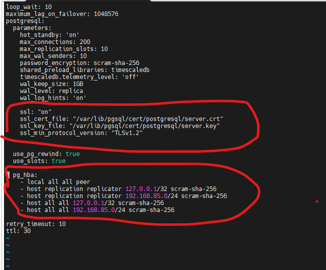

# PostgreSQL TLS for Zabbix HA

## Patroni + HAProxy TCP Passthrough + One Shared PostgreSQL Certificate

This document enables PostgreSQL TLS for the existing 3-node Patroni cluster.

The lab intentionally uses **one PostgreSQL server certificate/private key on all PostgreSQL nodes**.

> For production, separate server certificates/private keys per PostgreSQL node are safer. The shared certificate model is used here to keep the lab simple.

---

## 1. Topology

| Component | Address |
|---|---|
| Zabbix Server | `192.168.85.150` |
| PostgreSQL `pg-1` | `192.168.85.91` |
| PostgreSQL `pg-2` | `192.168.85.92` |
| PostgreSQL `pg-3` | `192.168.85.93` |
| PostgreSQL VIP | `192.168.85.95` |
| HAProxy Primary port | `5000` |
| HAProxy Replica port | `5001` |
| PostgreSQL | `5432` |
| Patroni REST API | `8008` |

Traffic path:

```text
Zabbix Server 192.168.85.150
        |
        | PostgreSQL TLS
        v
VIP 192.168.85.95:5000
        |
        | HAProxy TCP passthrough
        v
Current PostgreSQL Primary:5432
```

HAProxy does **not** decrypt PostgreSQL TLS. PostgreSQL itself terminates TLS.

---

## 2. Certificate Design

The same certificate and private key will be installed on all three PostgreSQL nodes:

```text
/var/lib/pgsql/cert/postgresql/server.crt
/var/lib/pgsql/cert/postgresql/server.key
```

The certificate contains all PostgreSQL node addresses and the floating VIP in its SAN:

```text
DNS: pg-1
DNS: pg-2
DNS: pg-3

IP: 192.168.85.91
IP: 192.168.85.92
IP: 192.168.85.93
IP: 192.168.85.95
```

The VIP must be present because Zabbix connects to `192.168.85.95` with full certificate verification.

---

# 3. Create PostgreSQL CA and Shared Server Certificate

Run this section once on `pg-1`.

```bash
mkdir -p /root/postgresql-tls
cd /root/postgresql-tls
```

## 3.1 Create PostgreSQL CA

```bash
openssl req -x509 -noenc -newkey rsa:4096 \
  -subj '/CN=Zabbix-PostgreSQL-HA-CA' \
  -keyout postgres_ca.key \
  -out postgres_ca.crt \
  -days 3650 \
  -sha256
```

Files created:

```text
postgres_ca.key    # CA private key - keep private
postgres_ca.crt    # CA certificate - distribute to clients
```

Do not copy `postgres_ca.key` to PostgreSQL nodes other than the certificate-generation location or to the Zabbix server.

---

## 3.2 Create OpenSSL Configuration

```bash
cat > /root/postgresql-tls/postgres_server.cnf <<'EOF_CERT'
[req]
prompt = no
distinguished_name = dn
req_extensions = req_ext

[dn]
CN = zabbix-postgresql-ha

[req_ext]
subjectAltName = @alt_names

[v3_server]
basicConstraints = critical,CA:FALSE
keyUsage = critical,digitalSignature,keyEncipherment
extendedKeyUsage = serverAuth
subjectAltName = @alt_names

[alt_names]
DNS.1 = pg-1
DNS.2 = pg-2
DNS.3 = pg-3

IP.1 = 192.168.85.91
IP.2 = 192.168.85.92
IP.3 = 192.168.85.93
IP.4 = 192.168.85.95
EOF_CERT
```

---

## 3.3 Create Shared PostgreSQL Private Key and CSR

```bash
cd /root/postgresql-tls

openssl req \
  -noenc \
  -newkey rsa:4096 \
  -keyout postgres_server.key \
  -out postgres_server.csr \
  -config postgres_server.cnf
```

---

## 3.4 Sign the Shared PostgreSQL Certificate

```bash
openssl x509 \
  -req \
  -in postgres_server.csr \
  -CA postgres_ca.crt \
  -CAkey postgres_ca.key \
  -CAcreateserial \
  -out postgres_server.crt \
  -days 825 \
  -sha256 \
  -extfile postgres_server.cnf \
  -extensions v3_server
```

Verify the certificate chain:

```bash
openssl verify \
  -CAfile postgres_ca.crt \
  postgres_server.crt
```

Expected:

```text
postgres_server.crt: OK
```

Verify SANs:

```bash
openssl x509 \
  -in postgres_server.crt \
  -noout \
  -subject \
  -issuer \
  -dates \
  -ext subjectAltName
```

Confirm that the output contains:

```text
DNS:pg-1
DNS:pg-2
DNS:pg-3
IP Address:192.168.85.91
IP Address:192.168.85.92
IP Address:192.168.85.93
IP Address:192.168.85.95
```

---

# 4. Install the Shared Certificate on `pg-1`

Run on `pg-1`:

```bash
mkdir -p /var/lib/pgsql/cert/postgresql

chown postgres:postgres /var/lib/pgsql/cert
chown postgres:postgres /var/lib/pgsql/cert/postgresql

chmod 700 /var/lib/pgsql/cert
chmod 700 /var/lib/pgsql/cert/postgresql
```

Install the certificate:

```bash
install \
  -o postgres \
  -g postgres \
  -m 0644 \
  /root/postgresql-tls/postgres_server.crt \
  /var/lib/pgsql/cert/postgresql/server.crt
```

Install the private key:

```bash
install \
  -o postgres \
  -g postgres \
  -m 0600 \
  /root/postgresql-tls/postgres_server.key \
  /var/lib/pgsql/cert/postgresql/server.key
```

Verify:

```bash
ls -l /var/lib/pgsql/cert/postgresql/
```

Expected permissions:

```text
-rw-r--r-- postgres postgres server.crt
-rw------- postgres postgres server.key
```

If SELinux is enabled:

```bash
restorecon -Rv /var/lib/pgsql/cert/postgresql
```

If this returns `Disabled`:

```bash
getenforce
```

then `restorecon` is not required.

---

# 5. Install the Same Certificate on `pg-2`

Run these commands from `pg-1`.

Create directories and permissions on `pg-2`:

```bash
ssh root@192.168.85.92 \
  'mkdir -p /var/lib/pgsql/cert/postgresql && \
   chown postgres:postgres /var/lib/pgsql/cert /var/lib/pgsql/cert/postgresql && \
   chmod 700 /var/lib/pgsql/cert /var/lib/pgsql/cert/postgresql'
```

Copy the shared certificate:

```bash
scp /root/postgresql-tls/postgres_server.crt \
  root@192.168.85.92:/var/lib/pgsql/cert/postgresql/server.crt
```

Copy the shared private key:

```bash
scp /root/postgresql-tls/postgres_server.key \
  root@192.168.85.92:/var/lib/pgsql/cert/postgresql/server.key
```

Set ownership and permissions:

```bash
ssh root@192.168.85.92 \
  'chown postgres:postgres \
     /var/lib/pgsql/cert/postgresql/server.crt \
     /var/lib/pgsql/cert/postgresql/server.key && \
   chmod 0644 /var/lib/pgsql/cert/postgresql/server.crt && \
   chmod 0600 /var/lib/pgsql/cert/postgresql/server.key'
```

Verify:

```bash
ssh root@192.168.85.92 \
  'ls -l /var/lib/pgsql/cert/postgresql/'
```

If SELinux is enabled on `pg-2`:

```bash
ssh root@192.168.85.92 \
  'restorecon -Rv /var/lib/pgsql/cert/postgresql'
```

---

# 6. Install the Same Certificate on `pg-3`

Run these commands from `pg-1`.

Create directories and permissions on `pg-3`:

```bash
ssh root@192.168.85.93 \
  'mkdir -p /var/lib/pgsql/cert/postgresql && \
   chown postgres:postgres /var/lib/pgsql/cert /var/lib/pgsql/cert/postgresql && \
   chmod 700 /var/lib/pgsql/cert /var/lib/pgsql/cert/postgresql'
```

Copy the shared certificate:

```bash
scp /root/postgresql-tls/postgres_server.crt \
  root@192.168.85.93:/var/lib/pgsql/cert/postgresql/server.crt
```

Copy the shared private key:

```bash
scp /root/postgresql-tls/postgres_server.key \
  root@192.168.85.93:/var/lib/pgsql/cert/postgresql/server.key
```

Set ownership and permissions:

```bash
ssh root@192.168.85.93 \
  'chown postgres:postgres \
     /var/lib/pgsql/cert/postgresql/server.crt \
     /var/lib/pgsql/cert/postgresql/server.key && \
   chmod 0644 /var/lib/pgsql/cert/postgresql/server.crt && \
   chmod 0600 /var/lib/pgsql/cert/postgresql/server.key'
```

Verify:

```bash
ssh root@192.168.85.93 \
  'ls -l /var/lib/pgsql/cert/postgresql/'
```

If SELinux is enabled on `pg-3`:

```bash
ssh root@192.168.85.93 \
  'restorecon -Rv /var/lib/pgsql/cert/postgresql'
```

---

# 7. Verify That All PostgreSQL Nodes Use the Same Certificate

Run on `pg-1`:

```bash
sha256sum \
  /var/lib/pgsql/cert/postgresql/server.crt \
  /var/lib/pgsql/cert/postgresql/server.key
```

Check `pg-2`:

```bash
ssh root@192.168.85.92 \
  'sha256sum \
   /var/lib/pgsql/cert/postgresql/server.crt \
   /var/lib/pgsql/cert/postgresql/server.key'
```

Check `pg-3`:

```bash
ssh root@192.168.85.93 \
  'sha256sum \
   /var/lib/pgsql/cert/postgresql/server.crt \
   /var/lib/pgsql/cert/postgresql/server.key'
```

The `server.crt` hash must be identical on all three nodes.

The `server.key` hash must also be identical because this lab intentionally shares the same private key.

---

# 8. Enable TLS in the Existing Patroni Cluster

The cluster is already initialized. Therefore, cluster-wide PostgreSQL settings must be changed through Patroni dynamic configuration stored in etcd.

Do not expect changes made only under `bootstrap.dcs` in `/etc/patroni/patroni.yml` to modify the already-running cluster.

## 8.1 Check the Current Dynamic Configuration

Run from any Patroni node:

```bash
patronictl \
  -c /etc/patroni/patroni.yml \
  show-config
```

---

## 8.2 Phase 1 - Enable PostgreSQL TLS Without Enforcing It Yet

This first phase enables TLS support while retaining the existing `host` rules. This avoids forcing every client and replication connection to switch at exactly the same moment.

Run:

```bash
patronictl \
  -c /etc/patroni/patroni.yml \
  edit-config
```

Use this complete dynamic configuration:

```yaml
ttl: 20
loop_wait: 5
retry_timeout: 5
maximum_lag_on_failover: 1048576

postgresql:
  use_pg_rewind: true
  use_slots: true

  parameters:
    wal_level: replica
    hot_standby: "on"
    max_wal_senders: 10
    max_replication_slots: 10
    wal_keep_size: 1GB
    wal_log_hints: "on"

    max_connections: 250

    shared_preload_libraries: "timescaledb"
    timescaledb.telemetry_level: "off"

    password_encryption: "scram-sha-256"

    ssl: "on"
    ssl_cert_file: "/var/lib/pgsql/cert/postgresql/server.crt"
    ssl_key_file: "/var/lib/pgsql/cert/postgresql/server.key"
    ssl_min_protocol_version: "TLSv1.2"

  pg_hba:
    - local all all peer
    - host replication replicator 127.0.0.1/32 scram-sha-256
    - host replication replicator 192.168.85.0/24 scram-sha-256
    - host all all 127.0.0.1/32 scram-sha-256
    - host all all 192.168.85.0/24 scram-sha-256
```

Save and exit the editor.




Verify the stored configuration:

```bash
patronictl \
  -c /etc/patroni/patroni.yml \
  show-config
```

Check cluster state:

```bash
patronictl \
  -c /etc/patroni/patroni.yml \
  list
```

If Patroni marks any member as `Pending restart`, restart only the pending members:

```bash
patronictl \
  -c /etc/patroni/patroni.yml \
  restart zabbix-postgres --pending
```

Check again:

```bash
patronictl \
  -c /etc/patroni/patroni.yml \
  list
```

---

# 9. Verify PostgreSQL TLS on Every Database Node

Copy the CA certificate to the Zabbix server first.

Run from `pg-1`:

```bash
ssh root@192.168.85.147   'mkdir -p /etc/zabbix'
```

```bash
scp /root/postgresql-tls/postgres_ca.crt \
  root@192.168.85.147:/etc/zabbix/postgresql-ca.crt
```

```bash
ssh root@192.168.85.147 \
  'chown root:zabbix /etc/zabbix/postgresql-ca.crt && \
   chmod 0640 /etc/zabbix/postgresql-ca.crt'
```

Verify the file:

```bash
ssh root@192.168.85.147 \
  'ls -l /etc/zabbix/postgresql-ca.crt'
```

## 9.1 Test the VIP

Run on the Zabbix server:

```bash
psql \
  "host=192.168.85.95 port=5000 dbname=zabbix user=zabbix sslmode=verify-full sslrootcert=/etc/zabbix/postgresql-ca.crt"
```

Inside `psql`:

```sql
\conninfo
```

Then:

```sql
SELECT
    ssl,
    version,
    cipher
FROM pg_stat_ssl
WHERE pid = pg_backend_pid();
```

Expected:

```text
ssl = true
```

Exit:

```sql
\q
```

---

## 9.2 Test `pg-1` Directly

Run on the Zabbix server:

```bash
psql \
  "host=192.168.85.91 port=5432 dbname=zabbix user=zabbix sslmode=verify-full sslrootcert=/etc/zabbix/postgresql-ca.crt" \
  -c "SELECT inet_server_addr(), ssl, version, cipher FROM pg_stat_ssl WHERE pid = pg_backend_pid();"
```

---

## 9.3 Test `pg-2` Directly

```bash
psql \
  "host=192.168.85.92 port=5432 dbname=zabbix user=zabbix sslmode=verify-full sslrootcert=/etc/zabbix/postgresql-ca.crt" \
  -c "SELECT inet_server_addr(), ssl, version, cipher FROM pg_stat_ssl WHERE pid = pg_backend_pid();"
```

---

## 9.4 Test `pg-3` Directly

```bash
psql \
  "host=192.168.85.93 port=5432 dbname=zabbix user=zabbix sslmode=verify-full sslrootcert=/etc/zabbix/postgresql-ca.crt" \
  -c "SELECT inet_server_addr(), ssl, version, cipher FROM pg_stat_ssl WHERE pid = pg_backend_pid();"
```

Every test should report:

```text
ssl = true
```

---

# 10. Configure Zabbix Server to Verify PostgreSQL TLS

Edit on the Zabbix server:

```text
/etc/zabbix/zabbix_server.conf
```

Use:

```ini
DBHost=192.168.85.95
DBPort=5000
DBName=zabbix
DBUser=zabbix
DBPassword=CHANGE_ZABBIX_DB_PASSWORD

DBTLSConnect=verify_full
DBTLSCAFile=/etc/zabbix/postgresql-ca.crt
```

This configuration verifies the PostgreSQL server certificate and the database host identity.

This lab does not require a PostgreSQL client certificate from Zabbix. Database authentication continues to use SCRAM-SHA-256.

Restart Zabbix Server:

```bash
systemctl restart zabbix-server
systemctl status zabbix-server
```

Check logs:

```bash
journalctl -u zabbix-server -f
```

---

# 11. Configure Zabbix Web Frontend to Verify PostgreSQL TLS

The Zabbix Web Frontend opens its own database connections. Stopping or configuring only `zabbix-server` does not configure the frontend database sessions.

Edit:

```text
/etc/zabbix/web/zabbix.conf.php
```

Use:

```php
$DB['TYPE']     = 'POSTGRESQL';
$DB['SERVER']   = '192.168.85.95';
$DB['PORT']     = '5000';
$DB['DATABASE'] = 'zabbix';
$DB['USER']     = 'zabbix';
$DB['PASSWORD'] = 'CHANGE_ZABBIX_DB_PASSWORD';
$DB['SCHEMA']   = '';

$DB['ENCRYPTION']  = true;
$DB['KEY_FILE']    = '';
$DB['CERT_FILE']   = '';
$DB['CA_FILE']     = '/etc/zabbix/postgresql-ca.crt';
$DB['VERIFY_HOST'] = true;
$DB['CIPHER_LIST'] = '';
```

`KEY_FILE` and `CERT_FILE` remain empty because this scenario uses server-certificate verification, not PostgreSQL mutual TLS.

For Nginx + PHP-FPM:

```bash
systemctl restart php8.5-fpm.service
systemctl restart nginx
```

For Apache + PHP-FPM:

```bash
systemctl restart php-fpm
systemctl restart httpd
```

---

# 12. Verify Zabbix Sessions Before Enforcing `hostssl`

On the current PostgreSQL Primary:

```bash
sudo -u postgres psql
```

Run:

```sql
SELECT
    a.pid,
    a.usename,
    a.client_addr,
    a.application_name,
    s.ssl,
    s.version,
    s.cipher
FROM pg_stat_activity AS a
JOIN pg_stat_ssl AS s
  ON s.pid = a.pid
WHERE a.usename = 'zabbix'
ORDER BY a.pid;
```

All active Zabbix database sessions should show:

```text
ssl = true
```

Also verify PostgreSQL settings:

```sql
SHOW ssl;
SHOW ssl_cert_file;
SHOW ssl_key_file;
SHOW ssl_min_protocol_version;
```

Expected:

```text
ssl = on
ssl_cert_file = /var/lib/pgsql/cert/postgresql/server.crt
ssl_key_file  = /var/lib/pgsql/cert/postgresql/server.key
```

---

# 13. Phase 2 - Enforce TLS with `hostssl`

After the Zabbix Server, Zabbix Frontend, and direct `psql` tests work correctly with TLS, enforce TLS cluster-wide.

Run from any Patroni node:

```bash
patronictl \
  -c /etc/patroni/patroni.yml \
  edit-config
```

Use this complete dynamic configuration:

```yaml
ttl: 20
loop_wait: 5
retry_timeout: 5
maximum_lag_on_failover: 1048576

postgresql:
  use_pg_rewind: true
  use_slots: true

  parameters:
    wal_level: replica
    hot_standby: "on"
    max_wal_senders: 10
    max_replication_slots: 10
    wal_keep_size: 1GB
    wal_log_hints: "on"

    max_connections: 250

    shared_preload_libraries: "timescaledb"
    timescaledb.telemetry_level: "off"

    password_encryption: "scram-sha-256"

    ssl: "on"
    ssl_cert_file: "/var/lib/pgsql/cert/postgresql/server.crt"
    ssl_key_file: "/var/lib/pgsql/cert/postgresql/server.key"
    ssl_min_protocol_version: "TLSv1.2"

  pg_hba:
    # Local Unix-socket access remains local and does not use TCP TLS
    - local all all peer

    # Replication over TCP must use TLS
    - hostssl replication replicator 127.0.0.1/32 scram-sha-256
    - hostssl replication replicator 192.168.85.0/24 scram-sha-256

    # All PostgreSQL TCP clients must use TLS
    - hostssl all all 127.0.0.1/32 scram-sha-256
    - hostssl all all 192.168.85.0/24 scram-sha-256
```

Verify:

```bash
patronictl \
  -c /etc/patroni/patroni.yml \
  show-config
```

Check the cluster:

```bash
patronictl \
  -c /etc/patroni/patroni.yml \
  list
```

`pg_hba` is now managed from Patroni dynamic configuration and the remote rules are `hostssl` only.

---

# 14. Verify PostgreSQL Streaming Replication Uses TLS

Run on the current PostgreSQL Primary:

```bash
sudo -u postgres psql
```

Check replication connections:

```sql
SELECT
    r.pid,
    r.usename,
    r.application_name,
    r.client_addr,
    r.state,
    s.ssl,
    s.version,
    s.cipher
FROM pg_stat_replication AS r
JOIN pg_stat_ssl AS s
  ON s.pid = r.pid
ORDER BY r.application_name;
```

Expected for both replicas:

```text
state = streaming
ssl   = true
```

If an old replication connection still shows `ssl = false`, terminate only that old non-TLS replication session so the replica reconnects through the new `hostssl` rule:

```sql
SELECT pg_terminate_backend(r.pid)
FROM pg_stat_replication AS r
JOIN pg_stat_ssl AS s
  ON s.pid = r.pid
WHERE s.ssl = false;
```

Patroni/PostgreSQL replicas should reconnect automatically.

Check again:

```sql
SELECT
    r.application_name,
    r.client_addr,
    r.state,
    s.ssl,
    s.version,
    s.cipher
FROM pg_stat_replication AS r
JOIN pg_stat_ssl AS s
  ON s.pid = r.pid
ORDER BY r.application_name;
```

Then verify Patroni:

```bash
patronictl \
  -c /etc/patroni/patroni.yml \
  list
```

---

# 15. HAProxy Configuration

No PostgreSQL certificate is configured in HAProxy for this design.

HAProxy remains a TCP passthrough proxy.

`/etc/haproxy/haproxy.cfg`:

```haproxy
global
    maxconn 100

defaults
    log global
    mode tcp
    retries 2
    timeout client 30m
    timeout connect 4s
    timeout server 30m
    timeout check 5s

listen stats
    mode http
    bind *:7000
    stats enable
    stats uri /
    stats realm HAProxy\ Statistics
    stats auth admin:CHANGE_THIS_PASSWORD

# PostgreSQL read-write endpoint
listen production
    bind *:5000
    option httpchk OPTIONS /primary
    http-check expect status 200
    default-server inter 3s fall 3 rise 2 on-marked-down shutdown-sessions

    server pg-1 192.168.85.91:5432 maxconn 100 check port 8008
    server pg-2 192.168.85.92:5432 maxconn 100 check port 8008
    server pg-3 192.168.85.93:5432 maxconn 100 check port 8008

# PostgreSQL read-only endpoint
listen standby
    bind *:5001
    option httpchk OPTIONS /replica
    http-check expect status 200
    default-server inter 3s fall 3 rise 2 on-marked-down shutdown-sessions

    server pg-1 192.168.85.91:5432 maxconn 100 check port 8008
    server pg-2 192.168.85.92:5432 maxconn 100 check port 8008
    server pg-3 192.168.85.93:5432 maxconn 100 check port 8008
```

Validate HAProxy:

```bash
haproxy -c -f /etc/haproxy/haproxy.cfg
```

Important:

```text
Zabbix -> TLS -> HAProxy -> same TLS stream -> PostgreSQL
```

HAProxy health checks are different traffic:

```text
HAProxy -> HTTP /primary or /replica -> Patroni REST API :8008
```

---

# 16. Complete Bootstrap Configuration for a New Patroni Cluster

For a brand-new Patroni cluster, the TLS configuration can exist before bootstrap.

Relevant complete `bootstrap` block:

```yaml
bootstrap:
  dcs:
    ttl: 20
    loop_wait: 5
    retry_timeout: 5
    maximum_lag_on_failover: 1048576

    postgresql:
      use_pg_rewind: true
      use_slots: true

      parameters:
        wal_level: replica
        hot_standby: "on"
        max_wal_senders: 10
        max_replication_slots: 10
        wal_keep_size: 1GB
        wal_log_hints: "on"

        max_connections: 250

        shared_preload_libraries: "timescaledb"
        timescaledb.telemetry_level: "off"

        password_encryption: "scram-sha-256"

        ssl: "on"
        ssl_cert_file: "/var/lib/pgsql/cert/postgresql/server.crt"
        ssl_key_file: "/var/lib/pgsql/cert/postgresql/server.key"
        ssl_min_protocol_version: "TLSv1.2"

  initdb:
    - encoding: UTF8
    - data-checksums
    - auth-host: scram-sha-256
    - auth-local: peer

  pg_hba:
    - local all all peer
    - hostssl replication replicator 127.0.0.1/32 scram-sha-256
    - hostssl replication replicator 192.168.85.0/24 scram-sha-256
    - hostssl all all 127.0.0.1/32 scram-sha-256
    - hostssl all all 192.168.85.0/24 scram-sha-256
```

For an already initialized cluster, use the dynamic configuration procedure in Sections 8 and 13 instead.

---

# 17. Wireshark Verification

## Before TLS

Display filter:

```text
ip.addr == 192.168.85.147 && tcp.port == 5000
```

Without TLS, PostgreSQL query/data payloads can be visible in the TCP stream.

## After TLS

Use the same filter:

```text
ip.addr == 192.168.85.150 && tcp.port == 5000
```

Open a TLS-verified connection:

```bash
psql \
  "host=192.168.85.95 port=5000 dbname=zabbix user=zabbix sslmode=verify-full sslrootcert=/etc/zabbix/postgresql-ca.crt"
```

Run:

```sql
SELECT 'POSTGRES_TLS_TEST_12345';
```

After TLS is enabled, `POSTGRES_TLS_TEST_12345` should not be readable in the TCP payload.

The packet capture will still show source/destination IPs, ports, packet sizes, and TCP/TLS metadata, but the PostgreSQL application payload is encrypted.

---

# 18. Final Verification Checklist

- [ ] `server.crt` is identical on `pg-1`, `pg-2`, and `pg-3`.
- [ ] `server.key` is identical on `pg-1`, `pg-2`, and `pg-3`.
- [ ] Shared certificate SAN contains `.91`, `.92`, `.93`, and VIP `.95`.
- [ ] `server.key` is owned by `postgres` and mode `0600`.
- [ ] `SHOW ssl;` returns `on`.
- [ ] VIP `psql` connection succeeds with `sslmode=verify-full`.
- [ ] Direct connections to `.91`, `.92`, and `.93` succeed with `verify-full`.
- [ ] Zabbix Server uses `DBTLSConnect=verify_full`.
- [ ] Zabbix Web Frontend uses encryption, CA verification, and host verification.
- [ ] Zabbix sessions in `pg_stat_ssl` show `ssl = true`.
- [ ] Replication sessions in `pg_stat_ssl` show `ssl = true`.
- [ ] Patroni shows one Leader and two streaming Replicas.
- [ ] HAProxy remains `mode tcp` with no PostgreSQL TLS termination.
- [ ] `pg_hba` remote rules are `hostssl` after migration is verified.
- [ ] Wireshark can no longer read PostgreSQL SQL/data payloads.

---

# 19. Security Note for Production

This lab deliberately shares one PostgreSQL private key across all PostgreSQL nodes.

For production, prefer:

```text
One CA
  |
  +-- pg-1 certificate + pg-1 private key
  +-- pg-2 certificate + pg-2 private key
  +-- pg-3 certificate + pg-3 private key
```

The CA can remain common, while each PostgreSQL node has its own server certificate/private key.

This limits the impact of a private-key compromise on one database node.

---

# 20. debug

```sh
psql 
SELECT pid, application_name, client_addr, state
FROM pg_stat_replication;


SELECT pg_terminate_backend(13648);


SELECT
    r.pid,
    r.application_name,
    r.client_addr,
    r.state,
    s.ssl,
    s.version,
    s.cipher
FROM pg_stat_replication r
JOIN pg_stat_ssl s ON s.pid = r.pid;
```