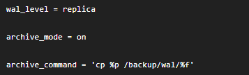

# backup and resotre zabbix with postgres database


```bash
# =========================
# Backup
# =========================

# -F c = custom format
# -f   = output file
# zabbix = database name

sudo -u postgres pg_dump \
  -Fc \
  -f /backup/zabbix_$(date +%F).dump \
  zabbix


# =========================
# Verify backup
# =========================

# List backup contents
sudo -u postgres pg_restore -l /backup/zabbix_*.dump | head
echo $?


# =========================
# Copy backup
# =========================

scp /backup/zabbix_2026-06-01.dump root@NEW_SERVER:/backup/


# =========================
# Stop Zabbix
# =========================

systemctl stop zabbix-server


# Create Zabbix user
sudo -u postgres createuser --pwprompt zabbix

# Create database
sudo -u postgres createdb -O zabbix zabbix

# Create TimescaleDB
sudo -u postgres psql -d zabbix \
  -c "CREATE EXTENSION IF NOT EXISTS timescaledb;"

# Prepare restore
sudo -u postgres psql -d zabbix \
  -c "SELECT timescaledb_pre_restore();"

# Restore as Zabbix owner
sudo -u postgres pg_restore \
  --no-owner \
  --role=zabbix \
  --exit-on-error \
  -d zabbix \
  /backup/zabbix_2026-06-01.dump

# Finish restore
sudo -u postgres psql -d zabbix \
  -c "SELECT timescaledb_post_restore();"


```


```sh
----------------------

# get backup
# -F = Format
# c  = Custom
# -f = output file
# zabbix = database name
sudo -u postgres pg_dump -Fc -f /backup/zabbix_$(date +%F).dump zabbix
# ignore warnings


# verify backup
sudo -u postgres pg_restore -l /backup/zabbix_*.dump | head


scp /backup/zabbix_2026-06-01.dump root@NEW_SERVER:/backup/


systemctl stop zabbix-server


sudo -u postgres createuser --pwprompt zabbix
sudo -u postgres createdb -O zabbix zabbix


sudo -u postgres psql -d zabbix -c "CREATE EXTENSION IF NOT EXISTS timescaledb;"

sudo -u postgres psql -d zabbix -c "SELECT timescaledb_pre_restore();"


sudo -u postgres pg_restore --no-owner -d zabbix /backup/zabbix_2026-06-01.dump

	
sudo -u postgres psql -d zabbix -c "SELECT timescaledb_post_restore();"

sudo -u postgres psql -d zabbix

ALTER FUNCTION public.zbx_ts_unix_now() OWNER TO zabbix;


ALTER TABLE history OWNER TO zabbix;
ALTER TABLE history_uint OWNER TO zabbix;
ALTER TABLE history_str OWNER TO zabbix;
ALTER TABLE history_text OWNER TO zabbix;
ALTER TABLE history_log OWNER TO zabbix;
ALTER TABLE history_bin OWNER TO zabbix;
ALTER TABLE trends OWNER TO zabbix;
ALTER TABLE trends_uint OWNER TO zabbix;

ALTER SCHEMA public OWNER TO zabbix;
GRANT ALL PRIVILEGES ON ALL TABLES IN SCHEMA public TO zabbix;
GRANT ALL PRIVILEGES ON ALL SEQUENCES IN SCHEMA public TO zabbix;
GRANT ALL PRIVILEGES ON ALL FUNCTIONS IN SCHEMA public TO zabbix;

```

# bolting table
```sh
# In PostgreSQL, a bloated table means the table has extra unused space inside it.
# PostgreSQL does not immediately remove old rows from disk when data is updated or deleted. Instead, old/deleted rows stay inside the table as “dead rows” until PostgreSQL cleans them.

# vacuumdb is a PostgreSQL tool that cleans dead rows from tables.

vacuumdb -d zabbix -z -v
# -d zabbix   run on database named zabbix
# -z          also run ANALYZE
# -v          show detailed output


# summery
# Bloated table = table has too much dead/unused space

# VACUUM = cleans dead rows and makes space reusable

# ANALYZE = updates database statistics

# vacuumdb -d zabbix -z -v = VACUUM + ANALYZE on zabbix database

# Normal VACUUM is usually safe

# VACUUM FULL needs maintenance window


```


# pgbackrest
```sh

psql
show  wal_level;
show  archive_mode;
show archive_command;


```



# dbserver: 192.168.85.22
# backup server: 192.168.85.27


```sh


dnf install epel-release
dnf makecache

sudo dnf install pgbackrest

# mkdir -p /root/pgbackrest-pkg

# sudo dnf install --downloadonly --downloaddir=/root/pgbackrest-pkg pgbackrest


# on db- 192.168.85.22
sudo mkdir -p /var/lib/pgbackrest
sudo chown -R postgres:postgres /var/lib/pgbackrest
sudo chmod 750 /var/lib/pgbackrest

```