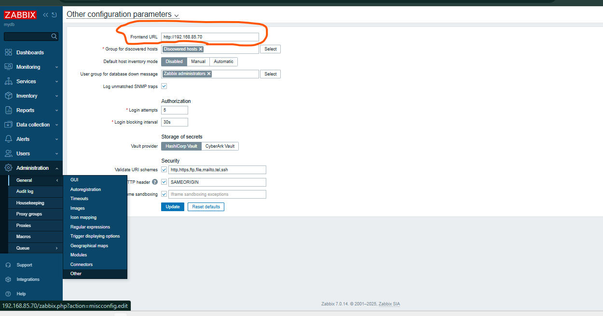

# setup zabbix with postgresql and timescale db

#### os: Rocky linux 9.7
#### zbx server version: 7.0.22
#### postgresql: 18
#### timescaledb: 2.23

#### zbx-srv: 192.168.85.100
#### zbx-db: 192.168.85.101


[time-scale-support-version](https://www.tigerdata.com/docs/self-hosted/latest/upgrades/upgrade-pg)

[install-postgresql](https://www.postgresql.org/download/)


# zbx-db: 192.168.85.101
```sh
dnf install net-tools python3-dnf-plugin-versionlock -y


# add repo
sudo dnf install -y https://download.postgresql.org/pub/repos/yum/reporpms/EL-9-x86_64/pgdg-redhat-repo-latest.noarch.rpm


# install pgsql
sudo dnf install -y postgresql18-server


sudo /usr/pgsql-18/bin/postgresql-18-setup initdb
sudo systemctl enable postgresql-18 --now
sudo systemctl status postgresql-18


# allow ssh 
firewall-cmd --permanent --zone=drop --add-port=22/tcp
firewall-cmd --reload

# change firewalld zone to dorp 
firewall-cmd --zone=drop --change-interface=ens160
firewall-cmd --permanent --zone=drop --change-interface=ens160
firewall-cmd --set-default-zone=drop
firewall-cmd --reload
systemctl stop firewalld.service
systemctl start firewalld.service
firewall-cmd --list-all


# allow icmp
firewall-cmd --permanent --zone=drop --add-icmp-block-inversion
firewall-cmd --permanent --zone=drop --add-icmp-block=echo-request
firewall-cmd --permanent --zone=drop --add-icmp-block=echo-reply
firewall-cmd --reload

firewall-cmd --permanent --zone=drop --add-port=5432/tcp
firewall-cmd --reload


rpm -Uvh https://repo.zabbix.com/zabbix/7.0/rocky/9/x86_64/zabbix-release-latest-7.0.el9.noarch.rpm
# dnf clean all
dnf makecache


dnf list --showduplicates zabbix-sql-scripts
dnf list --showduplicates zabbix-agent2
dnf list --showduplicates zabbix-selinux-policy


# install zabbix packages for setting up our databases
dnf install -y zabbix-sql-scripts-7.0.22
dnf install -y zabbix-agent2-7.0.22
dnf install -y zabbix-selinux-policy-7.0.22


dnf list zabbix-agent2-plugin-mongodb --showduplicates
dnf install -y zabbix-agent2-plugin-mongodb-7.0.22
dnf install -y zabbix-agent2-plugin-mssql-7.0.22
dnf install -y zabbix-agent2-plugin-postgresql-7.0.22


# create database and user
sudo -u postgres createuser --pwprompt zabbix
sudo -u postgres createdb -O zabbix zabbix

# create schema 
zcat /usr/share/zabbix-sql-scripts/postgresql/server.sql.gz | sudo -u zabbix psql zabbix


vim /var/lib/pgsql/18/data/postgresql.conf
-----
listen_addresses = '192.168.85.101'

-----

vim /var/lib/pgsql/18/data/pg_hba.conf
-----
host    zabbix             zabbix             192.168.85.100/32            scram-sha-256
-----

systemctl restart postgresql-18.service


```

# zbx-srv: 192.168.85.100

```sh


dnf install glibc-langpack-en net-tools python3-dnf-plugin-versionlock -y


# allow ssh 
firewall-cmd --permanent --zone=drop --add-port=22/tcp
firewall-cmd --reload

# change firewalld zone to dorp 
firewall-cmd --zone=drop --change-interface=ens160
firewall-cmd --permanent --zone=drop --change-interface=ens160
firewall-cmd --set-default-zone=drop
firewall-cmd --reload
systemctl stop firewalld.service
systemctl start firewalld.service
firewall-cmd --list-all


# allow icmp
firewall-cmd --permanent --zone=drop --add-icmp-block-inversion
firewall-cmd --permanent --zone=drop --add-icmp-block=echo-request
firewall-cmd --permanent --zone=drop --add-icmp-block=echo-reply
firewall-cmd --reload

firewall-cmd --permanent --zone=drop --add-port=10051/tcp
firewall-cmd --permanent --zone=drop --add-port=10050/tcp
firewall-cmd --permanent --zone=drop --add-port=80/tcp
firewall-cmd --reload


rpm -Uvh https://repo.zabbix.com/zabbix/7.0/rocky/9/x86_64/zabbix-release-latest-7.0.el9.noarch.rpm
# dnf clean all
dnf makecache


dnf list zabbix-server-pgsql --showduplicates
dnf list zabbix-web-pgsql --showduplicates
dnf list zabbix-nginx-conf --showduplicates
dnf list zabbix-sql-scripts --showduplicates
dnf list zabbix-selinux-policy --showduplicates
dnf list zabbix-agent2 --showduplicates


dnf install -y zabbix-server-pgsql-7.0.22
dnf install -y zabbix-web-pgsql-7.0.22
dnf install -y zabbix-nginx-conf-7.0.22
dnf install -y zabbix-sql-scripts-7.0.22
dnf install -y zabbix-selinux-policy-7.0.22
dnf install -y zabbix-agent2-7.0.22


dnf install -y zabbix-agent2-plugin-mongodb-7.0.22
dnf install -y zabbix-agent2-plugin-mssql-7.0.22
dnf install -y zabbix-agent2-plugin-postgresql-7.0.22


# set DBPassword in /etc/zabbix/zabbix_server.conf
vim /etc/zabbix/zabbix_server.conf
------
DBHost=192.168.85.71
DBPassword=123456
DBName=zabbix
DBUser=zabbix
-----
# change nginx config
vim /etc/nginx/conf.d/zabbix.conf
------
listen 80;
server_name 192.168.85.70;

-----


systemctl restart zabbix-server zabbix-agent2 nginx php-fpm
systemctl enable zabbix-server zabbix-agent2 nginx php-fpm --now


```


# zbx-db: 192.168.85.101  # config timescaledb
```sh
# first stop the zabbix server 
# go to the zabbix server machine and stop zabbix-server process
systemctl stop zabbix-server


# now go back to zbx-db machine

# setup timescaledb
sudo tee /etc/yum.repos.d/timescale_timescaledb.repo <<EOL
[timescale_timescaledb]
name=timescale_timescaledb
baseurl=https://packagecloud.io/timescale/timescaledb/el/$(rpm -E %{rhel})/\$basearch
repo_gpgcheck=1
gpgcheck=0
enabled=1
gpgkey=https://packagecloud.io/timescale/timescaledb/gpgkey
sslverify=1
sslcacert=/etc/pki/tls/certs/ca-bundle.crt
metadata_expire=300
EOL

# dnf clean all
dnf makecache

# show and select specific version of timescaledb
dnf list timescaledb-2-postgresql-18 --showduplicates
dnf list timescaledb-2-loader-postgresql-18 --showduplicates
dnf list timescaledb-tools --showduplicates


dnf install timescaledb-2-postgresql-18-2.23.1 timescaledb-2-loader-postgresql-18-2.23.1 timescaledb-tools-0.18.2


sudo dnf versionlock add timescaledb-2-postgresql-18
sudo dnf versionlock timescaledb-2-loader-postgresql-18
sudo dnf versionlock timescaledb-tools 

sudo dnf versionlock list


# Configure TimescaleDB
sudo timescaledb-tune --pg-config=/usr/pgsql-18/bin/pg_config


vim /var/lib/pgsql/18/data/postgresql.conf
-----
shared_preload_libraries = 'timescaledb'
-----

sudo systemctl restart postgresql-18.service


# Create timescaledb extension
sudo su - postgres
psql  zabbix
CREATE EXTENSION IF NOT EXISTS timescaledb CASCADE;
\dx

# Patch Zabbix database
\i /usr/share/zabbix-sql-scripts/postgresql/timescaledb/schema.sql
exit
exit


# back to zabbix server and Start the zabbix server
sudo systemctl start zabbix-server


```


# report manager
# zbx-srv - 85.100
```sh

# on the zabbix server
dnf install zabbix-web-service


sudo nano /etc/yum.repos.d/google-chrome.repo
----------
[google-chrome]
name=google-chrome
baseurl=http://dl.google.com/linux/chrome/rpm/stable/$basearch
enabled=1
gpgcheck=1
gpgkey=https://dl-ssl.google.com/linux/linux_signing_key.pub

----------

dnf makecache

dnf install -y google-chrome-stable


vim /etc/zabbix/zabbix_server.conf
--------

StartReportWriters=3
WebServiceURL=http://localhost:10053/report
--------

vim /etc/zabbix/zabbix_web_service.conf
------

AllowedIP=127.0.0.1,::1
-------


systemctl restart zabbix-server.service
systemctl enable zabbix-web-service.service --now

systemctl restart zabbix-web-service.service


chown -R zabbix:zabbix /var/lib/zabbix
chmod 750 /var/lib/zabbix

mkdir -p /var/lib/zabbix/.local/share/applications
chown -R zabbix:zabbix /var/lib/zabbix/.local


# now you can test your reports.
# you have to create Email-HTML type 


# run below command 
getent passwd zabbix

# if not the same below
zabbix:x:997:995:Zabbix Monitoring System:/var/lib/zabbix:/sbin/nologin
# If HOME is NOT /var/lib/zabbix, fix it:
usermod -d /var/lib/zabbix zabbix


# the last step is to add the address in zabbix like below image
```



# Selinux configurations
```sh

tail -f /var/log/audit/audit.log

setenforce 0
sestatus  # now its on permisive mode


grep zabbix_t /var/log/audit/audit.log  | audit2allow -M zabbix-server
ls
cat zabbix-server.pp

semodule -i zabbix-server.pp
echo $?
cat zabbix-server.te
setenforce 1
sestatus
tail -f /var/log/audit/audit.log

```


