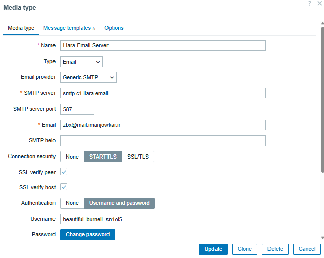

# report manager
# on the zabbix server - 85.70
```sh

# on the zabbix server
dnf install zabbix-web-service


sudo nano /etc/yum.repos.d/google-chrome.repo
----------
[google-chrome]
name=google-chrome
baseurl=http://dl.google.com/linux/chrome/rpm/stable/$basearch
enabled=1
gpgcheck=1
gpgkey=https://dl-ssl.google.com/linux/linux_signing_key.pub

----------

dnf makecache

dnf install -y google-chrome-stable


vim /etc/zabbix/zabbix_server.conf
--------

StartReportWriters=3
WebServiceURL=http://localhost:10053/report
--------

vim /etc/zabbix/zabbix_web_service.conf
------

AllowedIP=127.0.0.1,::1
-------


systemctl restart zabbix-server.service
systemctl enable zabbix-web-service.service --now

systemctl restart zabbix-web-service.service


chown -R zabbix:zabbix /var/lib/zabbix
chmod 750 /var/lib/zabbix

mkdir -p /var/lib/zabbix/.local/share/applications
chown -R zabbix:zabbix /var/lib/zabbix/.local


# now you can test your reports.
# you have to create Email-HTML type 


# run below command 
getent passwd zabbix

# if not the same below
zabbix:x:997:995:Zabbix Monitoring System:/var/lib/zabbix:/sbin/nologin
# If HOME is NOT /var/lib/zabbix, fix it:
usermod -d /var/lib/zabbix zabbix


# the last step is to add the address in zabbix like below image
```


# Selinux configurations
```sh

tail -f /var/log/audit/audit.log

setenforce 0
sestatus  # now its on permisive mode


grep zabbix_t /var/log/audit/audit.log  | audit2allow -M zabbix-server
ls
cat zabbix-server.pp

semodule -i zabbix-server.pp
echo $?
cat zabbix-server.te
setenforce 1
sestatus
tail -f /var/log/audit/audit.log

```




