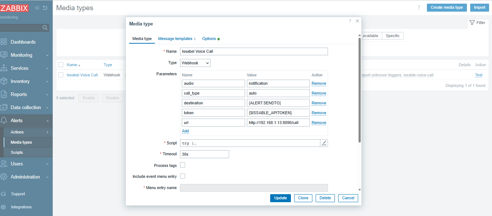
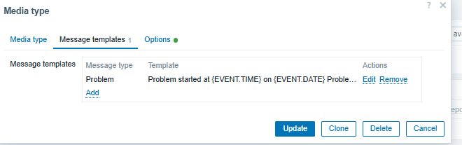
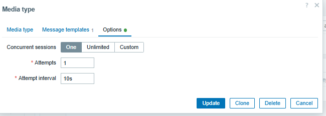

# Setup on issable server
```sh
asterisk -rx "core show version"
python3 --version
cat /etc/os-release


# check if we user pjsip or sip
asterisk -rx "pjsip show endpoint 201"
asterisk -rx "sip show peer 201"


asterisk -rx "manager show settings"

# you have to see something like below
----
Enabled: Yes
TCP Bindaddress: 127.0.0.1:5038
----

ss -lntp | grep 5038


# 
grep -n "manager_custom.conf" /etc/asterisk/manager.conf
# must contain #include manager_custom.conf

# create random password
openssl rand -hex 32

vim /etc/asterisk/manager_custom.conf
----
[call-api]
secret = 1f8bxftyg5rtu76hrtyiuhyrtihjkuykuutgsdfrtre0123456789abcd
deny = 0.0.0.0/0.0.0.0
permit = 127.0.0.1/255.255.255.255
read = call
write = originate
displayconnects = no
----

asterisk -rx "manager reload"
asterisk -rx "manager show user call-api"

# create dialplan
grep -n "extensions_custom.conf" /etc/asterisk/extensions.conf
# you have to see something like #include extensions_custom.conf

vim /etc/asterisk/extensions_custom.conf
-----
[api-playback]
exten => s,1,NoOp(API audio call started)
 same => n,NoOp(Audio file: ${AUDIO_FILE})
 same => n,Answer()
 same => n,Wait(1)
 same => n,Playback(${AUDIO_FILE})
 same => n,NoOp(Playback status: ${PLAYBACKSTATUS})
 same => n,Hangup()
-----


# reload dialplan
asterisk -rx "dialplan reload"
asterisk -rx "dialplan show api-playback"

# you have to see Answer, Wait, Playback, Hangup


# find asterisk data dir
grep -E '^[[:space:]]*astdatadir' /etc/asterisk/asterisk.conf   # something like astdatadir => /var/lib/asterisk


mkdir -p /var/lib/asterisk/sounds/custom
chown asterisk:asterisk /var/lib/asterisk/sounds/custom
chmod 755 /var/lib/asterisk/sounds/custom


ffmpeg -i /root/notification.mp3 -ar 8000 -ac 1  -c:a pcm_s16le /root/notification.wav

ffprobe -v error -show_entries stream=codec_name,sample_rate,channels -of default=noprint_wrappers=1 /root/notification.wav


install -o asterisk -g asterisk -m 0644 /root/notification.wav /var/lib/asterisk/sounds/custom/notification.wav

ls -lh /var/lib/asterisk/sounds/custom/notification.wav
file /var/lib/asterisk/sounds/custom/notification.wav

asterisk -rx "channel originate PJSIP/201 application Playback custom/notification"
asterisk -rx "channel originate SIP/201 application Playback custom/notification"


asterisk -rx "channel originate Local/09123456789@from-internal/n application Playback custom/notification"


mkdir -p /opt/issabel-call-api
vim /opt/issabel-call-api/app.py
-------

-------

chown root:root /opt/issabel-call-api/app.py
chmod 700 /opt/issabel-call-api/app.py


python3 -m py_compile /opt/issabel-call-api/app.py
echo $?

python3 /opt/issabel-call-api/app.py


# test api
curl -i http://127.0.0.1:8090/health

# internal call
curl -i \
  -X POST \
  "http://127.0.0.1:8090/call" \
  -H "Authorization: Bearer YOUR-API-TOKEN" \
  -H "Content-Type: application/json" \
  -d '{
    "type": "internal",
    "destination": "201",
    "audio": "notification"
  }'

```

```sh
# external call
curl -i \
  -X POST \
  "http://127.0.0.1:8090/call" \
  -H "Authorization: Bearer YOUR-API-TOKEN" \
  -H "Content-Type: application/json" \
  -d '{
    "type": "external",
    "destination": "09123456789",
    "audio": "notification"
  }'


```


```sh
# create systemd unit file
vim /etc/systemd/system/issabel-call-api.service
----

[Unit]
Description=Issabel Call API
After=network.target asterisk.service
Wants=asterisk.service

[Service]
Type=simple
WorkingDirectory=/opt/issabel-call-api
ExecStart=/usr/bin/python3 /opt/issabel-call-api/app.py

User=root
Group=root

Environment=PYTHONUNBUFFERED=1

Restart=on-failure
RestartSec=3

NoNewPrivileges=true
PrivateTmp=true

[Install]
WantedBy=multi-user.target
----

systemctl daemon-reload
systemctl enable --now issabel-call-api


systemctl status issabel-call-api
journalctl -u issabel-call-api -f


curl -i \
  -X POST \
  "http://127.0.0.1:8090/call" \
  -H "Authorization: Bearer YOUR-API-TOKEN" \
  -H "Content-Type: application/json" \
  -d '{
    "type": "external",
    "destination": "09123456789",
    "audio": "notification"
  }'


```

# add zabbix media type




```sh
# parameters
audio=notification
call_type=external
destination={ALERT.SENDTO}
token={$ISSABLE_APITOKEN}
url=http://192.168.1.13:8090/call


# in the script paster below
------

try {
    var params = JSON.parse(value),
        request,
        response,
        statusCode,
        callType,
        payload;

    function required(name) {
        if (typeof params[name] === 'undefined' ||
                params[name] === null ||
                String(params[name]).trim() === '') {
            throw 'Missing parameter: ' + name;
        }

        return String(params[name]).trim();
    }

    params.url = required('url');
    params.token = required('token');
    params.destination = required('destination');
    params.audio = required('audio');

    callType = String(params.call_type || 'auto').trim().toLowerCase();


    if (callType === 'auto') {
        if (/^[1-9][0-9]{1,5}$/.test(params.destination)) {
            callType = 'internal';
        }
        else if (/^09[0-9]{9}$/.test(params.destination)) {
            callType = 'external';
        }
        else {
            throw 'Cannot detect destination type: ' + params.destination;
        }
    }

    if (callType !== 'internal' && callType !== 'external') {
        throw 'Invalid call_type: ' + callType;
    }


    if (
        params.audio !== 'notification' &&
        params.audio !== 'critical' &&
        params.audio !== 'disaster'
    ) {
        throw 'Invalid audio identifier: ' + params.audio;
    }

    payload = JSON.stringify({
        type: callType,
        destination: params.destination,
        audio: params.audio
    });


    if (typeof HttpRequest !== 'undefined') {
        request = new HttpRequest();

        request.addHeader('Content-Type: application/json');
        request.addHeader(
            'Authorization: Bearer ' + params.token
        );

        response = request.post(
            params.url,
            payload
        );

        statusCode = request.getStatus();
    }
    else if (typeof CurlHttpRequest !== 'undefined') {
        request = new CurlHttpRequest();

        request.AddHeader('Content-Type: application/json');
        request.AddHeader(
            'Authorization: Bearer ' + params.token
        );

        response = request.Post(
            params.url,
            payload
        );

        statusCode = request.Status();
    }
    else {
        throw 'HttpRequest is not available in this Zabbix version';
    }

    Zabbix.log(
        4,
        '[ Issabel Voice ] URL=' + params.url +
        ' destination=' + params.destination +
        ' type=' + callType +
        ' audio=' + params.audio +
        ' status=' + statusCode +
        ' response=' + response
    );

    if (statusCode < 200 || statusCode >= 300) {
        throw 'HTTP ' + statusCode + ': ' + response;
    }

    return response;
}
catch (error) {
    Zabbix.log(
        3,
        '[ Issabel Voice ] Failed: ' + error
    );

    throw 'Issabel Voice failed: ' + error;
}

------


```