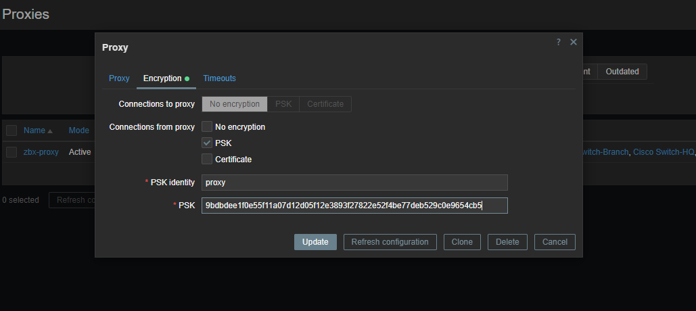

## install zabbix proxy

```sh
sudo apt install sqlite3


wget https://repo.zabbix.com/zabbix/7.0/ubuntu/pool/main/z/zabbix-release/zabbix-release_7.0-1+ubuntu20.04_all.deb
dpkg -i zabbix-release_7.0-1+ubuntu20.04_all.deb
apt update


apt install zabbix-proxy-sqlite3


vim /etc/zabbix/zabbix_proxy.conf

ProxyMode: 
    0 - proxy in the active mode
    1 - proxy in the passive mode

#### 
# ProxyMode=0
Server=10.10.10.10  # zabbix server ip
Hostname=zbx-proxy
DBName=/tmp/zabbix_proxy.db
####

systemctl restart zabbix-proxy
systemctl enable zabbix-proxy
```


## enable psk between zabbix server and zabbix proxy

```sh
# generate a random number for using as a secret in zabbix

cd /etc/zabbix
openssl rand -hex 32 > secret.psk

chmod 640 secret.psk
chown zabbix: secret.psk


# add below config to you zabbix_proxy.conf or zabbix_agent.conf
TLSConnect=psk
TLSAccept=psk
TLSPSKIdentity=proxy
TLSPSKFile=/etc/zabbix/secret.psk


# next enable encryption in zabbix UI like below image
```



## zabbix-proxy high availability

```sh


```