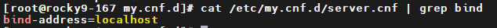

# Setup mariadb 
## Install the LTS version of that

[MariaDB Lifecycle: End Of Life And Support Status](https://www.itechtics.com/eol/mariadb/)

[add mariadb-repository](https://mariadb.org/download/?t=mariadb&o=true&p=mariadb&r=11.4.4&os=windows&cpu=x86_64&pkg=msi&mirror=archive)

#### installation on RHEL
```sh
cat >> /etc/yum.repos.d/mariadb.repo <<EOF
# MariaDB 11.4 RedHatEnterpriseLinux repository list - created 2025-05-24 05:38 UTC
# https://mariadb.org/download/
[mariadb]
name = MariaDB
# rpm.mariadb.org is a dynamic mirror if your preferred mirror goes offline. See https://mariadb.org/mirrorbits/ for details.
# baseurl = https://rpm.mariadb.org/11.4/rhel/\$releasever/\$basearch
baseurl = https://mirror.parsvds.com/mariadb/yum/11.4/rhel/\$releasever/\$basearch
# gpgkey = https://rpm.mariadb.org/RPM-GPG-KEY-MariaDB
gpgkey = https://mirror.parsvds.com/mariadb/yum/RPM-GPG-KEY-MariaDB
gpgcheck = 1
EOF


dnf makecache
dnf list | grep MariaDB-server 
sudo dnf install MariaDB-server MariaDB-client
mariadb-secure-installation

```



## installation on ubuntu 
### Install the LTS version of that


[MariaDB Lifecycle: End Of Life And Support Status](https://www.itechtics.com/eol/mariadb/)

[add mariadb-repository](https://mariadb.org/download/?t=mariadb&o=true&p=mariadb&r=11.4.4&os=windows&cpu=x86_64&pkg=msi&mirror=archive)


```sh
apt-cache policy mariadb-server

apt install mariadb-server

mariadb_secure_installation
```

# some query

```sh
# create user
CREATE USER 'iman1'@'localhost' IDENTIFIED BY 'test';
GRANT ALL ON *.* TO 'iman1'@'localhost';
FLUSH PRIVILEGES;


CREATE USER 'iman1'@'%' IDENTIFIED BY 'test';
GRANT ALL ON zabbix.* TO 'iman1'@'%';
FLUSH PRIVILEGES;

# change root password
alter user 'root'@'localhost' identified by 'root';


 mariadb -u root -p
 use mysql;
 select host,user,password from user;

```