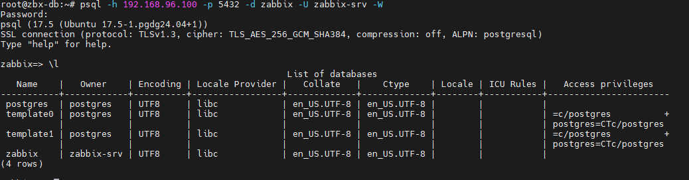

# Database

## install postgresql on ubuntu from postgresql repositroy

### initialize the server
```sh
hostnamectl set-hostname zbx-db # change in /etc/hosts too


```

[version-EOL](https://endoflife.date/postgresql)

[installation](https://www.postgresql.org/download/)


```sh
# Import the repository signing key:
sudo apt install curl ca-certificates
sudo install -d /usr/share/postgresql-common/pgdg
sudo curl -o /usr/share/postgresql-common/pgdg/apt.postgresql.org.asc --fail https://www.postgresql.org/media/keys/ACCC4CF8.asc

# Create the repository configuration file:
. /etc/os-release
sudo sh -c "echo 'deb [signed-by=/usr/share/postgresql-common/pgdg/apt.postgresql.org.asc] https://apt.postgresql.org/pub/repos/apt $VERSION_CODENAME-pgdg main' > /etc/apt/sources.list.d/pgdg.list"

# Update the package lists:
sudo apt update

# Install the latest version of PostgreSQL:
# If you want a specific version, use 'postgresql-17' or similar instead of 'postgresql'
sudo apt -y install postgresql


```


```sh
psql -h 192.168.96.100 -p 5432 -d db_name -U username -W

\l    # list all databases 
\l+   # show more info
\x    # enable or disable expanded mode
```



```sh
create database shop;
drop database shop;


# switch between databases;
\c zabbix;
\c postgres;
\c template1;
\connect zabbix;

\x
select * from users;
\dt   # show tables info about tables
\dt+  # show more detail info about tables


```

## create user and role

```sh
\du     # show all rule name
\conninfo

create role iman;
drop role iman;


create role iman with login;
alter role iman with superuser ;
alter role iman with nosuperuser ;

create role iman10 with password 'superpass';

```