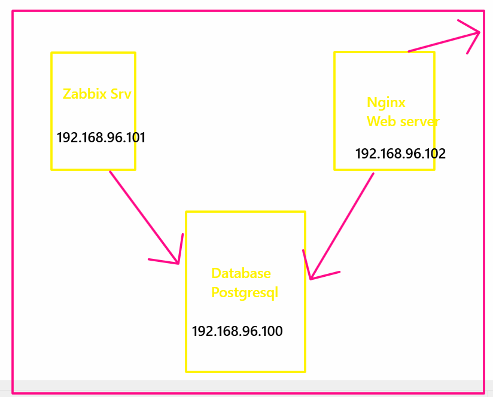
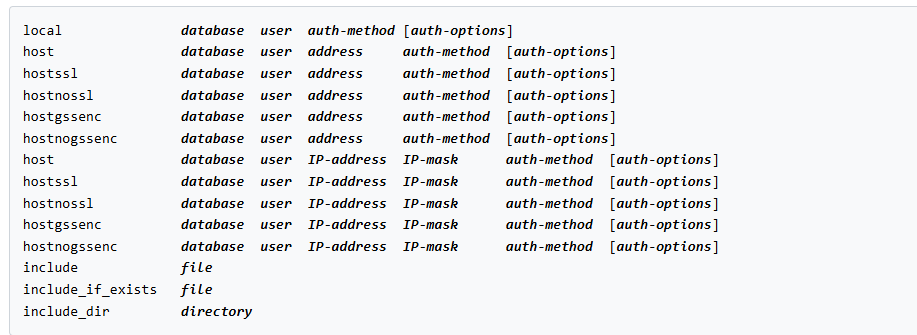
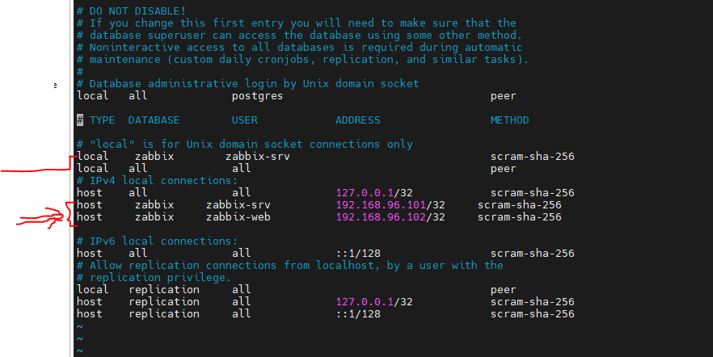

# install postgresql on ubuntu from postgresql repositroy



### initialize the server
```sh

hostnamectl set-hostname zbx-db # change in /etc/hosts too

```

[version-EOL](https://endoflife.date/postgresql)
[installation](https://www.postgresql.org/download/)

```sh

# Import the repository signing key:
sudo apt install curl ca-certificates
sudo install -d /usr/share/postgresql-common/pgdg
sudo curl -o /usr/share/postgresql-common/pgdg/apt.postgresql.org.asc --fail https://www.postgresql.org/media/keys/ACCC4CF8.asc

# Create the repository configuration file:
. /etc/os-release
sudo sh -c "echo 'deb [signed-by=/usr/share/postgresql-common/pgdg/apt.postgresql.org.asc] https://apt.postgresql.org/pub/repos/apt $VERSION_CODENAME-pgdg main' > /etc/apt/sources.list.d/pgdg.list"

# Update the package lists:
sudo apt update

# Install the latest version of PostgreSQL:
# If you want a specific version, use 'postgresql-17' or similar instead of 'postgresql'
sudo apt -y install postgresql


```

### connect to database engine
```sh

sudo su postgres
psql
SELECT version();

```


### change the connection to listen on all interfaces
```sh
vim /etc/postgresql/17/main/postgresql.conf
----------
listen_addresses = '0.0.0.0'
----------
systemctl restart postgresql

```
### config pghba file for accesing to the database



```sh
vim  /etc/postgresql/17/main/pg_hba.conf
----
# "local" is for Unix domain socket connections only
local    zabbix     zabbix-srv                                scram-sha-256

# IPv4 local connections:
host     zabbix     zabbix-srv          192.168.96.101/32     scram-sha-256
host     zabbix     zabbix-web          192.168.96.102/32     scram-sha-256

---

systemctl restart postgresql


```

### config the firewall

```sh
ufw status
ufw enable
# ufw allow 5432/tcp
sudo ufw allow from 192.168.96.101 to any port 5432
sudo ufw allow from 192.168.96.102 to any port 5432
```
## Create ZBX DB
```sh
wget https://repo.zabbix.com/zabbix/7.0/ubuntu/pool/main/z/zabbix-release/zabbix-release_latest_7.0+ubuntu24.04_all.deb
dpkg -i zabbix-release_latest_7.0+ubuntu24.04_all.deb
apt update
apt install zabbix-sql-scripts

gzip -d /usr/share/zabbix-sql-scripts/postgresql/server.sql.gz

# switch to postgres user

sudo su - postgres
createuser --pwprompt zabbix-srv
createuser --pwprompt zabbix-web

```
## unzip the zabbix database and create the database
```sh
su - postgres
createdb -E Unicode -O zabbix-srv zabbix
exit

# login to database with its user
psql -d zabbix -U zabbix-srv
SELECT session_user, current_user;
```


##  Create a schema 

```sql
CREATE SCHEMA zabbix_server AUTHORIZATION "zabbix-srv";
SET search_path TO "zabbix_server";

# list the existing schema
\dn

GRANT USAGE ON SCHEMA zabbix_server TO "zabbix-web";

sql zabbix=# \i /usr/share/zabbix-sql-scripts/postgresql/server.sql

GRANT SELECT, INSERT, UPDATE, DELETE ON ALL TABLES IN SCHEMA zabbix_server TO "zabbix-web";
GRANT SELECT, UPDATE ON ALL SEQUENCES IN SCHEMA zabbix_server TO "zabbix-web";


# you can confirm that all the tables are created successfully
\dt
```


# config the zabbix server
```sh
hostnamectl set-hostname zbx-srv # change the /etc/hosts too


wget https://repo.zabbix.com/zabbix/7.0/ubuntu/pool/main/z/zabbix-release/zabbix-release_latest_7.0+ubuntu24.04_all.deb
dpkg -i zabbix-release_latest_7.0+ubuntu24.04_all.deb
apt update

ufw allow 22/tcp
ufw enable

apt install zabbix-server-pgsql zabbix-frontend-php php8.3-pgsql zabbix-nginx-conf zabbix-sql-scripts zabbix-agent2


apt install zabbix-server-pgsql

vim /etc/zabbix/zabbix_server.conf
----
DBHost=192.168.96.100
DBName=zabbix
DBSchema=zabbix_server
DBUser=zabbix-srv
DBPassword=superpassword
DBPort=5432
----


systemctl enable --now zabbix-server.service
```