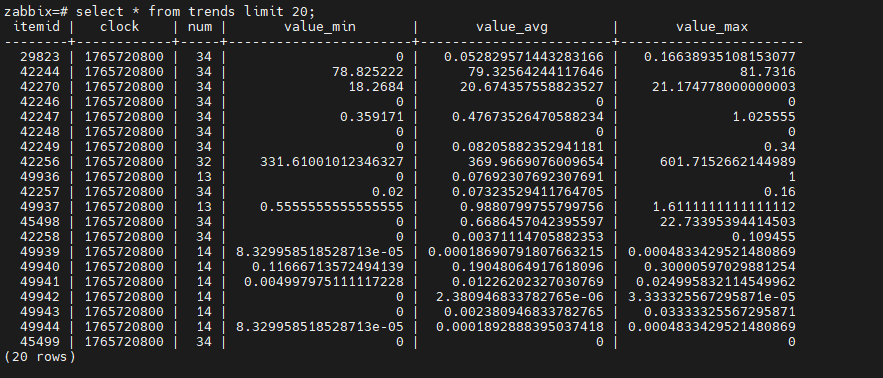

# if you got `System locale` error install the folowing pakages:

```sh

dnf install glibc-langpack-en

```
[ref](https://www.tecmint.com/fix-failed-to-set-locale-defaulting-to-c-utf-8-in-centos/)


## run command with zabbix user
```sh

sudo -u zabbix systemctl status nginx
sudo -u zabbix ssh-keygen
sudo -u zabbix ssh user@10.10.10.1
sudo -u zabbix ls -lah


```


# security
```sh

# hide nginx version
vim /etc/nginx/nginx.conf
-----
server_tokens       off;
-----

nginx -s reload


# hide php version 
vim /etc/php.ini
-----
expose_php = Off
-----
systemctl restart php-fpm

```

# inspect zabbix db

```sh

su - postgres
psql
\l 
\c zabbix;
\dt

\dt history*
\dt trends*

select hypertable_schema, hypertable_name FROM timescaledb_information.hypertables;


select * from history limit 10;

```




```sql

select i.name,h.* from items i, history h where h.itemid=i.itemid limit 10;
select i.name, i.key_, h.* from items i, history h where h.itemid=i.itemid limit 100;

```
##  reset zabbix password for mariadb
```sh
# for installing htpasswd
sudo dnf install httpd-tools -y
sudo apt install apache2-utils -y


htpasswd -bnBC 10 "" YourNewPassword | tr -d ':'
# copy the output

update users set passwd='<copied output>' where alias='Admin';          # zabbix 5
update users set passwd='<copied output>' where username='Admin';       # zabbix 6, 7

UPDATE users SET passwd = '$2a$10$ZXIvHAEP2ZM.dLXTm6uPHOMVlARXX7cqjbhM6Fn0cANzkCQBWpMrS' WHERE username = 'Admin';

```


## reset zabbix password in postgresql database

```sh


htpasswd -bnBC 10 "" newpasswd | tr -d ':\n'

psql
\c zabbix;

zabbix=# SELECT username, name, passwd from users;
zabbix=# UPDATE users SET passwd='5be9a68073f66a56554e25614e9f1c9a' WHERE username='iman';
UPDATE 1


select userid, sessionid, status, lastaccess from sessions;
DELETE FROM sessions WHERE userid = 3;


```


### you can change the login type in database 
```sh
mariadb -u root -p
show databases;
use zabbix;

select authentication_type from config;

        0: Internal
        1: LDAP

update config set authentication_type=1;
select authentication_type from config;


```


# useful command

```sh

find / -size +10M
sed -i 's/find/pattern/g' /etc/zabbix/zabbix.conf

sudo -H -u zabbix bash -c 'tail -f /var/log/nginx/access.log'
```


## Zabbix GET

```sh
dnf install zabbix-get
apt install zabbix-get


zabbix_get -s 192.168.85.70 -k agent.ping
zabbix_get -s 192.168.85.70 -k system.uptime
zabbix_get -s 192.168.85.70 -k agent.version
zabbix_get -s 192.168.85.70 -k vfs.dir.get[/iman] | jq
zabbix_get -s 192.168.85.70 -k vfs.file.contents[/etc/passwd]
zabbix_get -s 192.168.85.70 -k system.sw.packages[nginx]


zabbix_get -s 192.168.85.70 -k system.cpu.load[,avg1]
zabbix_get -s 192.168.85.70 -k system.cpu.load[,avg5]
zabbix_get -s 192.168.85.70 -k system.cpu.load[,avg15]


zabbix_get -s 192.168.85.70 -k system.cpu.num
nproc


zabbix_get -s 192.168.85.70 -k system.cpu.util[0,idle,avg15] # only show for cpu 1
zabbix_get -s 192.168.85.70 -k system.cpu.util[,idle,avg15]  # for all cpus


```


## simulate load on linux

```sh

dnf install epel-release
dnf install stress

stress --cpu 4 --timeout 60   # 4 CPU workers for 60 seconds

# load on the system without installing any extra package
yes > /dev/null

```