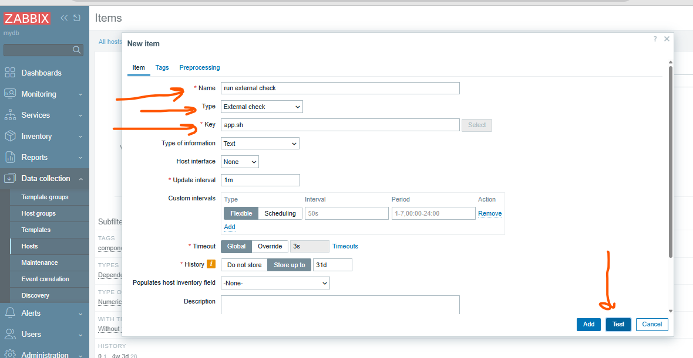
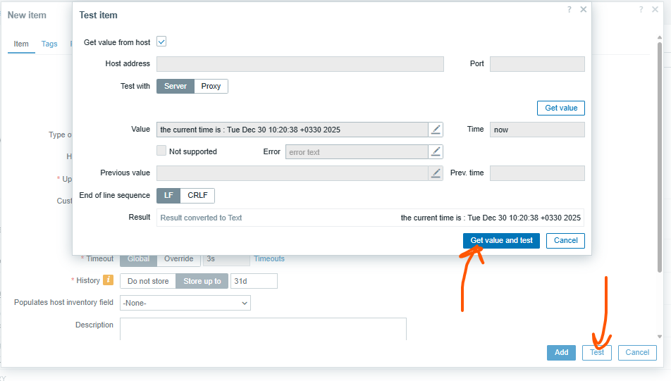
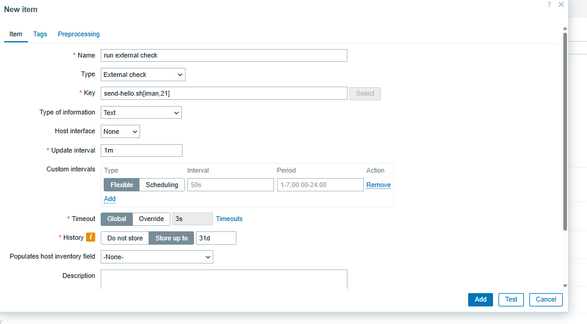
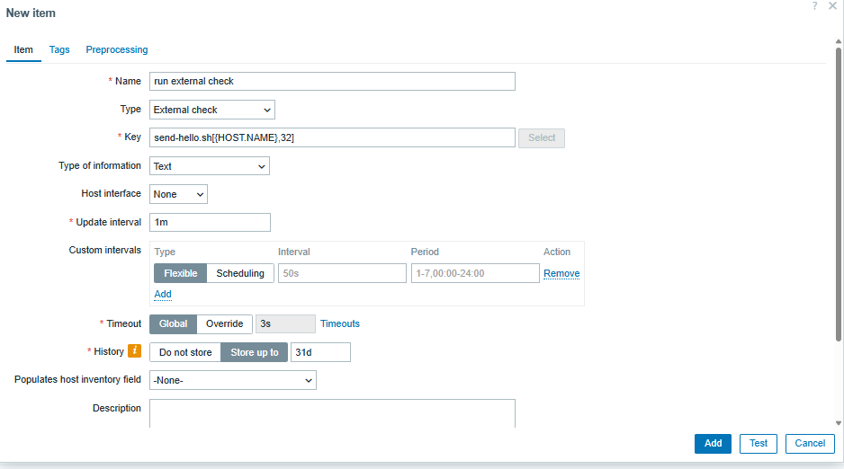
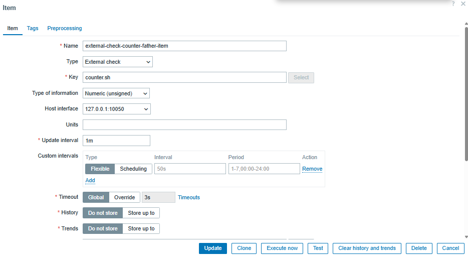
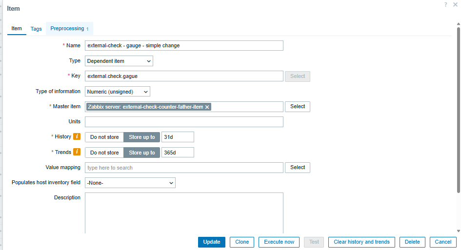
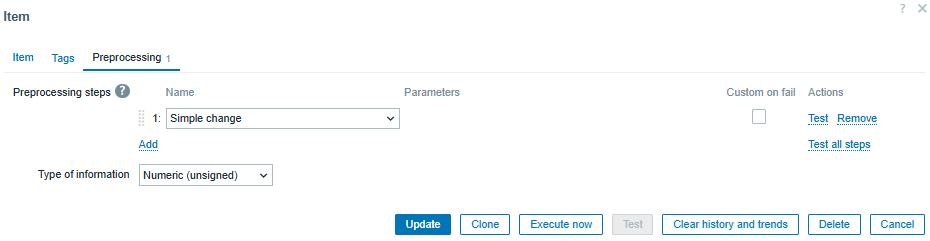
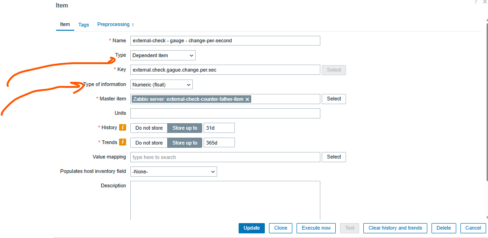
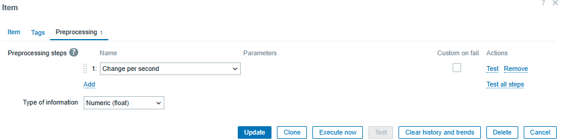

# if you got `System locale` error install the folowing pakages:

```sh

dnf install glibc-langpack-en

```
[ref](https://www.tecmint.com/fix-failed-to-set-locale-defaulting-to-c-utf-8-in-centos/)


## run command with zabbix user
```sh

sudo -u zabbix systemctl status nginx
sudo -u zabbix ssh-keygen
sudo -u zabbix ssh user@10.10.10.1
sudo -u zabbix ls -lah


```


# security
```sh

# hide nginx version
vim /etc/nginx/nginx.conf
-----
server_tokens       off;
-----

nginx -s reload


# hide php version 
vim /etc/php.ini
-----
expose_php = Off
-----
systemctl restart php-fpm

```

# inspect zabbix db

```sh

su - postgres
psql
\l 
\c zabbix;
\dt

\dt history*
\dt trends*

select hypertable_schema, hypertable_name FROM timescaledb_information.hypertables;


select * from history limit 10;

```


```sql

select i.name,h.* from items i, history h where h.itemid=i.itemid limit 10;
select i.name, i.key_, h.* from items i, history h where h.itemid=i.itemid limit 100;

```
##  reset zabbix password for mariadb
```sh
# for installing htpasswd
sudo dnf install httpd-tools -y
sudo apt install apache2-utils -y


htpasswd -bnBC 10 "" YourNewPassword | tr -d ':'
# copy the output

update users set passwd='<copied output>' where alias='Admin';          # zabbix 5
update users set passwd='<copied output>' where username='Admin';       # zabbix 6, 7

UPDATE users SET passwd = '$2a$10$ZXIvHAEP2ZM.dLXTm6uPHOMVlARXX7cqjbhM6Fn0cANzkCQBWpMrS' WHERE username = 'Admin';

```


## reset zabbix password in postgresql database

```sh


htpasswd -bnBC 10 "" newpasswd | tr -d ':\n'

psql
\c zabbix;

zabbix=# SELECT username, name, passwd from users;
zabbix=# UPDATE users SET passwd='5be9a68073f66a56554e25614e9f1c9a' WHERE username='iman';
UPDATE 1


select userid, sessionid, status, lastaccess from sessions;
DELETE FROM sessions WHERE userid = 3;


```


### you can change the login type in database 
```sh
mariadb -u root -p
show databases;
use zabbix;

select authentication_type from config;

        0: Internal
        1: LDAP

update config set authentication_type=1;
select authentication_type from config;


```


# useful command

```sh

find / -size +10M
sed -i 's/find/pattern/g' /etc/zabbix/zabbix.conf

sudo -H -u zabbix bash -c 'tail -f /var/log/nginx/access.log'
```


# Zabbix GET

```sh
dnf install zabbix-get
apt install zabbix-get


zabbix_get -s 192.168.85.70 -k agent.ping
zabbix_get -s 192.168.85.70 -k system.uptime
zabbix_get -s 192.168.85.70 -k agent.version
zabbix_get -s 192.168.85.70 -k vfs.dir.get[/iman] | jq
zabbix_get -s 192.168.85.70 -k vfs.file.contents[/etc/passwd]
zabbix_get -s 192.168.85.70 -k system.sw.packages[nginx]


zabbix_get -s 192.168.85.70 -k system.cpu.load[,avg1]
zabbix_get -s 192.168.85.70 -k system.cpu.load[,avg5]
zabbix_get -s 192.168.85.70 -k system.cpu.load[,avg15]


zabbix_get -s 192.168.85.70 -k system.cpu.num
nproc


zabbix_get -s 192.168.85.70 -k system.cpu.util[0,idle,avg15] # only show for cpu 1
zabbix_get -s 192.168.85.70 -k system.cpu.util[,idle,avg15]  # for all cpus


```


## simulate load on linux

```sh

dnf install epel-release
dnf install stress

stress --cpu 4 --timeout 60   # 4 CPU workers for 60 seconds

# load on the system without installing any extra package
yes > /dev/null

```


# system.run[]

```sh
vim /etc/zabbix/zabbix_agent.conf
------
AllowKey=system.run[/app/zbx-script/bash.sh]
AllowKey=system.run[systemctl status *]


------
systemctl restart zabbix-agent


zabbix_get -s 192.168.85.70 -k system.run['/app/zbx-script/bash.sh']
zabbix_get -s 192.168.85.70 -k system.run['systemctl status nginx']
zabbix_get -s 192.168.85.70 -k system.run['systemctl status httpd']


```

# Alias

```sh

vim /etc/zabbix/zabbix_agnet.conf
----
Alias=chronyd.status:system.run[systemctl status chronyd]
----

systemctl restart zabbix-agent


zabbix_get -s 192.168.85.71 -k chronyd.status
```


# UserParameter

```sh
mkdir /var/lib/zabbix
chown -R zabbix: /var/lib/zabbix/

vim /var/lib/zabbix/checkssl.sh
-------
data=`echo | openssl s_client -servername $1 -connect $1:${2:-443} 2>/dev/null | openssl x509 -in /dev/stdin -noout -enddate | sed -e 's#notAfter=##'`

ssldate=`date -d "${data}" '+%s'`

nowdate=`date '+%s'`

diff="$((${ssldate}-${nowdate}))"

echo $((${diff}/86400))
-------
chown -R zabbix: /var/lib/zabbix/


vim /etc/zabbix/zabbix_agent2.d/userparm.conf
-------
UserParameter=svc_status,systemctl status chronyd

UserParameter=ssl_check.status[*],/var/lib/zabbix/checkssl.sh $1 $2

UserParameter=disk.usage[*],df -P $1 | tail -1 | awk '{print $5}' | tr -d '%'

UserParameter=service.status[*],systemctl is-active $1 2>/dev/null | grep -c active

-------
systemctl restart zabbix-agent2
# or
zabbix_agent2 -R userparameter_reload
zabbix_agent2 -R metrics


zabbix_get -s 192.168.85.71 -k svc_status


zabbix_get -s 192.168.85.71 -k ssl_check.status['faradars.org',443]
zabbix_get -s 192.168.85.71 -k ssl_check.status['google.com',443]
zabbix_get -s 192.168.85.71 -k ssl_check.status['yahoo.com',443]


zabbix_get -s 192.168.85.71 -k disk.usage[/var]

zabbix_get -s 192.168.85.71 -k service.status[nginx]


```


# SNMP
[mib-browser-site](https://mibbrowser.online/mibdb_search.php)
```sh
# you can install snmp-walk for testing and getting your snmp OID information from devices

dnf install net-snmp-libs net-snmp-utils

dnf install nmap

# check udp port
nc -uz 10.10.10.1 161
echo $? # if 0 port open, if 1 port closed

snmpwalk -v 2c -c iman 10.10.10.1:161


# monitor cisco device
# read-only
snmp-server community iman ro

# if you want to restrict the ip
ip access-list standard snmp-acl
permit 192.168.85.170
exit
snmp-server community iman ro snmp-acl

# you can define multiple community-string , one of them is readonly and another is read-write
snmp-server community iman-readonly ro
snmp-server community iman-readwrite rw


```


# External Checks (simple with out parameter)

```sh

vim /etc/zabbix/zabbix_server.conf
----
ExternalScripts=/usr/lib/zabbix/externalscripts
----

vim /usr/lib/zabbix/externalscripts/app.sh
----
#!/bin/bash
echo the current time is : `date`
----
chown zabbix: app.sh

sudo -H -u zabbix bash -c 'tail -f /var/log/nginx/access.log'
sudo -u zabbix bash app.sh


```



# External Checks ( with parameter)

```sh

vim /etc/zabbix/zabbix_server.conf
----
ExternalScripts=/usr/lib/zabbix/externalscripts
----

vim /usr/lib/zabbix/externalscripts/send-hello.sh
----
#!/bin/bash
echo hello ${1:-"saman"} and you age is ${2:-20}
----
chown zabbix: send-hello.sh

sudo -H -u zabbix bash -c 'tail -f /var/log/nginx/access.log'
sudo -u zabbix bash send-hello.sh


```




# convert counter to gauge with preprocessing
```sh
# first create a external script for simulating the counter

vim /usr/lib/zabbix/externalscripts/counter.sh
------
#!/bin/bash

COUNTER_FILE="/usr/lib/zabbix/externalscripts/zabbix_counter.value"

# Random increment range
MIN_INC=1
MAX_INC=10

# Initialize counter if missing
if [ ! -f "$COUNTER_FILE" ]; then
    echo 0 > "$COUNTER_FILE"
fi

# Read current value
value=$(cat "$COUNTER_FILE")

# Generate random increment
increment=$(( RANDOM % (MAX_INC - MIN_INC + 1) + MIN_INC ))

# Increase counter
value=$((value + increment))

# Save new value
echo "$value" > "$COUNTER_FILE"

# Output counter for Zabbix
echo "$value"
------
touch /usr/lib/zabbix/externalscripts/zabbix_counter.value

chown zabbix: /usr/lib/zabbix/externalscripts/zabbix_counter.value
chown zabbix: /usr/lib/zabbix/externalscripts/counter.sh
chmod u+x /usr/lib/zabbix/externalscripts/counter.sh


```






---------------------------------------------------





