[repository for download zabbix](https://repo.zabbix.com)


# if you got `System locale` error install the folowing pakages:

```sh

dnf install glibc-langpack-en

```
[ref](https://www.tecmint.com/fix-failed-to-set-locale-defaulting-to-c-utf-8-in-centos/)


## run command with zabbix user
```sh

sudo -u zabbix systemctl status nginx
sudo -u zabbix ssh-keygen
sudo -u zabbix ssh user@10.10.10.1
sudo -u zabbix ls -lah


```


# security
```sh

# hide nginx version
vim /etc/nginx/nginx.conf
-----
server_tokens       off;
-----

nginx -s reload


# hide php version 
vim /etc/php.ini
-----
expose_php = Off
-----
systemctl restart php-fpm


```

# inspect zabbix db

```sh

su - postgres
psql
\l 
\c zabbix;
\dt

\dt history*
\dt trends*

select hypertable_schema, hypertable_name FROM timescaledb_information.hypertables;


select * from history limit 10;

```

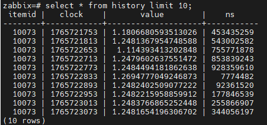
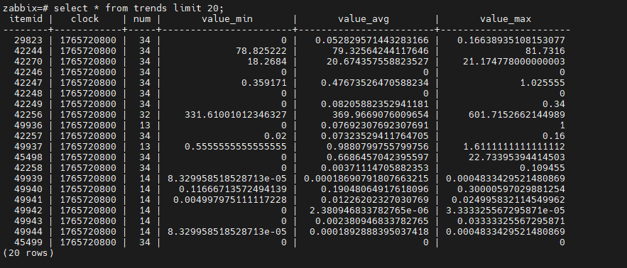

```sql

select i.name,h.* from items i, history h where h.itemid=i.itemid limit 10;
select i.name, i.key_, h.* from items i, history h where h.itemid=i.itemid limit 100;

```
##  reset zabbix password for mariadb
```sh
# for installing htpasswd
sudo dnf install httpd-tools -y
sudo apt install apache2-utils -y


htpasswd -bnBC 10 "" YourNewPassword | tr -d ':'
# copy the output

update users set passwd='<copied output>' where alias='Admin';          # zabbix 5
update users set passwd='<copied output>' where username='Admin';       # zabbix 6, 7

UPDATE users SET passwd = '$2a$10$ZXIvHAEP2ZM.dLXTm6uPHOMVlARXX7cqjbhM6Fn0cANzkCQBWpMrS' WHERE username = 'Admin';

```


## reset zabbix password in postgresql database

```sh


htpasswd -bnBC 10 "" newpasswd | tr -d ':\n'

psql
\c zabbix;

zabbix=# SELECT username, name, passwd from users;
zabbix=# UPDATE users SET passwd='5be9a68073f66a56554e25614e9f1c9a' WHERE username='iman';
UPDATE 1


select userid, sessionid, status, lastaccess from sessions;
DELETE FROM sessions WHERE userid = 3;


```


### you can change the login type in database 
```sh
mariadb -u root -p
show databases;
use zabbix;

select authentication_type from config;

        0: Internal
        1: LDAP

update config set authentication_type=1;
select authentication_type from config;


```


# useful command

```sh

find / -size +10M
sed -i 's/find/pattern/g' /etc/zabbix/zabbix.conf

sudo -H -u zabbix bash -c 'tail -f /var/log/nginx/access.log'
```


# Zabbix GET

```sh
dnf install zabbix-get
apt install zabbix-get


zabbix_get -s 192.168.85.70 -k agent.ping
zabbix_get -s 192.168.85.70 -k system.uptime
zabbix_get -s 192.168.85.70 -k agent.version
zabbix_get -s 192.168.85.70 -k vfs.dir.get[/iman] | jq
zabbix_get -s 192.168.85.70 -k vfs.file.contents[/etc/passwd]
zabbix_get -s 192.168.85.70 -k system.sw.packages[nginx]


zabbix_get -s 192.168.85.70 -k system.cpu.load[,avg1]
zabbix_get -s 192.168.85.70 -k system.cpu.load[,avg5]
zabbix_get -s 192.168.85.70 -k system.cpu.load[,avg15]


zabbix_get -s 192.168.85.70 -k system.cpu.num
nproc


zabbix_get -s 192.168.85.70 -k system.cpu.util[0,idle,avg15] # only show for cpu 1
zabbix_get -s 192.168.85.70 -k system.cpu.util[,idle,avg15]  # for all cpus


```


## simulate load on linux

```sh

dnf install epel-release
dnf install stress

stress --cpu 4 --timeout 60   # 4 CPU workers for 60 seconds

# load on the system without installing any extra package
yes > /dev/null

```


# system.run[]

```sh
vim /etc/zabbix/zabbix_agent.conf
------
AllowKey=system.run[/app/zbx-script/bash.sh]
AllowKey=system.run[systemctl status *]


------
systemctl restart zabbix-agent


zabbix_get -s 192.168.85.70 -k system.run['/app/zbx-script/bash.sh']
zabbix_get -s 192.168.85.70 -k system.run['systemctl status nginx']
zabbix_get -s 192.168.85.70 -k system.run['systemctl status httpd']


```

# Alias

```sh

vim /etc/zabbix/zabbix_agnet.conf
----
Alias=chronyd.status:system.run[systemctl status chronyd]
----

systemctl restart zabbix-agent


zabbix_get -s 192.168.85.71 -k chronyd.status
```


# UserParameter

```sh
mkdir /var/lib/zabbix
chown -R zabbix: /var/lib/zabbix/

vim /var/lib/zabbix/checkssl.sh
-------
data=`echo | openssl s_client -servername $1 -connect $1:${2:-443} 2>/dev/null | openssl x509 -in /dev/stdin -noout -enddate | sed -e 's#notAfter=##'`

ssldate=`date -d "${data}" '+%s'`

nowdate=`date '+%s'`

diff="$((${ssldate}-${nowdate}))"

echo $((${diff}/86400))
-------
chown -R zabbix: /var/lib/zabbix/


vim /etc/zabbix/zabbix_agent2.d/userparm.conf
-------
UserParameter=svc_status,systemctl status chronyd

UserParameter=ssl_check.status[*],/var/lib/zabbix/checkssl.sh $1 $2

UserParameter=disk.usage[*],df -P $1 | tail -1 | awk '{print $5}' | tr -d '%'

UserParameter=service.status[*],systemctl is-active $1 2>/dev/null | grep -c active

-------
systemctl restart zabbix-agent2
# or
zabbix_agent2 -R userparameter_reload
zabbix_agent2 -R metrics


zabbix_get -s 192.168.85.71 -k svc_status


zabbix_get -s 192.168.85.71 -k ssl_check.status['faradars.org',443]
zabbix_get -s 192.168.85.71 -k ssl_check.status['google.com',443]
zabbix_get -s 192.168.85.71 -k ssl_check.status['yahoo.com',443]


zabbix_get -s 192.168.85.71 -k disk.usage[/var]

zabbix_get -s 192.168.85.71 -k service.status[nginx]


```


# External Checks (simple with out parameter)

```sh

vim /etc/zabbix/zabbix_server.conf
----
ExternalScripts=/usr/lib/zabbix/externalscripts
----

vim /usr/lib/zabbix/externalscripts/app.sh
----
#!/bin/bash
echo the current time is : `date`
----
chown zabbix: app.sh

sudo -H -u zabbix bash -c 'tail -f /var/log/nginx/access.log'
sudo -u zabbix bash app.sh


```
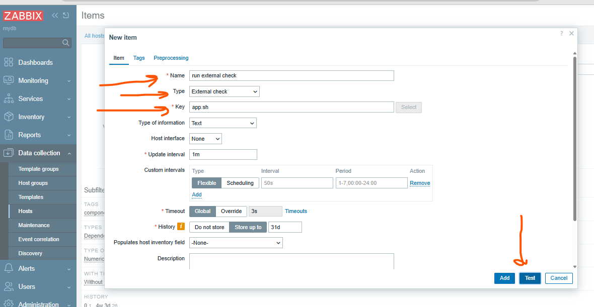
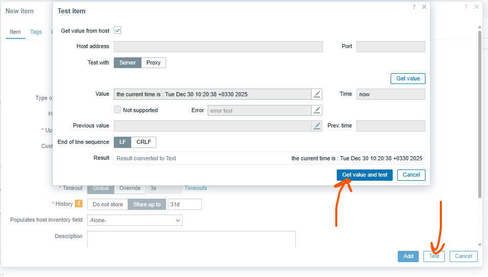

# External Checks ( with parameter)

```sh

vim /etc/zabbix/zabbix_server.conf
----
ExternalScripts=/usr/lib/zabbix/externalscripts
----

vim /usr/lib/zabbix/externalscripts/send-hello.sh
----
#!/bin/bash
echo hello ${1:-"saman"} and you age is ${2:-20}
----
chown zabbix: send-hello.sh

sudo -H -u zabbix bash -c 'tail -f /var/log/nginx/access.log'
sudo -u zabbix bash send-hello.sh


```
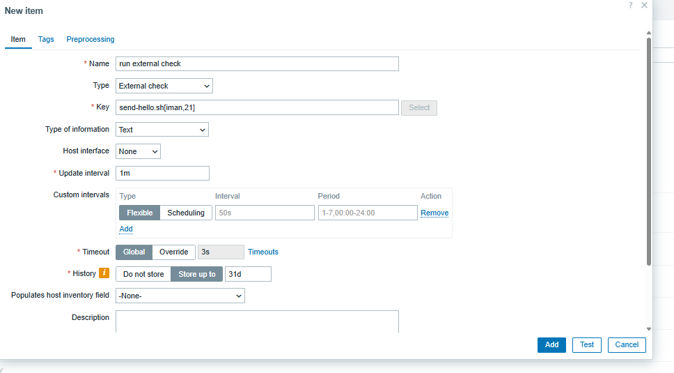
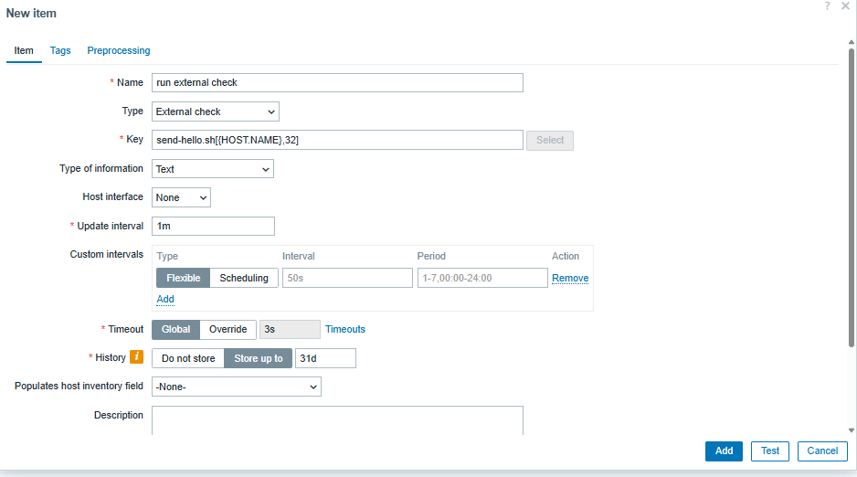


# convert counter to gauge with preprocessing
```sh
# first create a external script for simulating the counter

vim /usr/lib/zabbix/externalscripts/counter.sh
------
#!/bin/bash

COUNTER_FILE="/usr/lib/zabbix/externalscripts/zabbix_counter.value"

# Random increment range
MIN_INC=1
MAX_INC=10

# Initialize counter if missing
if [ ! -f "$COUNTER_FILE" ]; then
    echo 0 > "$COUNTER_FILE"
fi

# Read current value
value=$(cat "$COUNTER_FILE")

# Generate random increment
increment=$(( RANDOM % (MAX_INC - MIN_INC + 1) + MIN_INC ))

# Increase counter
value=$((value + increment))

# Save new value
echo "$value" > "$COUNTER_FILE"

# Output counter for Zabbix
echo "$value"
------
touch /usr/lib/zabbix/externalscripts/zabbix_counter.value

chown zabbix: /usr/lib/zabbix/externalscripts/zabbix_counter.value
chown zabbix: /usr/lib/zabbix/externalscripts/counter.sh
chmod u+x /usr/lib/zabbix/externalscripts/counter.sh


```
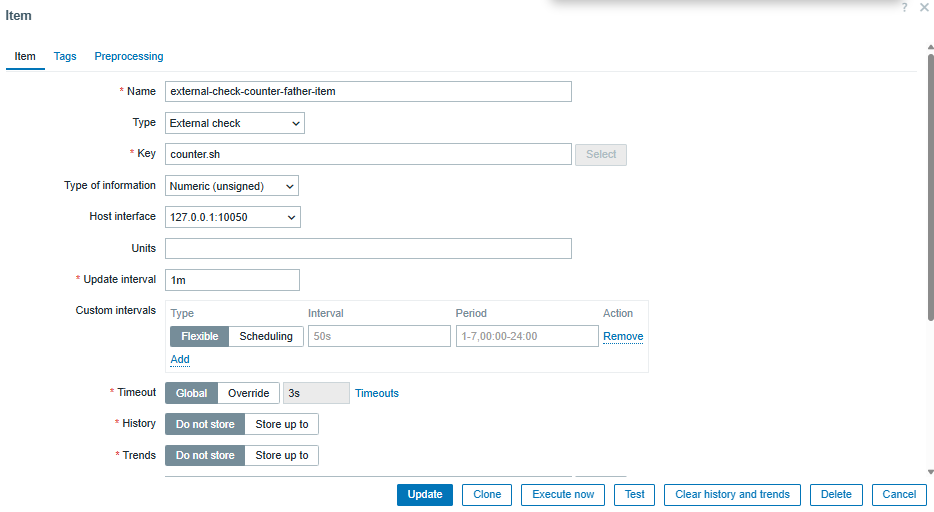

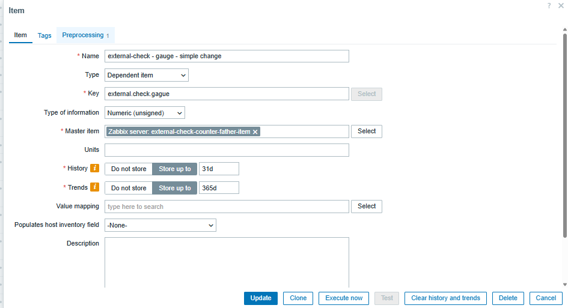
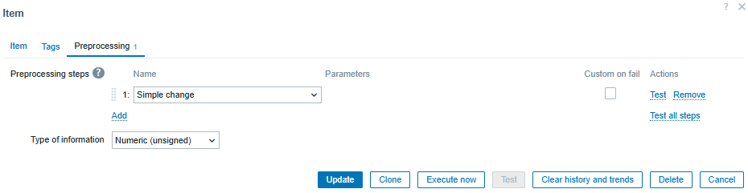


---------------------------------------------------

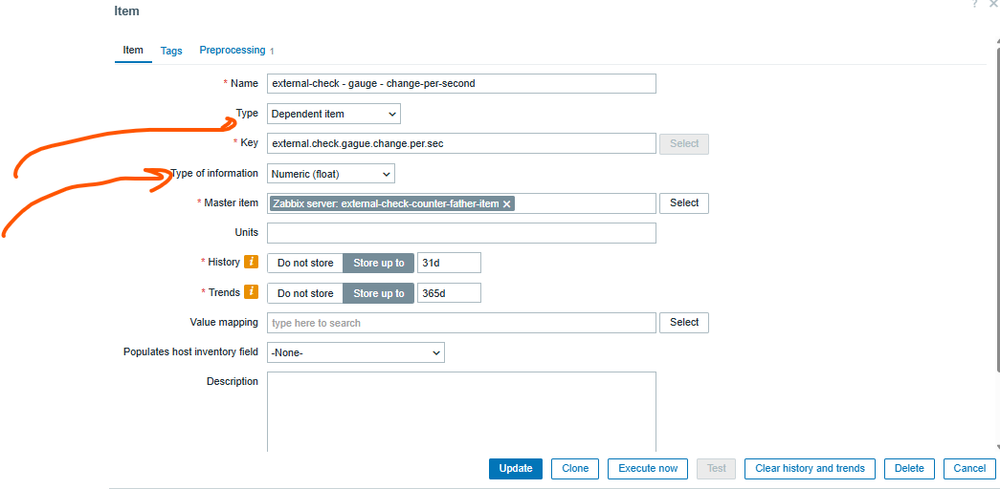
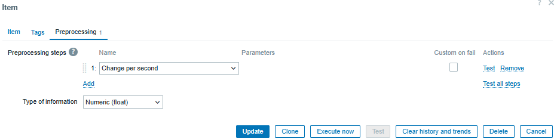

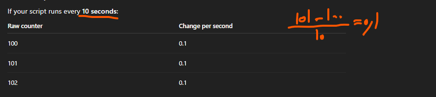


# Discovery and discovery action

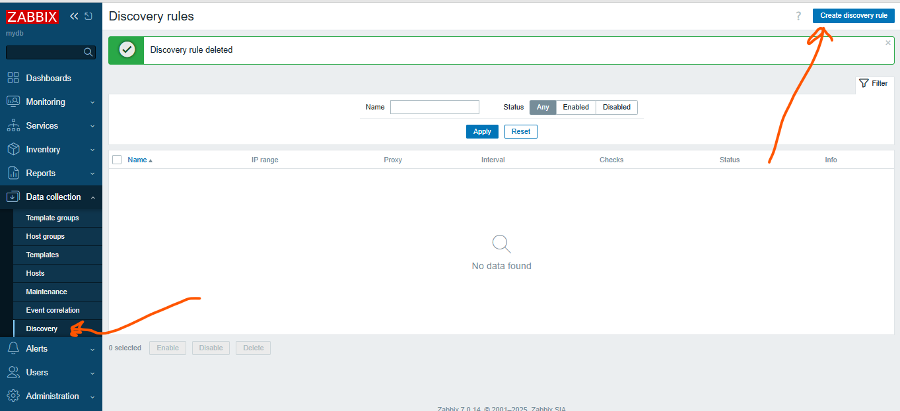
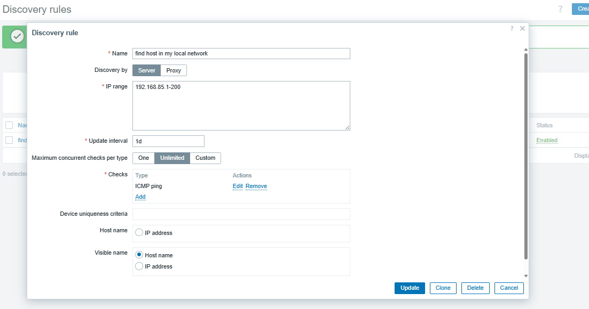
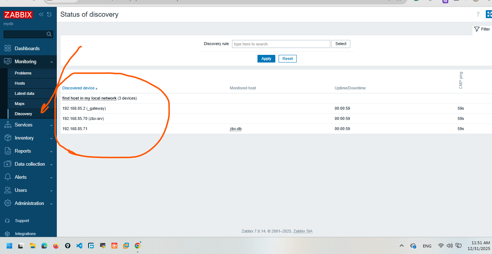

now create discovery action
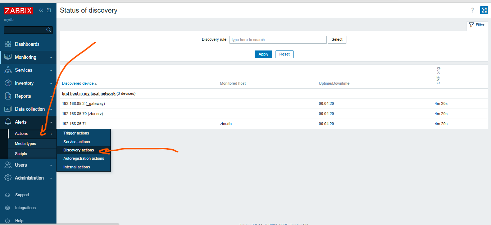

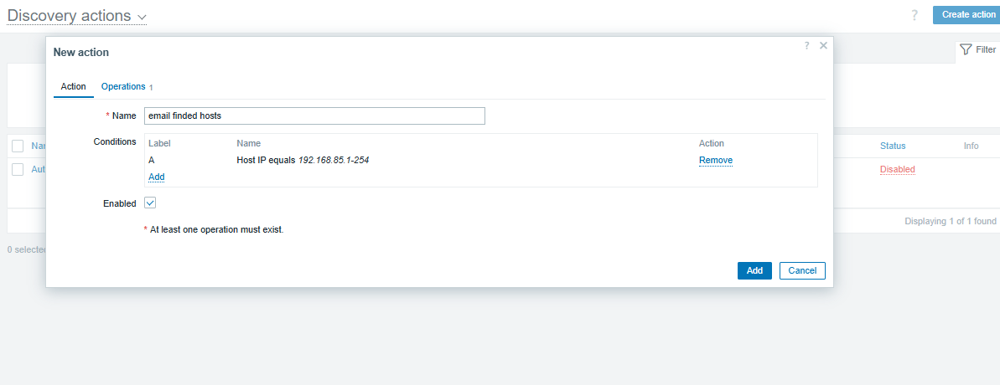

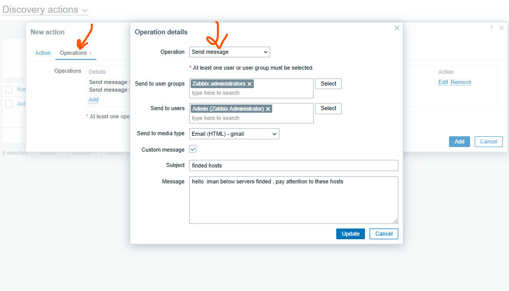


## zbx-proxy-configuration and tunning
```sh
vim /etc/mysql/mariadb.conf.d/50-server.cnf
-----
innodb_buffer_pool_size = 8G
-----


vim /etc/zabbix/zabbix_proxy.conf
------
ProxyLocalBuffer=24  # keeps data for 1 day # Proxy will keep data locally for N hours, even if the data have already been synced with the server. 

ProxyOfflineBuffer=240 # Proxy will keep data for N hours in case if no connectivity with Zabbix Server.

ProxyBufferMode=hybrid
ProxyMemoryBufferSize=2G

ProxyConfigFrequency=10
DataSenderFrequency=1

CacheSize=512M


```

## zabbix server tunning
```sh

vim /etc/php-fpm.d/zabbix.conf
-----
# always use nginx instead of httpd(apach2)
# I recommend increse it to 1G
php_value[memory_limit] = 1G
-----
systemctl restart php-fpm.service

# always use ssd instead of HDD


## change the audit-log Data storage period


vim /etc/zabbix/zabbix_server.conf
-----
CacheSize=512M

-----


```


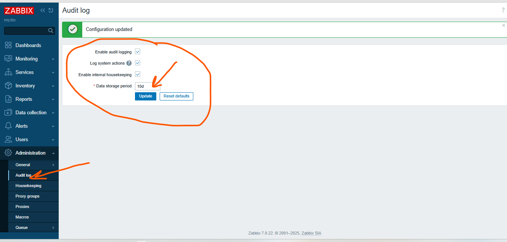


## Zabbix and elastic Search
```sh

docker pull hub.hamdocker.ir/elastic/elasticsearch:9.2.3

sudo sysctl -w vm.max_map_count=262144


docker run --name es01 -p 9200:9200 -it -m 2GB hub.hamdocker.ir/elasticsearch/elasticsearch:9.2.3


```


# zabbix server and proxy configuration
```sh

vim /etc/zabbix/zabbix_server.conf
------
HousekeepingFrequency=1
MaxHouseKeeperDelete=10000


CacheSize=2G  # Rule: ~8–10% of RAM
HistoryCacheSize=1G
HistoryIndexCacheSize=512M
TrendCacheSize=512M
ValueCacheSize=2G  # Big impact on frontend speed
StartDBSyncers=4


------

zabbix_server -R housekeeper_execute   # manually execute housekeeping


```


### enable https for zabbix ui with valid certificate

```sh

server {
    listen 80;
    server_name bia2bagh.ir www.bia2bagh.ir;
    return 301 https://bia2bagh.ir$request_uri;
}

server {
    listen 443 ssl;
    ssl_certificate /etc/letsencrypt/live/bia2bagh.ir/fullchain.pem;
    ssl_certificate_key /etc/letsencrypt/live/bia2bagh.ir/privkey.pem;


    server_name bia2bagh.ir www.bia2bagh.ir;   
    root /var/www/bia2bagh.ir/public_html;   
    index index.php;
    location / {
        try_files $uri $uri/ /index.php$is_args$args;
    }
    location ~ \.php$ {
        include snippets/fastcgi-php.conf;
        fastcgi_pass unix:/run/php/php8.3-fpm.sock;
    }
    access_log /var/log/nginx/access_bia2bash.log combined buffer=256k flush=60m;
    error_log /var/log/nginx/error_bia2bash.log;
}


apt install certbot
certbot certonly --manual --preferred-challenges=dns -d biatobagh.ir -d '*.bia2bagh.ir' --agree-tos

# add the txt in your dns provider


```


## Authenticate Zabbix user with Active Directory(ldap)

domain: company.com
OU: IT

Distinguish Name(DN): dc=company,dc=com
```sh


```


## change systemd unit file trigger time
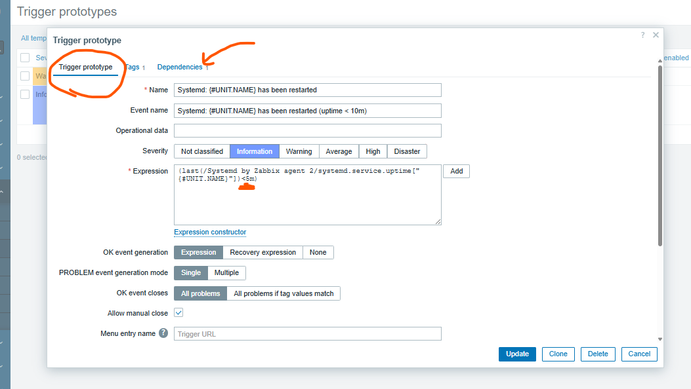
```sh


```
## json path functions query
```sh

$.[?(@.age == 20)].name
$.[?(@.shop_name== 'digikala' && @.product_name=="Smartphone")].total.first()
$.[?(@.shop_name == '{#SHOP_NAME}' && @.product_name == '{#PRODUCT_NAME}')].total.first()


 
total[{#PRODUCT_NAME}-{#SHOP_NAME}]

```
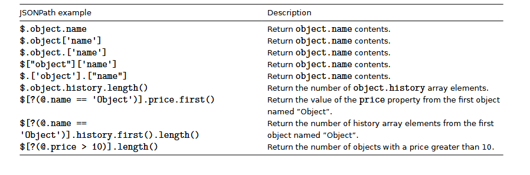

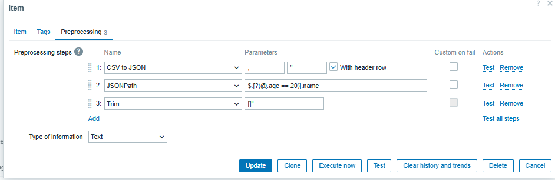

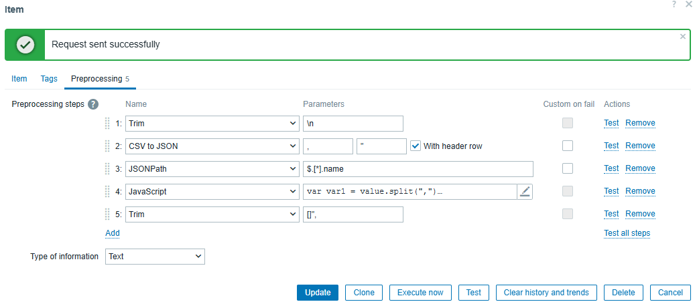

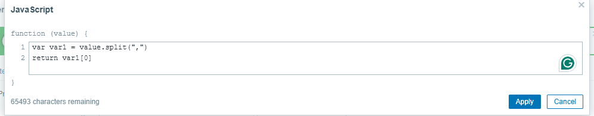

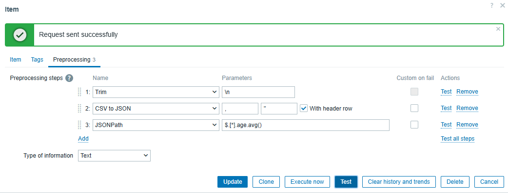


# report manager
### zbx-srv - 85.100
```sh

# on the zabbix server
dnf install zabbix-web-service


sudo nano /etc/yum.repos.d/google-chrome.repo
----------
[google-chrome]
name=google-chrome
baseurl=http://dl.google.com/linux/chrome/rpm/stable/$basearch
enabled=1
gpgcheck=1
gpgkey=https://dl-ssl.google.com/linux/linux_signing_key.pub

----------

dnf makecache

dnf install -y google-chrome-stable


vim /etc/zabbix/zabbix_server.conf
--------

StartReportWriters=3
WebServiceURL=http://localhost:10053/report
--------

vim /etc/zabbix/zabbix_web_service.conf
------

AllowedIP=127.0.0.1,::1
-------


systemctl restart zabbix-server.service
systemctl enable zabbix-web-service.service --now

systemctl restart zabbix-web-service.service


chown -R zabbix:zabbix /var/lib/zabbix
chmod 750 /var/lib/zabbix

mkdir -p /var/lib/zabbix/.local/share/applications
chown -R zabbix:zabbix /var/lib/zabbix/.local


# now you can test your reports.
# you have to create Email-HTML type 


# run below command 
getent passwd zabbix

# if not the same below
zabbix:x:997:995:Zabbix Monitoring System:/var/lib/zabbix:/sbin/nologin
# If HOME is NOT /var/lib/zabbix, fix it:
usermod -d /var/lib/zabbix zabbix


# the last step is to add the address in zabbix like below image
```
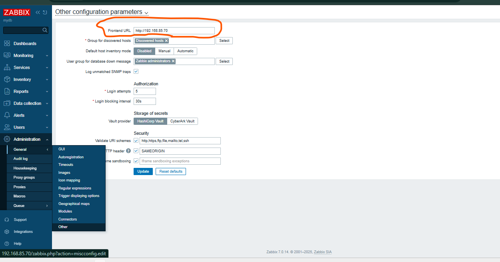


## Selinux configurations
```sh

tail -f /var/log/audit/audit.log

setenforce 0
sestatus  # now its on permisive mode


grep zabbix_t /var/log/audit/audit.log  | audit2allow -M zabbix-server
ls
cat zabbix-server.pp

semodule -i zabbix-server.pp
echo $?
cat zabbix-server.te
setenforce 1
sestatus
tail -f /var/log/audit/audit.log

```

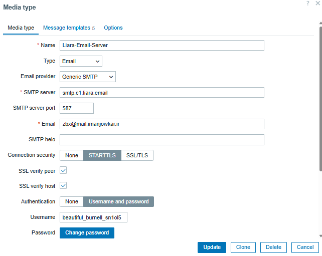

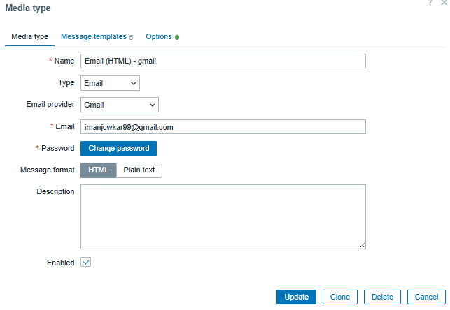


## Expression Macro on maps
```sh
Bit Recv: {?last(/Zabbix server/net.if.in["ens160"])}
Bit Send: {?last(/Zabbix server/net.if.out["ens160"])}


```
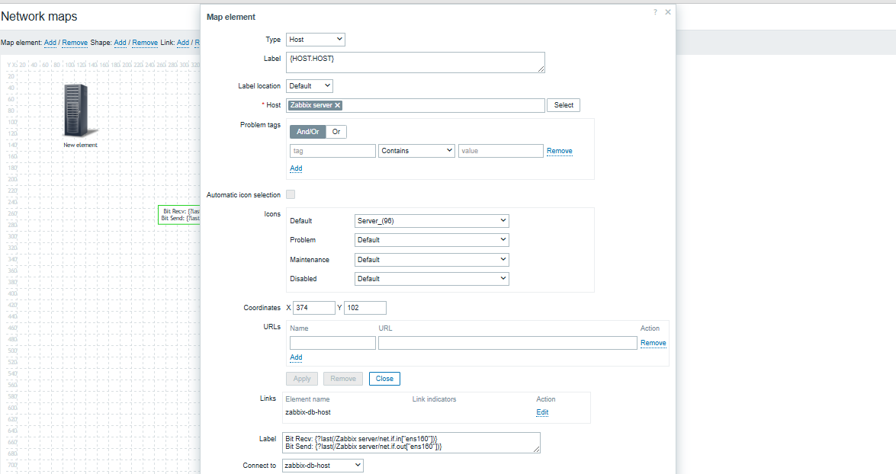


## Backup and restore zbx db when timescaaledb extention is enable

```sh

----------------------
# get backup
sudo -u postgres pg_dump -Fc -f /backup/zabbix_$(date +%F).dump zabbix
# ignore warnings


# verify backup
sudo -u postgres pg_restore -l /backup/zabbix_*.dump | head


scp /backup/zabbix_2026-06-01.dump root@NEW_SERVER:/backup/


systemctl stop zabbix-server


sudo -u postgres createuser --pwprompt zabbix
sudo -u postgres createdb -O zabbix zabbix


sudo -u postgres psql -d zabbix -c "CREATE EXTENSION IF NOT EXISTS timescaledb;"

sudo -u postgres psql -d zabbix -c "SELECT timescaledb_pre_restore();"


sudo -u postgres pg_restore --no-owner -d zabbix /backup/zabbix_2026-06-01.dump

	
sudo -u postgres psql -d zabbix -c "SELECT timescaledb_post_restore();"

sudo -u postgres psql -d zabbix

ALTER FUNCTION public.zbx_ts_unix_now() OWNER TO zabbix;


ALTER TABLE history OWNER TO zabbix;
ALTER TABLE history_uint OWNER TO zabbix;
ALTER TABLE history_str OWNER TO zabbix;
ALTER TABLE history_text OWNER TO zabbix;
ALTER TABLE history_log OWNER TO zabbix;
ALTER TABLE history_bin OWNER TO zabbix;
ALTER TABLE trends OWNER TO zabbix;
ALTER TABLE trends_uint OWNER TO zabbix;

ALTER SCHEMA public OWNER TO zabbix;
GRANT ALL PRIVILEGES ON ALL TABLES IN SCHEMA public TO zabbix;
GRANT ALL PRIVILEGES ON ALL SEQUENCES IN SCHEMA public TO zabbix;
GRANT ALL PRIVILEGES ON ALL FUNCTIONS IN SCHEMA public TO zabbix;


# bolting table
# In PostgreSQL, a bloated table means the table has extra unused space inside it.
# PostgreSQL does not immediately remove old rows from disk when data is updated or deleted. Instead, old/deleted rows stay inside the table as “dead rows” until PostgreSQL cleans them.

# vacuumdb is a PostgreSQL tool that cleans dead rows from tables.

vacuumdb -d zabbix -z -v
# -d zabbix   run on database named zabbix
# -z          also run ANALYZE
# -v          show detailed output


# summery
# Bloated table = table has too much dead/unused space

# VACUUM = cleans dead rows and makes space reusable

# ANALYZE = updates database statistics

# vacuumdb -d zabbix -z -v = VACUUM + ANALYZE on zabbix database

# Normal VACUUM is usually safe

# VACUUM FULL needs maintenance window


```


## SLA calculation on zabbix
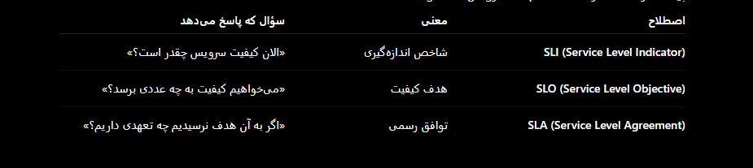


create host first and link template
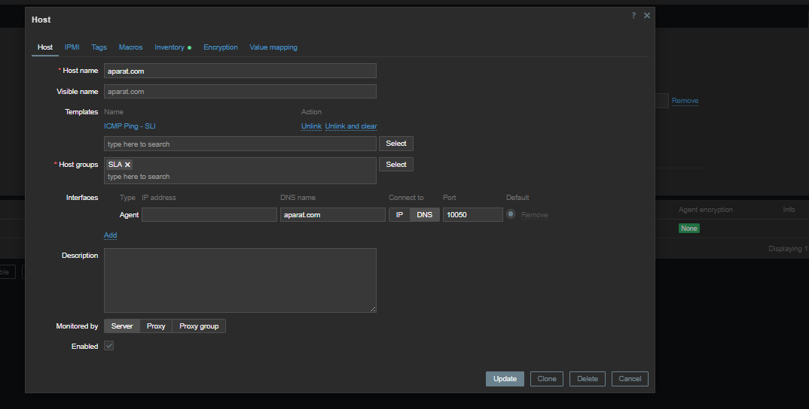


then set tag on trigger
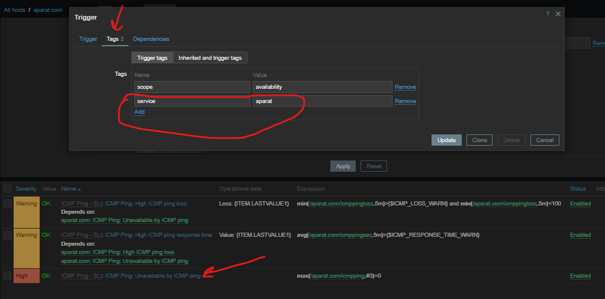


then create service
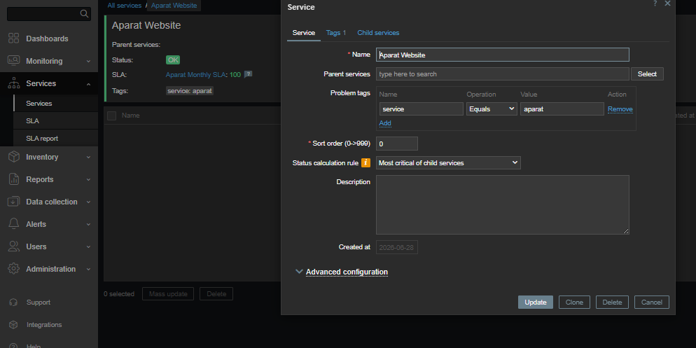

set tag for created server
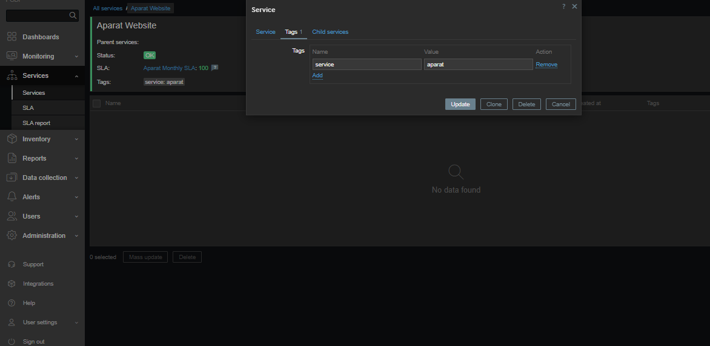

then create SLA
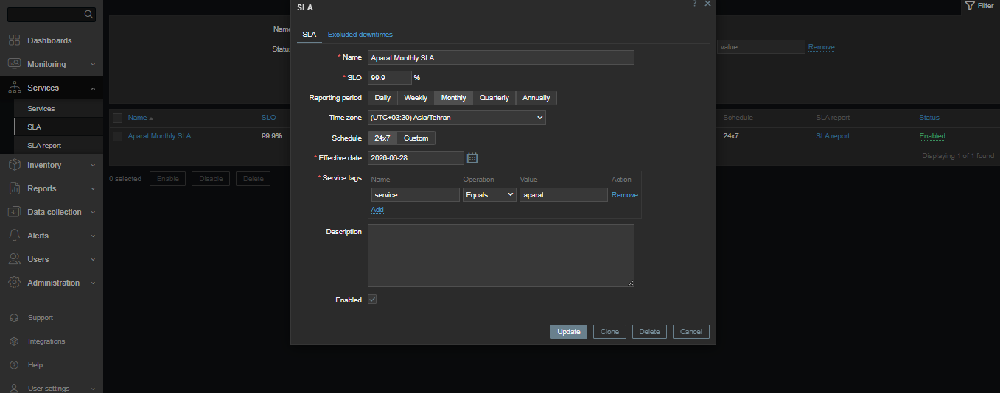

you can see the the SLA report
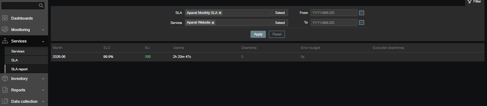


# Connect Zabbix to Bale
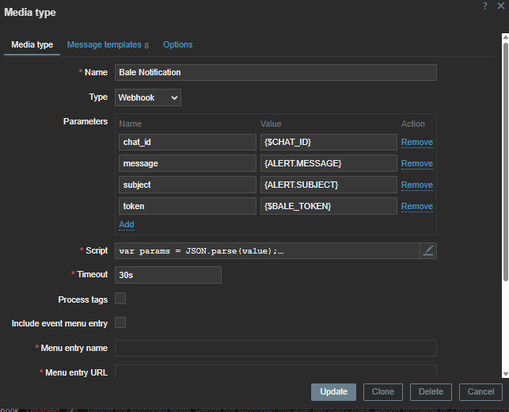

chat_id   {$CHAT_ID}
message   {ALERT.MESSAGE}
subject   {ALERT.SUBJECT}
token     {$BALE_TOKEN}

```js
var params = JSON.parse(value);

if (!params.token) {
    throw 'Bale bot token is empty';
}

if (!params.chat_id) {
    throw 'Bale chat_id is empty';
}

var request = new HttpRequest();

request.addHeader('Content-Type: application/json');

var url = 'https://tapi.bale.ai/bot' +
    encodeURIComponent(params.token) +
    '/sendMessage';

var text = '';

if (params.subject) {
    text += params.subject + '\n\n';
}

if (params.message) {
    text += params.message;
}

var payload = {
    chat_id: params.chat_id,
    text: text
};

Zabbix.log(
    4,
    '[Bale Webhook] Sending message to chat_id: ' + params.chat_id
);

var response = request.post(
    url,
    JSON.stringify(payload)
);

Zabbix.log(
    4,
    '[Bale Webhook] Response: ' + response
);

if (request.getStatus() < 200 || request.getStatus() >= 300) {
    throw 'Bale API returned HTTP status ' +
        request.getStatus() +
        ': ' +
        response;
}

var result;

try {
    result = JSON.parse(response);
} catch (error) {
    throw 'Invalid JSON response from Bale: ' + response;
}

if (!result.ok) {
    throw 'Bale API error: ' +
        (result.description || response);
}

return JSON.stringify({
    tags: {
        bale_message_id:
            result.result && result.result.message_id
                ? result.result.message_id
                : ''
    }
});


```

