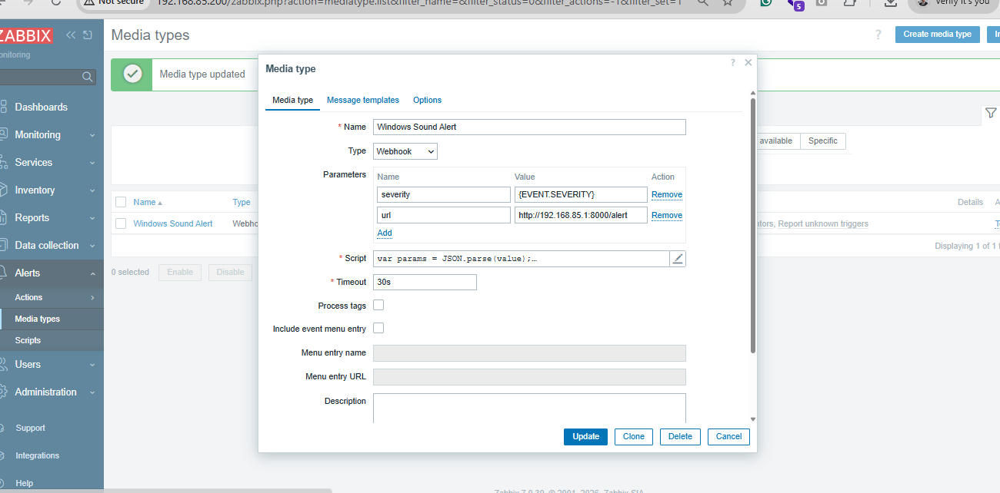
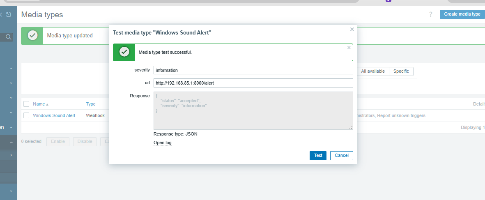

```sh
pip install fastapi uvicorn

uvicorn main:app --host 0.0.0.0 --port 8000

```

1. not_classified
2. information
3. warning
4. average
5. high
6. disaster


```sh

curl -X POST "http://192.168.85.1:8000/alert" \
  -H "Content-Type: application/json" \
  -d "{\"severity\":\"not_classified\"}"

curl -X POST "http://192.168.85.1:8000/alert" \
  -H "Content-Type: application/json" \
  -d "{\"severity\":\"information\"}"

curl -X POST "http://192.168.85.1:8000/alert" \
  -H "Content-Type: application/json" \
  -d "{\"severity\":\"warning\"}"

curl -X POST "http://192.168.85.1:8000/alert" \
  -H "Content-Type: application/json" \
  -d "{\"severity\":\"average\"}"

curl -X POST "http://192.168.85.1:8000/alert" \
  -H "Content-Type: application/json" \
  -d "{\"severity\":\"high\"}"

curl -X POST "http://192.168.85.1:8000/alert" \
  -H "Content-Type: application/json" \
  -d "{\"severity\":\"disaster\"}"

```


# add media in zabbix



```js
var params = JSON.parse(value);

var req = new HttpRequest();

req.addHeader('Content-Type: application/json');

var severity = params.severity
    .toLowerCase()
    .replace(/ /g, '_');

var payload = {
    severity: severity
};

var response = req.post(
    params.url,
    JSON.stringify(payload)
);

if (req.getStatus() < 200 || req.getStatus() >= 300) {
    throw 'HTTP error: ' + req.getStatus() + ' Response: ' + response;
}

return response;
```


```sh
# test
not_classified 
information 
warning 
average 
high 
disaster


```




### add trigger action, user media type