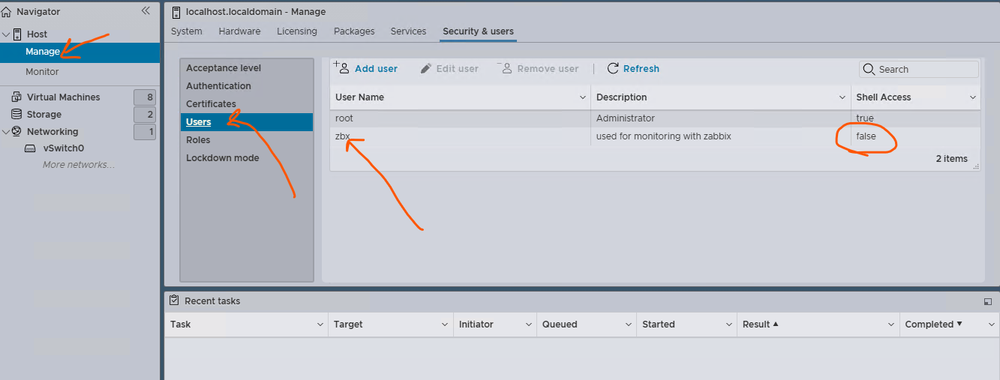
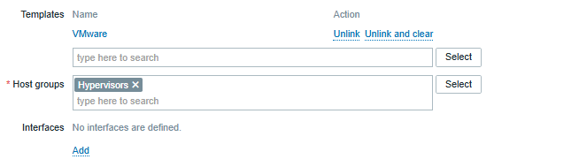
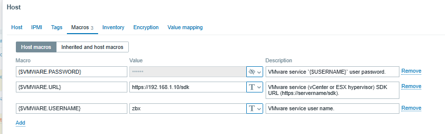

## how to monitor esxi with zabbix

create user and assgin role in esxi


then go to Host and on action find permision and assgin read only to user zbx


now go to zabbix and add esxi host

add below template


and set the macro like below



```sh

# vim /etc/zabbix/zabbix_server.conf # or zabbix proxy
vim /etc/zabbix/zabbix_proxy.conf
-----

StartVMwareCollectors=5
VMwareCacheSize=256M
VMwarePerfFrequency=60
VMwareFrequency=60
VMwareTimeout=10

-----


```