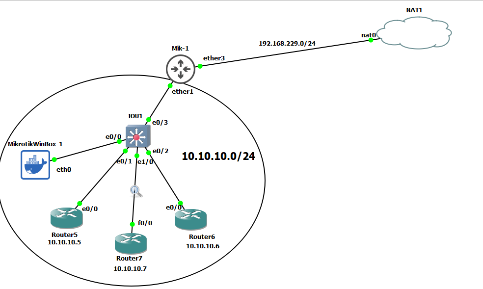
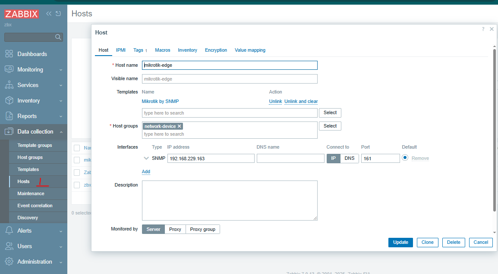

# monitor network devices using snmp




# mikrotik
```sh

ip dhcp-client add interface=ether3-WAN

ip address add address=10.10.10.1/24 interface=ether1-LAN network=10.10.10.0


# set snmp
snmp set enabled=yes
snmp community add name=supersecret addresses=192.168.229.10

snmp set contact="admin@example.com"
snmp set location="Data Center 1"

snmp print

```

### add in zabbix



# Router 5

```sh
hostname Router5
interface ethernet 0/0
ip address 10.10.10.5 255.255.255.0
no sh


ip route 0.0.0.0 0.0.0.0 10.10.10.1


ip access-list standard snmp-acl
permit 192.168.229.10
exit
snmp-server community supersecret ro snmp-acl

```


# Router 6

```sh

hostname Router6
interface ethernet 0/0
ip address 10.10.10.6 255.255.255.0
no sh


ip route 0.0.0.0 0.0.0.0 10.10.10.1


ip access-list standard snmp-acl
permit 192.168.229.10
exit
snmp-server community supersecret ro snmp-acl


```


# add route in zabbix host to reach the network devices

```
sudo ip route add 10.10.10.0/24 via 192.168.229.163 dev ens34


ping 10.10.10.1
ping 10.10.10.5
ping 10.10.10.6

```