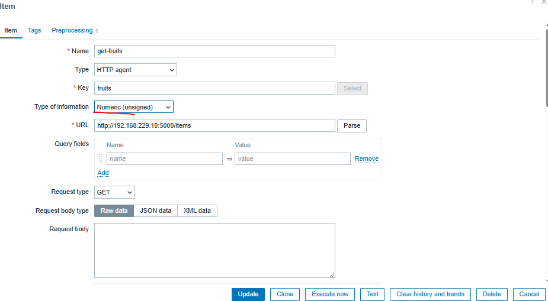
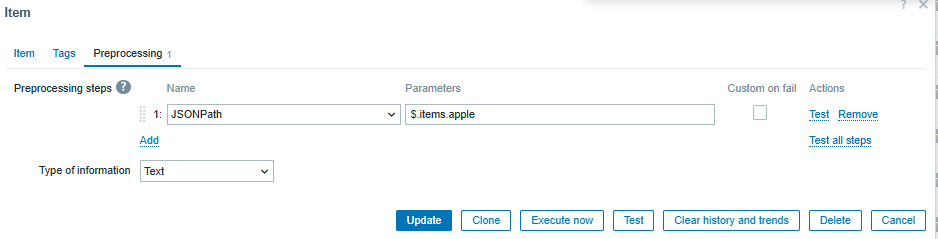
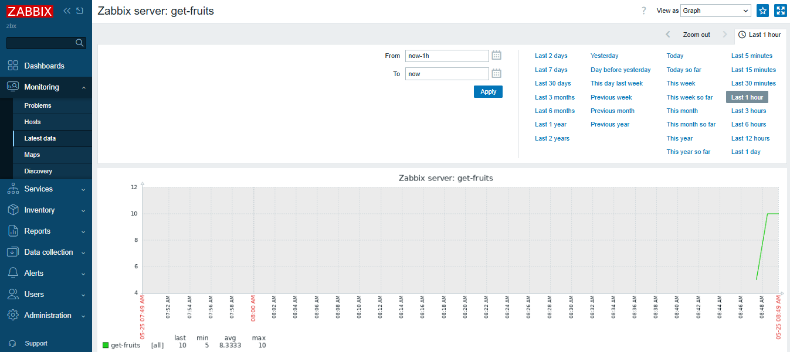
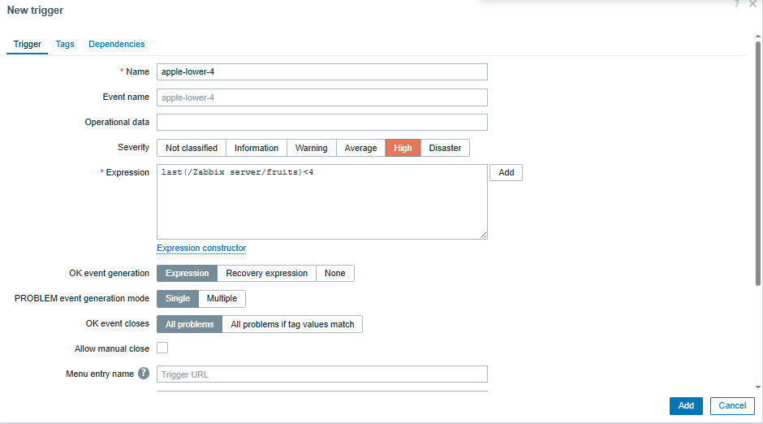

## how to run 

```sh
cd app
docker build -t app:ver1
cd ..

sudo apt-get install apache2-utils
cd nginx
htpasswd -c .htpasswd username
openssl req -newkey rsa:2048 -nodes -keyout key.pem -x509 -days 365 -out cert.pem


cd ..
docker compose up

```


## create items

Zabbix allows you to create an HTTP item that can send requests to external APIs and retrieve data for monitoring purposes.

Apply the following preprocessing steps



add preprocessing


you can see your graph in the latest data section


Now, head over to the dashboard and create a graph based on this item.


## you can add trigger too

