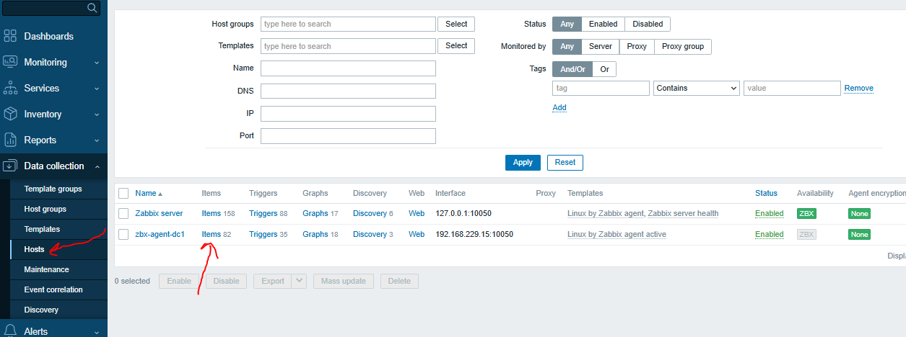
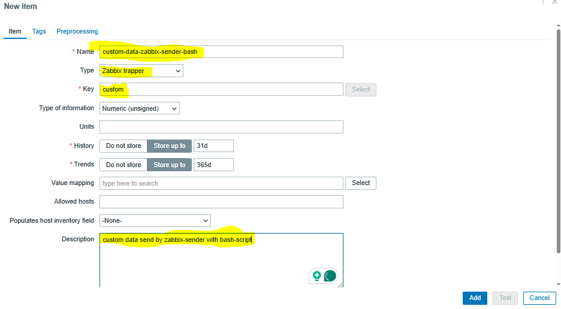
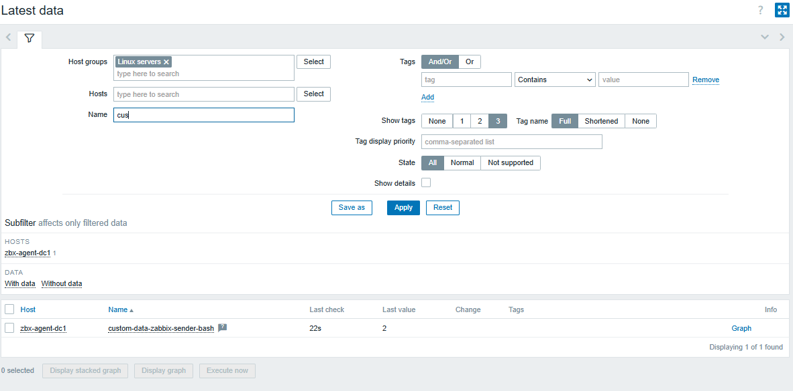
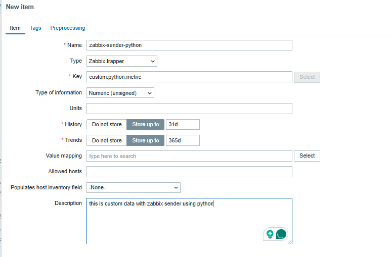

### 🛰️ What is **Zabbix Sender**?

**`zabbix_sender`** is a command-line utility provided by Zabbix that allows you to **send data directly** to the Zabbix server or proxy **without using the Zabbix agent**.

It’s mainly used for:

* **Custom scripts** or applications that collect metrics
* **One-off data sending**
* **Integration** with 3rd-party tools
* **Push monitoring**, rather than pull-based like the agent

---

### 🔍 **Use Cases for Zabbix Sender**

| Use Case                   | Description                                                                    |
| -------------------------- | ------------------------------------------------------------------------------ |
| **Custom monitoring**      | Push data from a script or service not covered by default templates            |
| **Application metrics**    | Send metrics directly from applications (e.g., response times, internal stats) |
| **Log monitoring**         | Tail logs and send error counts or patterns                                    |
| **Event-based monitoring** | Trigger data send when specific events occur                                   |
| **Offline processing**     | Aggregate metrics on a separate system and push periodically                   |

---

### installation
```
sudo apt install zabbix-sender
sudo yum install zabbix-sender

```


### ✅ Requirements

* The item in Zabbix must be of **type: "Zabbix trapper"**.
* You must know the **hostname**, **key**, and optionally a **timestamp**.

---

### 🧪 Example 1: Bash Script Using `zabbix_sender`

Let's say you want to send CPU temperature using a bash script:


#### 1. Zabbix Setup
create the trapper item in zabbix
* Hostname: `zbx-agent-dc1`
* Key: `custom`
* Item type: **Zabbix trapper**



create item


now run your script to send data to zabbix

#### 2. Bash Script:

```bash
#!/bin/bash

HOST="zbx-agent-dc1"
KEY="custom"
ZABBIX_SRV="192.168.229.10"
VALUE=$(cat /etc/passwd | awk -F: '$3 >= 1000 {print $1}' | wc -l)
echo $VALUE
zabbix_sender -z "$ZABBIX_SRV" -s "$HOST" -k "$KEY" -o "$VALUE"


```

> `-z`: Zabbix server address
> `-s`: Hostname as defined in Zabbix
> `-k`: Item key
> `-o`: Value to send

---

You can confirm successful data delivery:


Now you can add a user in Linux and run the command again to update the value sent to Zabbix. You can also create a graph and trigger for this item.


### 🐍 Example 2: Python Script Using 
create another item with another key


`subprocess`
```python
import subprocess

host = "zbx-agent-dc1"
key = "custom.python.metric"
zabbix_server="192.168.229.10"
value = 42  # Or any value from your logic

cmd = [
    "zabbix_sender",
    "-z", zabbix_server,
    "-s", host,
    "-k", key,
    "-o", str(value)
]

result = subprocess.run(cmd, capture_output=True, text=True)

print("STDOUT:", result.stdout)
print("STDERR:", result.stderr)
```

---


### 🧠 Tip

You can send multiple values from a file too:

```bash
zabbix_sender -z 127.0.0.1 -s "my-server" -i /tmp/metrics.txt
```

File format:

```
my-server custom.key1 123
my-server custom.key2 456
```

---

