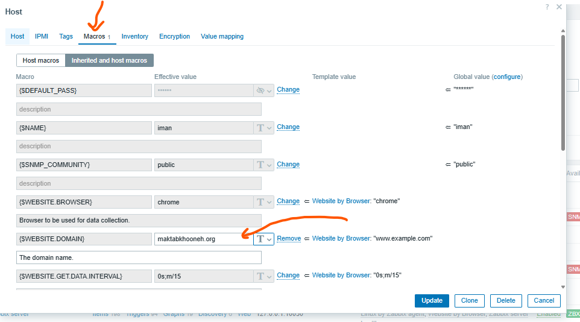
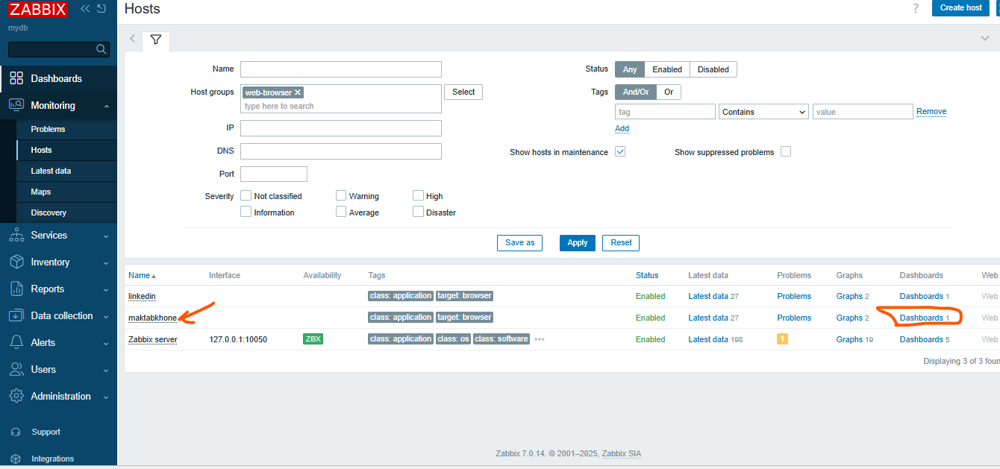
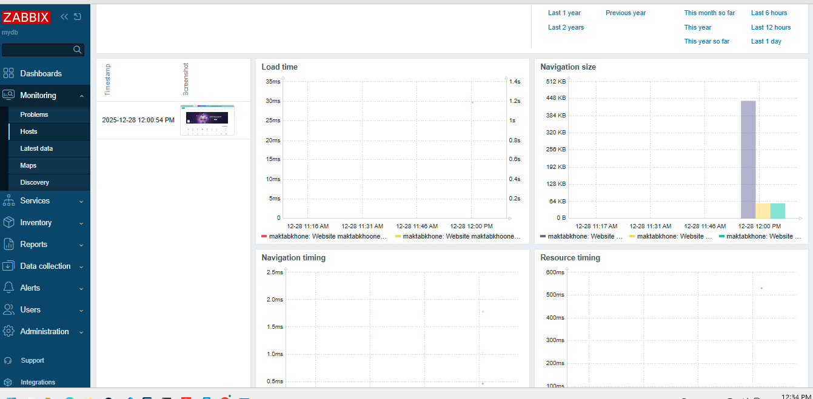

# Setup web driver with docker 
[ref](https://www.zabbix.com/documentation/current/en/manual/guides/monitor_browser)
```sh

docker run --name browser  -p 4444:4444  -p 7900:7900  --shm-size="2g" -d hub.hamdocker.ir/selenium/standalone-chrome:143.0-20251212

```

## add required value in zabbix config file

```sh
vim /etc/zabbix/zabbix_server.conf
# add below in this file
-----
WebDriverURL=192.168.56.10:4444
StartBrowserPollers=5
------


systemctl restart zabbix-server
```

now go to the zabbix
and create another hosts





```


```