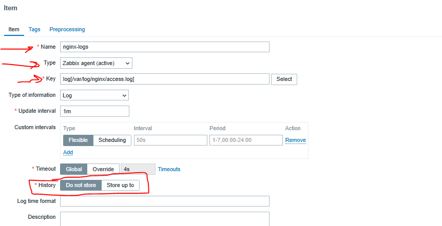
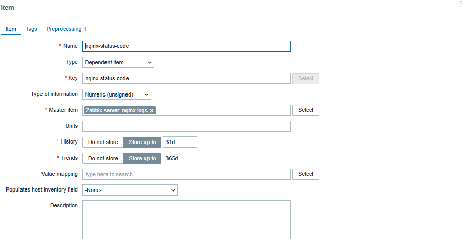
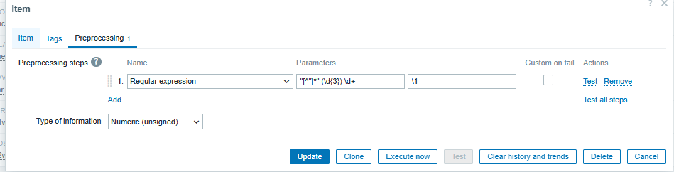
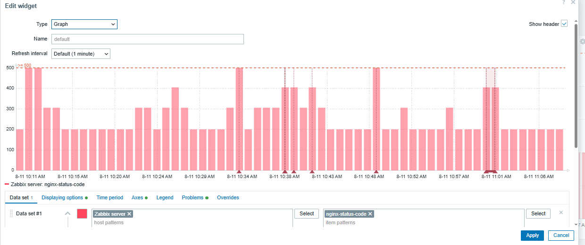

# first create a item for getting all nginx logs

```sh

# add zabbix user to adm group for grant permission to nginx access log
usermod -aG <groups> <user>
usermod -aG adm zabbix
newgrp adm
groups zabbix


# ensure zabbix user have access to below file
sudo -H -u zabbix bash -c 'tail -f /var/log/nginx/access.log'

```
## create a item for getting nginx log
now go to zabbix and create a item for getting the nginx log


it's better not store any nginx log

## create depenet item for extracting the status code from the nginx access log


and this is the preprocessing 



## now you can create a graph for this item
