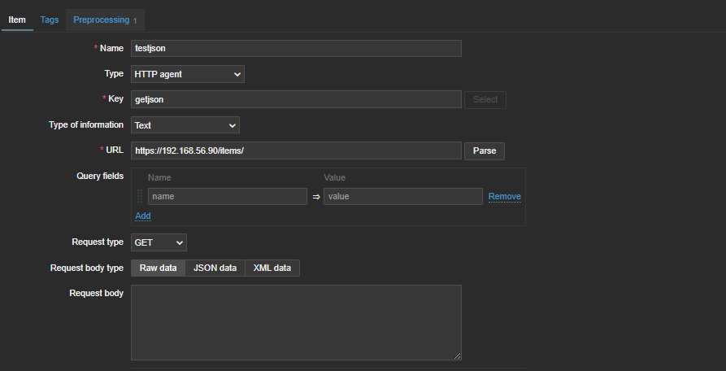
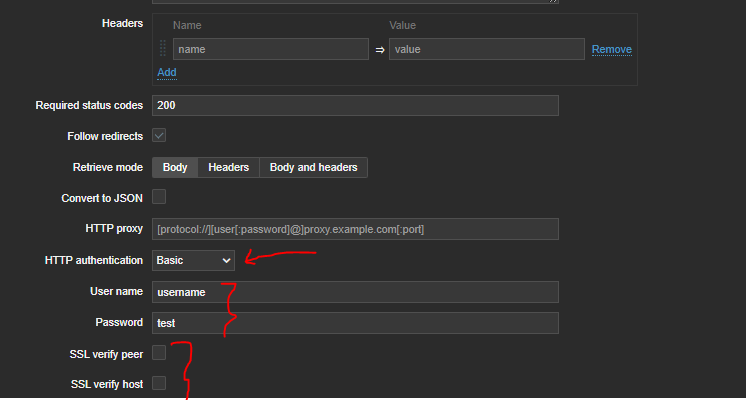

# Items

### system.run[]
```
mkdir /zabbix/files/zbx-script
vim /zabbix/files/zbx-script/check-ssl.sh
# add below
-----
data=`echo | openssl s_client -servername $1 -connect $1:${2:-443} 2>/dev/null | openssl x509 -in /dev/stdin -noout -enddate | sed -e 's#notAfter=##'`

ssldate=`date -d "${data}" '+%s'`

nowdate=`date '+%s'`

diff="$((${ssldate}-${nowdate}))"

echo $((${diff}/86400))

----

chown -R zabbix: /zabbix/files/zbx-script
chmod u+x /zabbix/files/zbx-script/check-ssl.sh
# enable system.run in zabbix-agent
vim /etc/zabbix/zabbix_agent.conf
AllowKey=system.run[/zabbix/files/zbx-script/check-ssl.sh*]


```


### read api with http item



