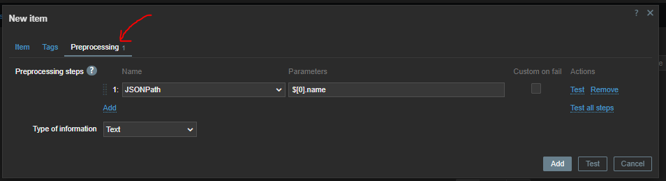

# Items

### system.run[]
```
mkdir /zabbix/files/zbx-script
vim /zabbix/files/zbx-script/check-ssl.sh
# add below
-----
data=`echo | openssl s_client -servername $1 -connect $1:${2:-443} 2>/dev/null | openssl x509 -in /dev/stdin -noout -enddate | sed -e 's#notAfter=##'`

ssldate=`date -d "${data}" '+%s'`

nowdate=`date '+%s'`

diff="$((${ssldate}-${nowdate}))"

echo $((${diff}/86400))

----

chown -R zabbix: /zabbix/files/zbx-script
chmod u+x /zabbix/files/zbx-script/check-ssl.sh
# enable system.run in zabbix-agent
vim /etc/zabbix/zabbix_agent.conf
AllowKey=system.run[/zabbix/files/zbx-script/check-ssl.sh*]


```

## zabbix sender

```
apt install zabbix-sender

```
##### create an item as type of zabbix-trapper 


```
# now you can send data into the zabbix 
zabbix_sender -z 192.168.56.221 -s "rockey-1" -k mykey -o 46

```


`you can use below python script to send data to zabbix`

```
import random
import subprocess
import time

while True:
    data = random.randrange(10)
    command = f"zabbix_sender -z 192.168.56.221 -s 'rockey-1' -k 'mykey' -o {data}"
    process = subprocess.Popen(command, stdout=subprocess.PIPE, shell=True)
    output, error = process.communicate()
    print(output)
    time.sleep(2)

```


##### zabbix sender with python

```
pip install zabbix_utils

from zabbix_utils import Sender
sender = Sender(server='192.168.56.221', port=10051)
resp = sender.send_value('rockey-1', 'mykey', 40)
print(resp)

```
```
from zabbix_utils import ItemValue, Sender


items = [
    ItemValue('host1', 'item.key1', 10),
    ItemValue('host1', 'item.key2', 'Test value'),
    ItemValue('host2', 'item.key1', -1, 1702511920),
    ItemValue('host3', 'item.key1', '{"msg":"Test value"}'),
    ItemValue('host2', 'item.key1', 0, 1702511920, 100)
]

sender = Sender('127.0.0.1', 10051, chunk_size=2)
response = sender.send(items)
```
In the example above, the chunk size is set to 2. So, 5 values passed will be sent in three requests of two, two, and one value, respectively.

### read api with http item


