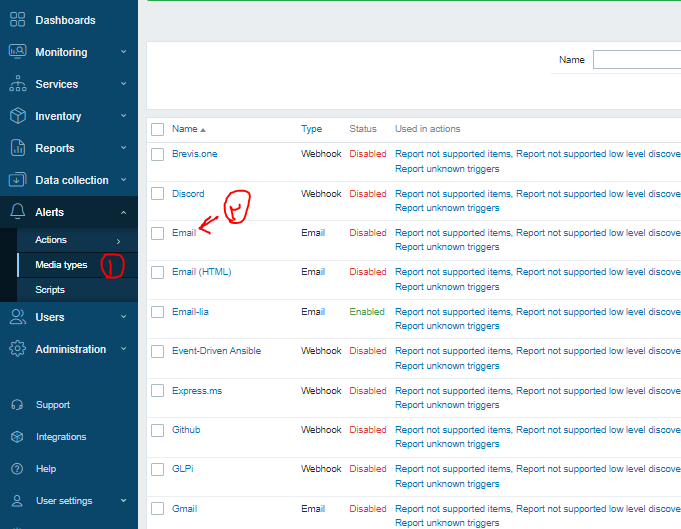
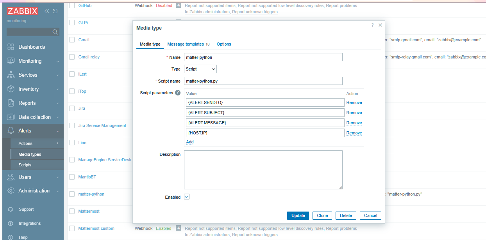

## Script type media


### example 1 - save to a file
```sh

vim /usr/lib/zabbix/alertscripts/local.sh
-----
#!/bin/bash

# Zabbix passes parameters in this order:
# $1 = {ALERT.SENDTO}
# $2 = {ALERT.SUBJECT}
# $3 = {ALERT.MESSAGE}

SENDTO="$1"
SUBJECT="$2"
MESSAGE="$3"


# Example: log alerts to a file
echo "$(date '+%Y-%m-%d %H:%M:%S') | To: $SENDTO | $SUBJECT | $MESSAGE" >> /tmp/zabbix_custom_alert.log

exit 0
-----


chmod u+x /usr/lib/zabbix/alertscripts/local.sh
chown zabbix:zabbix /usr/lib/zabbix/alertscripts/local.sh


```



### example 2 - call a webhook
```sh


vim /usr/lib/zabbix/alertscripts/matter-python.py
----

#!/usr/bin/python3

import os
import requests
import json
import sys

MATTERMOST_WEBHOOK_URL="https://biatobagh.ir/hooks/83aced6tttdgjpkxgk6e1seeze"


SENDTO   = sys.argv[1]
SUBJECT  = sys.argv[2]
MESSAGE  = sys.argv[3]
HOST_IP  = sys.argv[4]


msg = (
    f"*📩 To:* `{SENDTO}`\n"
    f"*🖥 Host IP:* `{HOST_IP}`\n"
    f"*📝 Subject:* *{SUBJECT}*\n"
    f"*💬 Message:*\n```{MESSAGE}```"
)

def send_notification(message):

    payload = {
        "text": message
    }

    try:
        response = requests.post(
            MATTERMOST_WEBHOOK_URL,
            data=json.dumps(payload),
            headers={'Content-Type': 'application/json'}
        )

        if response.status_code == 200:
            print('Notification sent successfully!')
            sys.exit(0)
        else:
            print(f'Failed to send notification: {response.status_code} - {response.text}')
            sys.exit(1)
    except Exception as e:
        print(f'Error sending notification: {e}')


send_notification(msg)

----


chmod u+x /usr/lib/zabbix/alertscripts/matter-python.py
chown zabbix:zabbix /usr/lib/zabbix/alertscripts/matter-python.py

```




