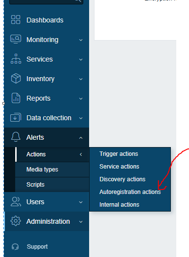
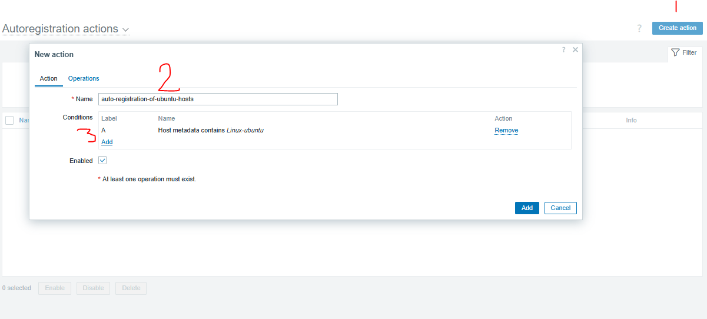
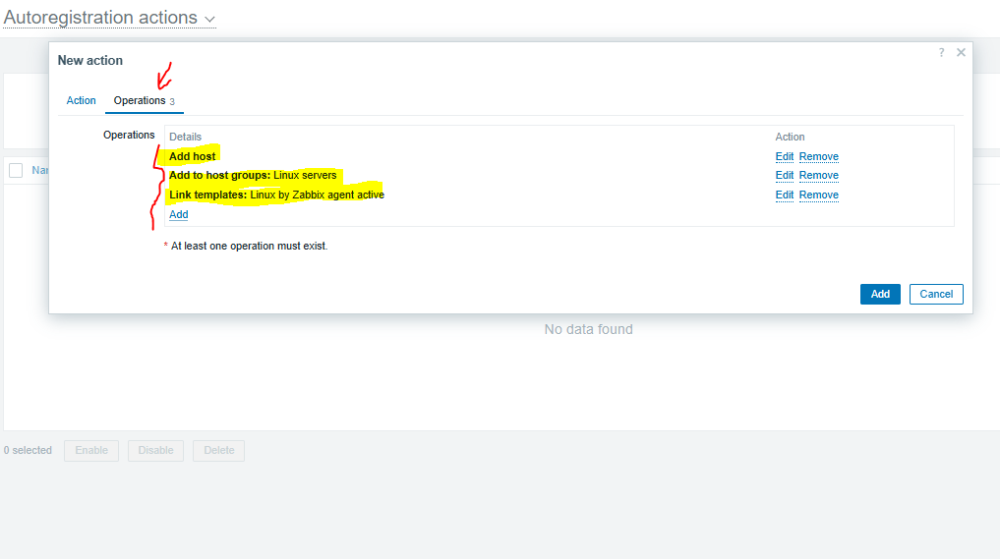
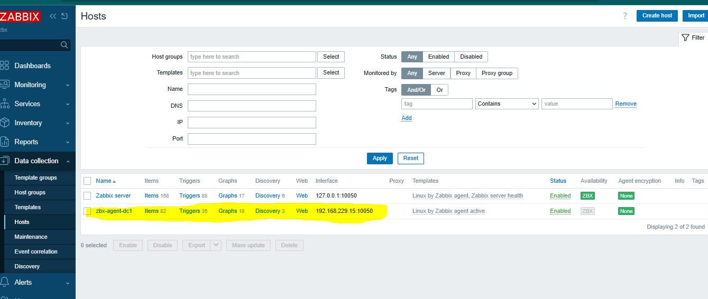
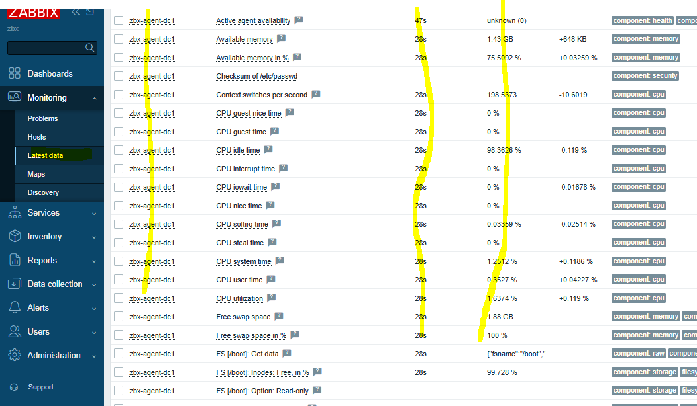

**Agent auto-registration** in **Zabbix** is a feature that allows **Zabbix agents** to automatically register themselves with the **Zabbix server** or **proxy** when they start, without needing to manually add them as hosts beforehand.

This is especially useful in **dynamic environments**, such as cloud or large-scale deployments, where hosts (like virtual machines or containers) are frequently added or removed.

---

### 🔧 How Agent Auto-Registration Works

1. **Zabbix agent starts** and connects to the Zabbix server (or proxy) using the address defined in its config (`Server=`).
2. If the host is **not already known** to Zabbix, the server triggers an **auto-registration event**.
3. Zabbix looks for **Auto-registration actions** defined in the frontend (Configuration → Actions → Auto-registration).
4. If a matching action is found, the Zabbix server can:

   * Add the host.
   * Link it to templates.
   * Set host groups.
   * Assign a proxy.
   * Enable monitoring.

---

### ✅ Requirements

* Zabbix agent must have `Server=` and `Hostname=` configured.
* Zabbix server must have at least one **auto-registration action** defined.
* Zabbix agent must be able to reach the server (default port: 10051).

---

### 🧠 Use Cases

* Automatically registering **new cloud VMs** or **Docker containers**.
* **Mass deployment** using scripts or automation tools like Ansible.
* Simplifying infrastructure expansion with **no manual steps**.

---

### 📘 Example Action

You can define an action in the Zabbix frontend:

* **Condition:** `Host metadata` = `webserver`
* **Operation:** Add to group `Web Servers`, link to template `Template OS Linux`.

Then, in the Zabbix agent config (`zabbix_agentd.conf`):

```ini
Server=zabbix.example.com
Hostname=webserver01
HostMetadata=webserver
```

When the agent starts, it registers itself and is automatically added and monitored.

---


# Step by Step to setup anget auto-registration


now create an action 



now go to operation tab



now run the playbook to install zabbix-agent
```sh
ansible-playbook play.yaml -u iman -k --ask-become-pass
```
Then go to the Hosts section to verify that your node has been successfully added.


You can confirm that the data was sent successfully in the Latest Data section.




