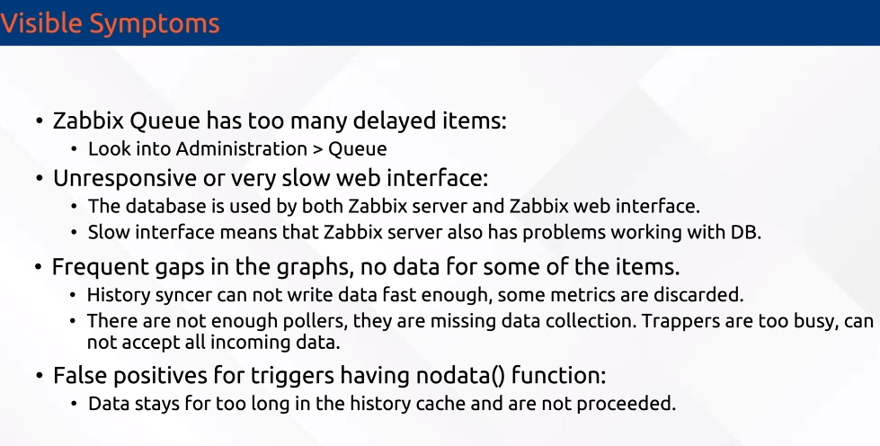
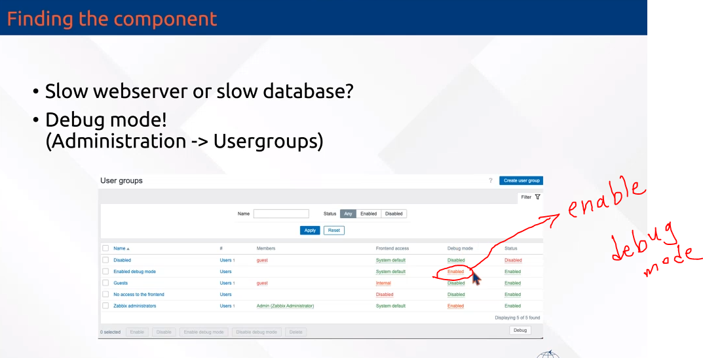
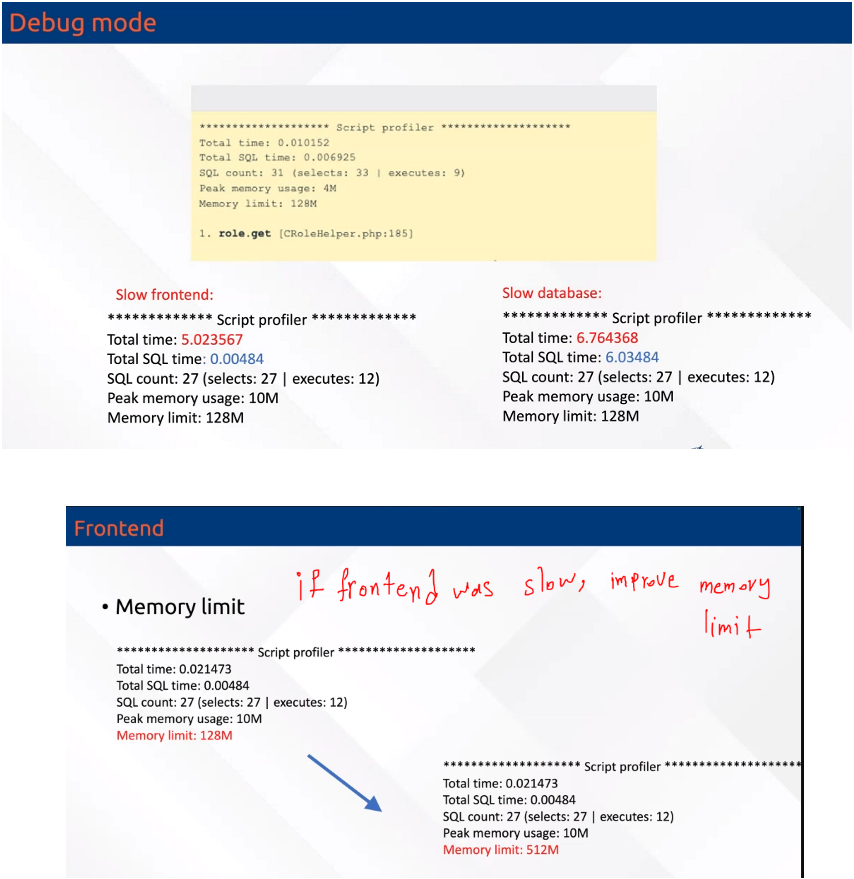
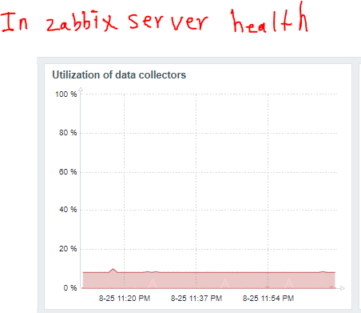
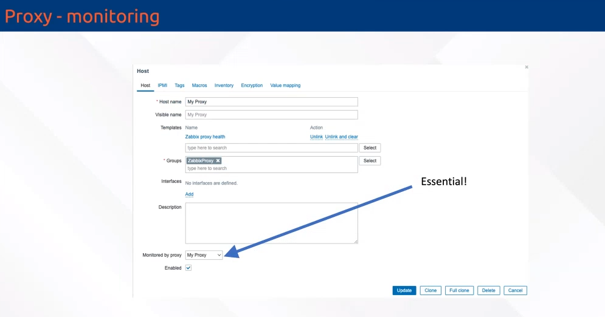
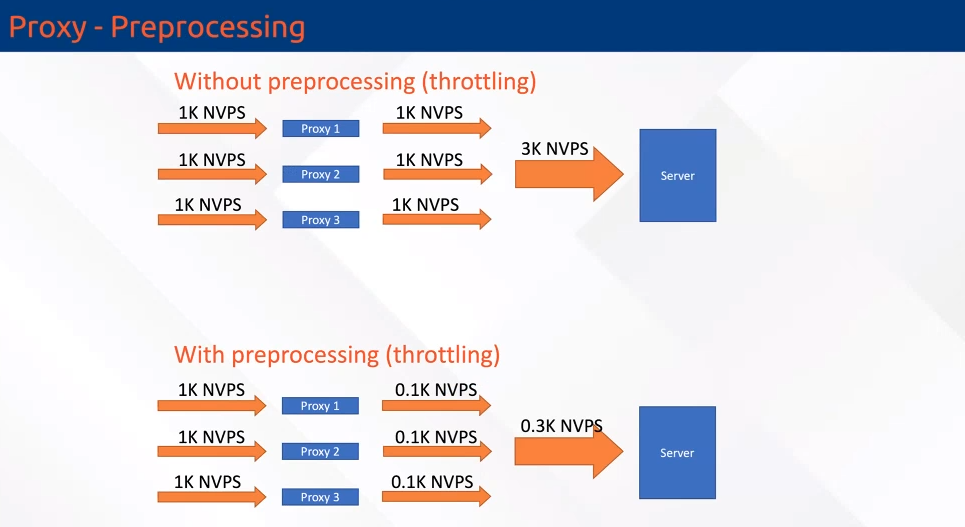
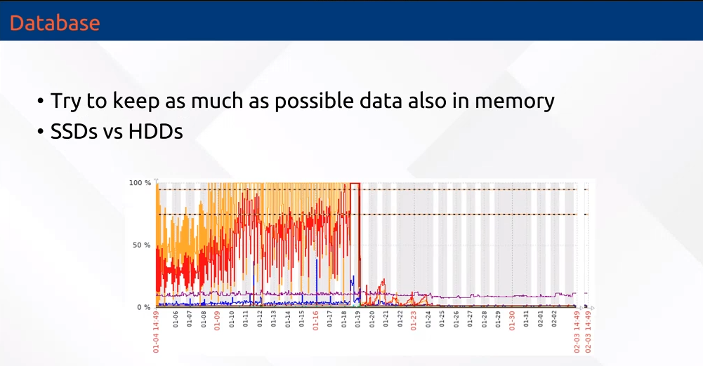
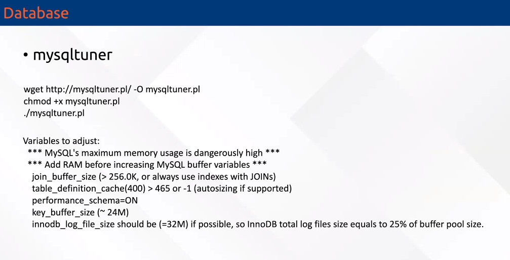
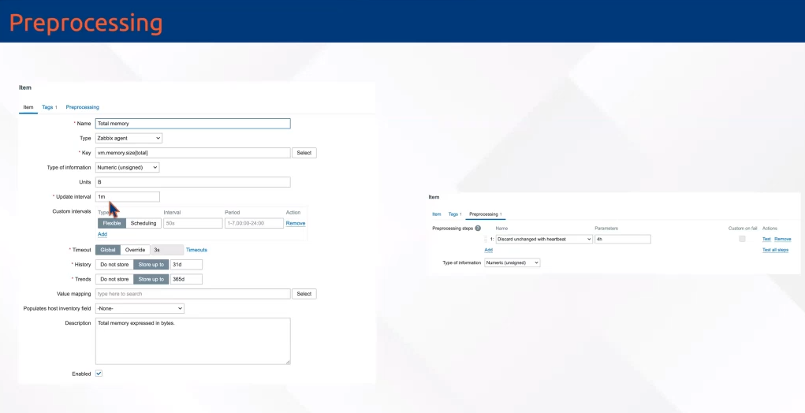
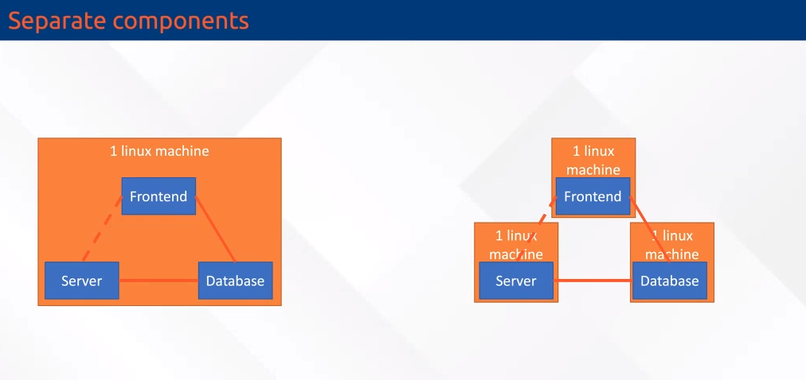

# reset zabbix password

```

htpasswd -bnBC 10 "" YourNewPassword | tr -d ':'
# copy the output

update users set passwd='<copied output>' where alias='Admin';          # zabbix 5
update users set passwd='<copied output>' where username='Admin';       # zabbix 6, 7

UPDATE users SET passwd = '$2a$10$ZXIvHAEP2ZM.dLXTm6uPHOMVlARXX7cqjbhM6Fn0cANzkCQBWpMrS' WHERE username = 'Admin';

```


### you can change the login type in database 
```
mariadb -u root -p
show databases;
use zabbix;

select authentication_type from config;

        0: Internal
        1: LDAP

update config set authentication_type=1;
select authentication_type from config;


```


# useful command

```

find / -size +10M
sed -i 's/OF1-T-2/OF1-T-3/g' /etc/zabbix/zabbix.conf

sudo -H -u zabbix bash -c 'tail -f /var/log/nginx/access.log'
```


# Backup and restore from mysql 
```
# backup
mysqldump --single-transaction  --no-tablespaces -u zabbix -p zabbix > zbx-backup.sql

# now delete the zabbix database for test(note that, its only for test)

mariadb -u root -p
drop database zabbix;

set global log_bin_trust_function_creators = 1;
quit

mariadb -u zabbix -p zabbix < zbx-backup.sql
mariadb -u root -p
set global log_bin_trust_function_creators = 0;


```

# Backup configuration file.

```
rsync -avP /etc/zabbix/ /zabbix-bak

rsync -avP /etc/zabbix/* -e "ssh -p 22" root@10.10.56.20:/zbx-bak


# only for test
rm -rf /etc/zabbix/
chmod 755 /etc/zabbix/
chmod 644 /etc/zabbix/web/zabbix.conf.php


```

# Performance Tuning
[ref](https://youtube.come)



### install ntop on debain 12
[ref](https://green.cloud/docs/how-to-install-ntopng-on-debian-12/)

```

apt update && apt install software-properties-common wget

source /etc/os-release
wget https://packages.ntop.org/apt/$VERSION_CODENAME/all/apt-ntop.deb
apt install ./apt-ntop.deb


apt update && apt install ntopng
netstat -ntlp


http://localhost:3000

user, pass: admin, admin


```








### proxy tunning





### database tunning





### unchanged items



### deploy on seprate machine



## Set https on zabbix

```


```