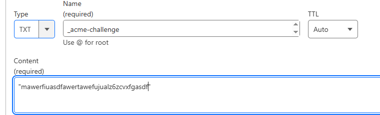

##  reset zabbix password for mariadb
```sh

htpasswd -bnBC 10 "" YourNewPassword | tr -d ':'
# copy the output

update users set passwd='<copied output>' where alias='Admin';          # zabbix 5
update users set passwd='<copied output>' where username='Admin';       # zabbix 6, 7

UPDATE users SET passwd = '$2a$10$ZXIvHAEP2ZM.dLXTm6uPHOMVlARXX7cqjbhM6Fn0cANzkCQBWpMrS' WHERE username = 'Admin';

```


## reset zabbix password in postgresql database

```sh

iman@node:~$ echo -n 'newsecurepassword' | md5sum
67bc4a4d0c80c103946d42acc3b2be1b  -

psql
\c zabbix;

zabbix=# UPDATE users SET passwd='5be9a68073f66a56554e25614e9f1c9a' WHERE username='iman';
UPDATE 1


```


### you can change the login type in database 
```sh
mariadb -u root -p
show databases;
use zabbix;

select authentication_type from config;

        0: Internal
        1: LDAP

update config set authentication_type=1;
select authentication_type from config;


```


# useful command

```

find / -size +10M
sed -i 's/find/pattern/g' /etc/zabbix/zabbix.conf

sudo -H -u zabbix bash -c 'tail -f /var/log/nginx/access.log'
```


# Backup and restore from mysql 
```
# backup
mysqldump --single-transaction  --no-tablespaces -u zabbix -p zabbix > zbx-backup.sql

# now delete the zabbix database for test(note that, its only for test)

mariadb -u root -p
drop database zabbix;

set global log_bin_trust_function_creators = 1;
quit

mariadb -u zabbix -p zabbix < zbx-backup.sql
mariadb -u root -p
set global log_bin_trust_function_creators = 0;


```

# Backup configuration file.

```
rsync -avP /etc/zabbix/ /zabbix-bak

rsync -avP /etc/zabbix/* -e "ssh -p 22" root@10.10.56.20:/zbx-bak


# only for test
rm -rf /etc/zabbix/
chmod 755 /etc/zabbix/
chmod 644 /etc/zabbix/web/zabbix.conf.php


```

# Performance Tuning
[ref](https://youtube.come)


### install ntop on debain 12
[ref](https://green.cloud/docs/how-to-install-ntopng-on-debian-12/)

```sh

apt update && apt install software-properties-common wget

source /etc/os-release
wget https://packages.ntop.org/apt/$VERSION_CODENAME/all/apt-ntop.deb
apt install ./apt-ntop.deb


apt update && apt install ntopng
netstat -ntlp


http://localhost:3000

user, pass: admin, admin


```


### proxy tunning


### database tunning


### unchanged items


### deploy on seprate machine


# context switching


# increase open file descriptors
[ref](https://www.initmax.com/wiki/zabbix-7-0-and-increasing-system-limits/)
```bash
cat /proc/$(pgrep -o zabbix_server)/limits | grep -i "max open file"

mkdir /etc/systemd/system/zabbix-server.service.d
chmod 755 /etc/systemd/system/zabbix-server.service.d

echo -e "[Service]\nLimitAS=infinity\nLimitRSS=infinity\nLimitNOFILE=10000\nLimitNPROC=1024" \
| sudo tee /etc/systemd/system/zabbix-server.service.d/override.conf

chmod 644 /etc/systemd/system/zabbix-server.service.d/override.conf

systemctl daemon-reload

systemctl status zabbix-server.service

systemctl restart zabbix-server.service

cat /proc/$(pgrep -o zabbix_server)/limits | grep "Max open files"

```

## item optimization
1) Choose a meaningful item name for you.
2) select best interval
3) set good history and trends
4) always create a template and create item inside it and link the template on host, not directly create item inside the host

## trigger optimization
1) Choose a meaningful trigger name for you.
2) Use the appropriate trigger function based on your use case.
3) always create a template and create item inside it and link the template on host, not directly create item inside the host


# generate certificate from letencrypt with dns challenge

```sh
certbot certonly --manual --preferred-challenges=dns -d imanjowkar.ir -d '*.imanjowkar.ir' --agree-tos

# add the txt in your dns provider


```



check the txt recored added or not
```sh
dig TXT _acme-challenge.example.com +short
```

now you have a public certificate

and the final nginx config is : 

```sh
server {
        listen          80;
        server_name     zbx.example.com;
        return https://$host$request_uri;

}

server {
        listen 443 ssl;
        server_name example.com *.example.com;

        ssl_certificate     /etc/letsencrypt/live/example.com/fullchain.pem;
        ssl_certificate_key /etc/letsencrypt/live/example.com/privkey.pem;


        root    /usr/share/zabbix;

        index   index.php;

        location = /favicon.ico {
                log_not_found   off;
        }

        location / {
                try_files       $uri $uri/ =404;
        }

        location /assets {
                access_log      off;
                expires         10d;
        }

        location ~ /\.ht {
                deny            all;
        }

        location ~ /(api\/|conf[^\.]|include|locale) {
                deny            all;
                return          404;
        }

        location /vendor {
                deny            all;
                return          404;
        }

        location ~ [^/]\.php(/|$) {
                fastcgi_pass    unix:/var/run/php/zabbix.sock;
                fastcgi_split_path_info ^(.+\.php)(/.+)$;
                fastcgi_index   index.php;

                fastcgi_param   DOCUMENT_ROOT   /usr/share/zabbix;
                fastcgi_param   SCRIPT_FILENAME /usr/share/zabbix$fastcgi_script_name;
                fastcgi_param   PATH_TRANSLATED /usr/share/zabbix$fastcgi_script_name;

                include fastcgi_params;
                fastcgi_param   QUERY_STRING    $query_string;
                fastcgi_param   REQUEST_METHOD  $request_method;
                fastcgi_param   CONTENT_TYPE    $content_type;
                fastcgi_param   CONTENT_LENGTH  $content_length;

                fastcgi_intercept_errors        on;
                fastcgi_ignore_client_abort     off;
                fastcgi_connect_timeout         60;
                fastcgi_send_timeout            180;
                fastcgi_read_timeout            180;
                fastcgi_buffer_size             128k;
                fastcgi_buffers                 4 256k;
                fastcgi_busy_buffers_size       256k;
                fastcgi_temp_file_write_size    256k;
        }
}


nginx -t 
nginx -s reload

```