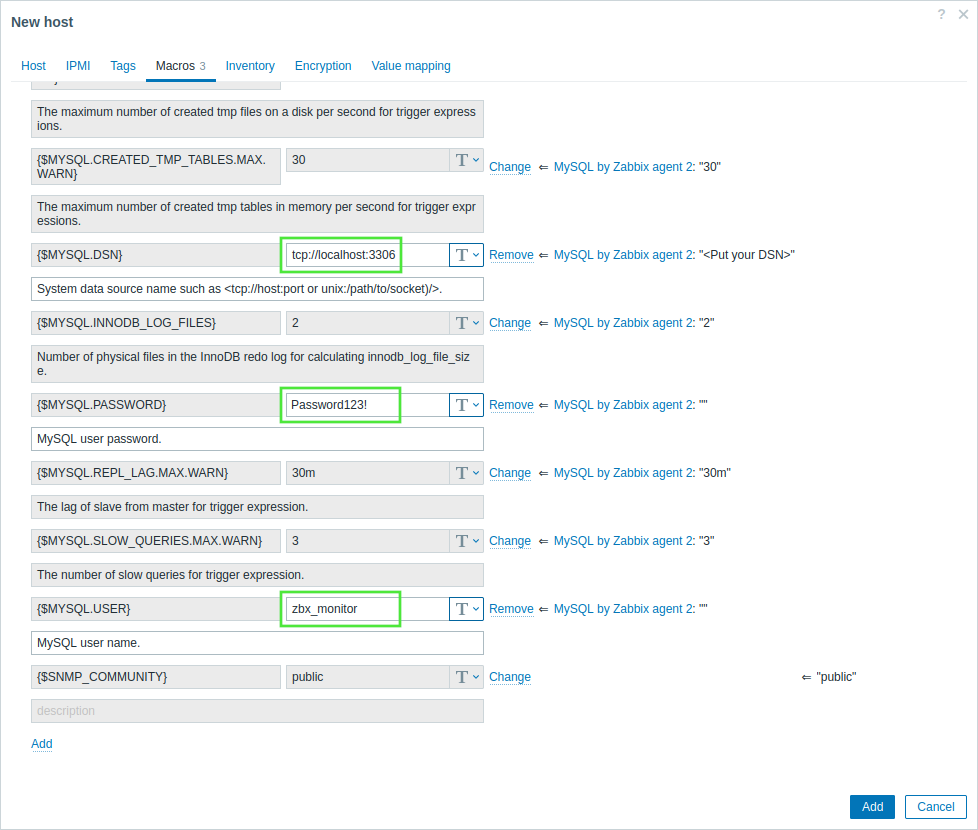

# monitor postgresql using zabbix agent 2 active
[ref](https://www.zabbix.com/integrations/postgresql#postgresql_agent2)


```sh
su - postgres
psql


CREATE USER zbx_monitor WITH PASSWORD '123456' INHERIT;
GRANT pg_monitor TO zbx_monitor;

exit
exit

vim /var/lib/pgsql/17/data/pg_hba.conf
------
host       all        zbx_monitor     ::1/128                 scram-sha-256

------
systemctl restart postgresql-17.service

# Set the connection string for the PostgreSQL instance in the {$PG.CONNSTRING.AGENT2} macro as URI, such as <protocol(host:port)>, or specify the named session - <sessionname>.


```


# monitor mysql/mariadb with zabbix
[ref](https://www.zabbix.com/documentation/current/en/manual/guides/monitor_mysql)
```sh
mysql -u root -p 

CREATE USER 'zbx_monitor'@'localhost' IDENTIFIED BY 'PsssssssMMMDDND';
GRANT REPLICATION CLIENT,PROCESS,SHOW DATABASES,SHOW VIEW ON *.* TO 'zbx_monitor'@'localhost';
quit;

```



