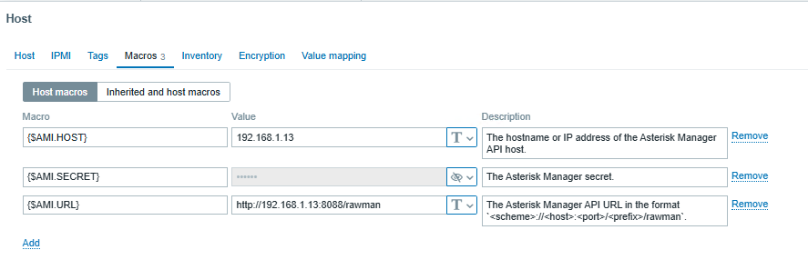

# Monitor issabel 5 by zabbix 
```sh


# add at the end of this file
vim /etc/asterisk/manager.conf
-------
[zabbix]
secret = fFFFDe3423
deny=0.0.0.0/0.0.0.0
permit=192.168.1.163/255.255.255.255
read=system,call,log,verbose,agent,user,config,dtmf,reporting,cdr,dialplan
write=system,call,agent,user,config,command,reporting,originate,message
--------
asterisk -rx "manager reload"
asterisk -rx "manager show users"


```

go to zabbix and add the template



# Monitor Issabel 4 by zabbix
```


```