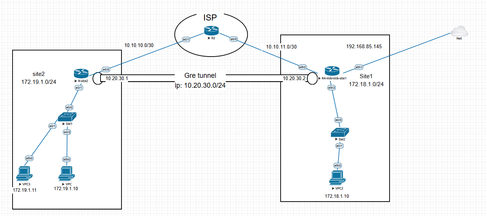
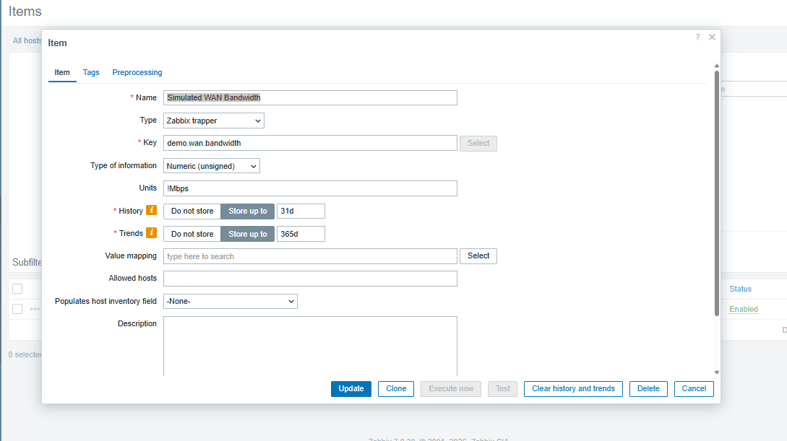
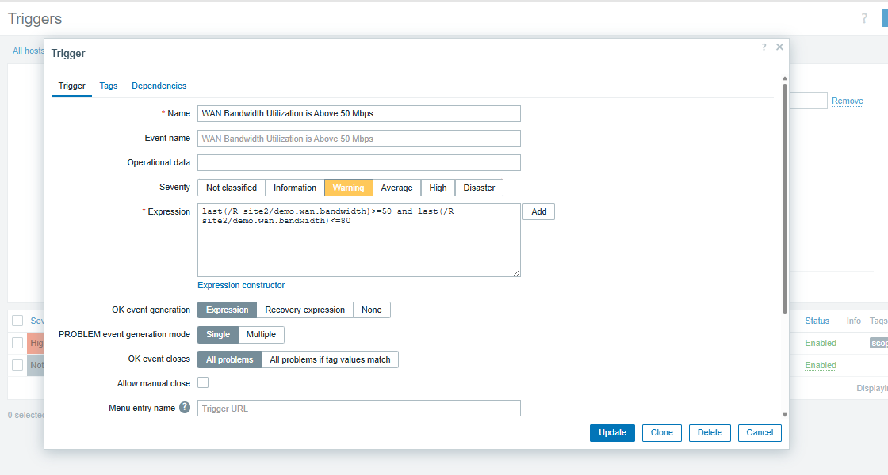
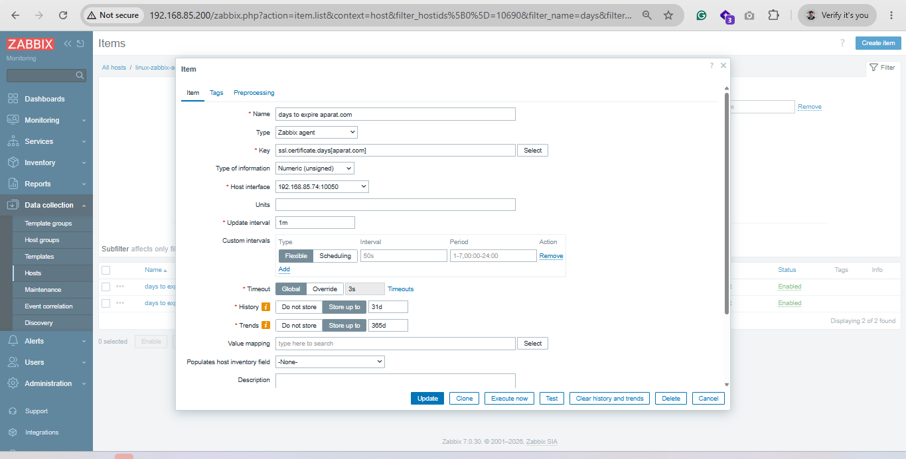

# Scenario 1




# mikrotik
```sh
/snmp community set [ find default=yes ] name=mikpass
/snmp set contact="iman jowkar" enabled=yes location=Shiraz


```


# test from zabbix
```sh
dnf install nc
# check udp port
nc -uzv 10.255.2.1 161
echo $?


# tcp check
nc -zv 10.255.2.1 22

```

# cisco router
```sh

ip access-list standard ZABBIX-SNMP
 permit 192.168.85.200
exit

snmp-server community zbximan ro ZABBIX-SNMP
```


## zabbix sender demo



```sh

zabbix_sender -z 192.168.85.200 \
-s "R-site2" \
-k demo.wan.bandwidth \
-o 20


zabbix_sender -z 192.168.85.200 \
-s "R-site2" \
-k demo.wan.bandwidth \
-o 60

```


## add expresion macro on map

```sh

last_value: {?last(/R-site2/demo.wan.bandwidth)}


```


# Certificate Days Until Expiry
```sh
mkdir -p /opt/zabbix
cd /opt/zabbix
python3 -m venv venv
source venv/bin/activate
vim check-ssl.py
----

import socket
import ssl
from datetime import datetime
import sys

def check_ssl_expiration(domain, port=443, verify_ssl=True):

    context = ssl.create_default_context()

    if not verify_ssl:
        context.check_hostname = False
        context.verify_mode = ssl.CERT_NONE

    try:

        with socket.create_connection((domain, port)) as sock:
            with context.wrap_socket(sock, server_hostname=domain) as ssock:
                cert = ssock.getpeercert()


        if 'notAfter' not in cert:
            raise ValueError("Certificate does not contain an expiration date ('notAfter')")


        expires = datetime.strptime(cert['notAfter'], "%b %d %H:%M:%S %Y %Z")
        remaining_days = (expires - datetime.utcnow()).days

        return expires, remaining_days

    except Exception as e:
        print(f"Error: {e}")
        sys.exit(1)

if __name__ == "__main__":

    if len(sys.argv) < 2:
        print("Usage: python check_ssl_expiration.py <domain_or_ip> [<port>] [--ignore-self-signed]")
        sys.exit(1)


    domain = sys.argv[1]
    port = int(sys.argv[2]) if len(sys.argv) > 2 and sys.argv[2].isdigit() else 443
    verify_ssl = "--ignore-self-signed" not in sys.argv


    try:
        expiration_date, days_left = check_ssl_expiration(domain, port, verify_ssl)
        print(days_left)
    except Exception as e:
        print(f"Error: {e}")
        sys.exit(1)

---
Usage: python check_ssl_expiration.py <domain_or_ip> [<port>] [--ignore-self-signed]

python check-ssl.py aparat.com
python check-ssl.py yahoo.com
python check-ssl.py google.com


chown -R zabbix: /opt/zabbix/

sudo -u zabbix /opt/zabbix/venv/bin/python /opt/zabbix/check-ssl.py aparat.com
sudo -u zabbix /opt/zabbix/venv/bin/python /opt/zabbix/check-ssl.py yahoo.com
sudo -u zabbix /opt/zabbix/venv/bin/python /opt/zabbix/check-ssl.py google.com


# userparameter

vim /etc/zabbix/zabbix_agent2.d/ssl.conf
-----
UserParameter=ssl.certificate.days[*],/opt/zabbix/venv/bin/python /opt/zabbix/check-ssl.py $1 $2 $3
-----


```




# ding-ding

```sh


```


## web driver


## check tcp port (simple check way)


# Finish
n8n - telegram, bale, viop, mattermost
